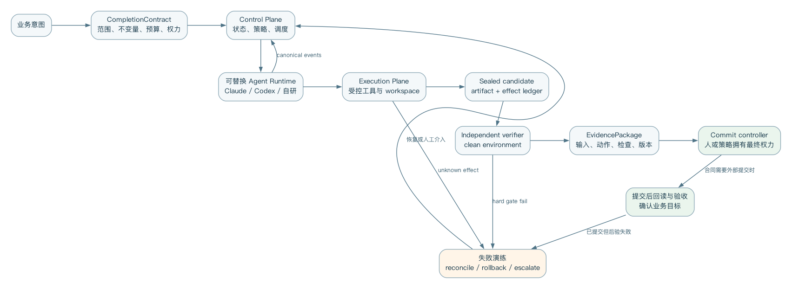

# 第二十五章 三个贯穿案例：从意图到可验证结果

> 证据地位：本章区分作者参考设计、教学占位数据和离线 fixture 检查。案例与阈值不代表生产实测；脚本化进化数据不能证明模型收益，也没有验证供应商端到端流程。

本章不试图给出某种语言的完整框架，而是用三个领域说明同一 Harness 骨架怎样落地。每个案例都回答六个问题：任务合同是什么，Agent 获得什么权力，真实副作用在哪里提交，完成由谁判定，证据怎样复建，故障时在哪里停止。

本书仓库提供公共教学入口。在仓库根目录、按 `examples/README.md` 准备好 Python 环境后运行：

```bash
python examples/run_examples.py
```

入口输出代码候选封存、DST 时间窗、SQL 聚合与进化门禁的检查结果；失败候选被正确拒绝也是预期行为。它不连接真实支付服务、数仓或模型供应商。下文的 `payments` 与第二十七章的 `billing-api` 都是场景名称，仓库不包含其生产源码；原稿的 `8f31b6e`、`8f2c9d1` 是教学占位，不能作为运行前置提交。公共示例使用自身 fixture 的实际基线，规模与结果以该次运行输出为准。



## 案例一：仓库级软件修复

### 1. 任务与合同

场景：支付服务升级日期库后，夏令时边界测试失败。教学口径将扣款窗定义为一个当地民用日对应的半开 UTC 区间；它不等于固定24小时，也不代表所有支付产品的账务规则。Agent 可以修改 `src/time/` 与对应测试，不允许改账务规则、删除或削弱测试、联网发布。本任务只交付可审阅补丁及证据；创建 PR 和合并另由代码负责人授权。

以下 JSON 是本书自定义的业务合同输入，不是厂商配置，也不能直接交给附录 E 的 Task 验证器。`<resolved-full-oid>` 等尖括号值是必须替换的占位符。第二十七章给出合同到平台对象的字段映射。

```json
{
  "contract_id": "CC-REPO-2048-v3",
  "task": "修复 DST 边界下的重复扣款时间窗计算",
  "workspace": {"repo": "payments", "commit": "<resolved-full-oid>"},
  "allowed_writes": ["src/time/**", "tests/time/**"],
  "forbidden": ["delete_or_weaken_tests", "change_ledger_rules", "push", "deploy"],
  "deliverables": ["git_patch", "change_explanation", "verification_results"],
  "checks": [
    "tests/time/test_dst.py::test_fall_back_window",
    "tests/time/test_dst.py::test_spring_forward_window",
    "pytest tests/time",
    "lint",
    "no_pass_to_pass_regression"
  ],
  "budget": {"wall_seconds": 1800, "model_usd": 8, "max_actions": 120},
  "commit_authority": "human_code_owner"
}
```

控制面验证合同与调用者权限，解析并保存完整基线提交，创建专用工作区，再签发限于任务目录和动作的短期授权。运行时适配层可连接不同 Agent，但必须先协商能力，再收集统一的 Action/Observation，并保留原始事件引用；这里没有承诺某个产品已经实现了全部映射。

### 2. 执行与验证序列

```text
User → Control: submit contract
Control → Workspace: create workspace@resolved_base
Control → Runtime: start(task, lease, budget)
Runtime ↔ Workspace: search/edit/test
Runtime → Control: candidate patch + self-report
Control → Verifier: clean base + sealed patch + candidate tree hash
Verifier → Control: checks + hashes + logs
Control → Reviewer: diff + contract + evidence
Control → User: accepted patch + evidence (task endpoint)
Reviewer → Git host: create PR only under separate authorization
```

Agent 在当前工作区执行测试只能提供修复反馈。普通 `git diff` 不包含未跟踪文件，而且封存后继续改工作区，会使“测试通过的代码”与“交付的补丁”分离。控制面必须把以下步骤作为一次候选协议执行，任何一步失败都停止；这段伪代码描述生产实现的必要步骤，公共入口只验证其中的本地机制。

```text
freeze candidate workspace; stop agent writes
resolve and verify base revision; record repository identity
inventory modified/deleted/new files, including untracked files
reject out-of-scope paths, secrets, unsafe links and unsupported file types
create private index from base; stage reviewed changes and new files
record candidate tree, file modes and content hashes
export binary patch and changed-file manifest from the same private index
seal patch, manifest, base and candidate tree; record their hashes
create clean verification workspace from the exact base
verify sealed hashes; check patch applicability; apply sealed patch
assert applied tree equals sealed candidate tree; reject extra source files
mount frozen acceptance suite read-only; remove agent write access
run fixed checks against this tree; record every exit code and skipped check
recheck source tree and sealed hashes after checks
bind results to contract, candidate tree, suite and environment versions
```

私有索引先装载基线，再收集审核过的修改、删除、重命名、新文件、模式与二进制变化；不能仅复制 Agent 当前的暂存区。未跟踪文件必须进入清单，忽略文件也要核对是否属于必要输入，不能自动打包凭证或缓存。若由 shell 编排，每个子命令都要检查退出码；使用管道时启用 `set -euo pipefail`，防止 `git` 失败被后面的 `sort` 掩盖。

基线已通过的回归检查和领域验收集由验证方固定，候选新增测试只作补充。候选不得通过删测试、跳过测试或削弱断言获得通过。验证日志须记录实际执行数、跳过数和失败数；必需检查未执行时不能写 PASS。运行环境、依赖锁、验证器版本、补丁摘要与应用后树摘要共同绑定同一候选。审阅者接收合同、补丁和这些证据，不需要继承 Agent 对结果的判断。

### 3. 证据包

下面沿用附录 E 的证据包骨架。所有尖括号值都须由一次实际运行填入，不能因为 YAML 能解析就当作证据已经存在。原稿的“482项回归通过”是示意数，已撤下；本例既不声称存在这些生产测试，也不把 AST 语法检查称为 lint 或秘密扫描。

```yaml
evidence_package:
  schema_version: evidence-package/v1
  package_id: EP-REPO-2048-A3
  task:
    task_id: TASK-REPO-2048
    contract_version: CC-REPO-2048-v3
  attempt:
    attempt_id: ATT-REPO-2048-A3
    runtime: local-fixture
    runtime_version: "<runner-version>"
    harness_profile: code-example-v1
  inputs:
    - uri: "git:<resolved-full-oid>"
      hash: "sha256:<input-manifest-digest>"
  candidate:
    uri: "artifact:<sealed-patch>"
    hash: "sha256:<patch-digest>"
  effects: []
  policy_decisions:
    artifact_ref: "artifact:<policy-log>"
  verification:
    verifier_version: "<frozen-suite-version>"
    environment_ref: "artifact:<environment-manifest>"
    status: INCONCLUSIVE
    checks: []
  approvals: []
  final_commit: null
  lineage:
    parent_attempt: null
    model_version: not-used-local-fixture
    harness_bundle: "<example-bundle-version>"
```

这是尚待填充的模板，因此状态是 INCONCLUSIVE。实际检查后填入每项结果与日志引用；输入清单另存基线 Git 对象ID，候选清单另存候选树、文件模式和文件摘要，不能把 Git tree ID 冒充 SHA-256。`task_id` 标识任务，`attempt_id` 标识该任务的一次执行尝试，`action_id` 标识其中的逻辑动作；同一工具动作的网络重试记为 ToolTry，沿用动作身份和逻辑幂等键。任务终点是验收并交付补丁，`final_commit` 可以为空；若合同改成创建 PR，则还必须记录远端 PR 的权威回读，不能只凭本地检查宣布完成。

### 4. 失败演练：只适配可见测试

注入故障：候选只对两条可见测试的日期写特例，在相邻年份、其他时区或半小时夏令时下失败。验证器据固定合同返回失败；检查发现实现违约，并不自动意味着规范有缺陷。开发验收可以按既定规则给出“不应硬编码日期”的修复反馈，并限定修复次数。用于最终确认的封存测试不向执行者返回可定位样本；若其反馈已经用于修改候选，该批数据就参与了开发或选择，不能继续宣称未见。

还要做两个与模型无关的负例：新增必要模块却漏进补丁，干净应用后必须失败；封存候选A后在工作区改成候选B，即使B通过，也不能把结果记给A。独立测试目录只是逻辑分离，同一操作系统用户并不构成安全隔离。生产验收还需落实进程身份和读写权限。

## 案例二：企业经营分析

### 1. 任务与口径

场景：生成2026年7月中国区订阅净收入变化分析。任务合同固定指标定义、数据快照、币种、允许维度和交付格式。以下仍是业务合同输入；`snapshot` 引用的是已物化且受保留策略保护的数据版本，不是到任意未来时间仍可使用的历史查询时间戳。

```json
{
  "contract_id": "CC-DATA-771-v5",
  "metric": "net_subscription_revenue_v4",
  "period": ["2026-07-01", "2026-08-01"],
  "comparison": "previous_month",
  "currency": "CNY_at_monthly_finance_rate",
  "snapshot": "materialized:subscription_revenue_v4_20260803T020000Z",
  "allowed_dimensions": ["province", "plan", "channel"],
  "prohibited_fields": ["email", "phone", "account_name", "raw_payment_token"],
  "deliverables": ["analysis.md", "aggregates.parquet", "query_bundle", "evidence.yaml"],
  "checks": ["metric_definition", "snapshot_consistency", "internal_total_reconciliation", "min_group_size_20", "disclosure_review"],
  "post_commit_checks": ["published_report_hash", "reader_access_policy"],
  "commit_authority": "finance_analytics_owner"
}
```

规划者可以拆分取数、对账、解释和反证。取数工具使用只读、短期、绑定快照的凭证，网关执行行列权限检查，模型只接收获准披露的聚合结果。内部全量结果由有权限的验证器保管，不能因为也是“聚合”就自动交给模型。

下面采用 BigQuery Standard SQL 方言。原稿的 `FOR SYSTEM_TIME AS OF` 受历史窗口限制：时间点不能早于当前超过7天，实际配置和表条件还可能更严格。2026年8月3日的数据到9月19日已不能靠该窗口找回，长期复现必须在有效期内物化或归档，再记录来源时间、schema、口径版本和内容摘要；没有保存就应报告无法复现，不能把当前数据改名当旧快照。该限制来自本轮已核验的[官方查询语法](https://docs.cloud.google.com/bigquery/docs/reference/standard-sql/query-syntax#for_system_time_as_of)，本书没有实际执行 BigQuery 账户查询。

此处假定物化快照已经过批准的语义层处理：同一业务事件在该截面只保留一个有效版本；`month` 是按业务时区归一化的月初 DATE，而非交易日；金额是按合同汇率换算的精确数值；NULL退款仅在业务确认“无退款”时转为0，NULL收入与无法识别账户的记录隔离待处理。重复、排除与隔离的数量及金额进入受限质量报告，并与财务采用相同口径对账；质量异常不能靠悄悄删行消失。`COUNT(DISTINCT account_id)` 只去重人数，不会去重收入。

```sql
SELECT month, province, plan,
       SUM(recognized_revenue_cny - refunds_cny) AS net_revenue_cny,
       COUNT(DISTINCT account_id) AS accounts
FROM `finance_snapshots.subscription_revenue_v4_20260803T020000Z`
WHERE region = 'CN'
  AND month IN (DATE '2026-06-01', DATE '2026-07-01')
GROUP BY month, province, plan;
```

### 2. 双重验证

上面的查询生成内部全量聚合，尚不能公开。确定性验证器先核对语义层与快照，再把未抑制汇总和相同口径的财务总额对账。随后由独立披露步骤处理人数不足20的组，并审查总额、分组、跨月份和其他可访问查询之间的组合泄漏。最低人数检查命名为 `min_group_size_20`，它只是抑制规则，不是 k 匿名或其他完整隐私保证的证明。

例如，纯合成数据中A组20人、收入100，B组19人、收入95，内部对账应使用195，公开候选只剩A组100。不能再要求100与195在舍入误差内相等，也不能同时公开总额195和“受抑制残差95”，否则B组被反推出。必要时连总额或另一个大组也要互补抑制，或采用经批准的其他披露机制。真实小组残差只保存在受限证据中；给模型的日志和报错同样不得携带它。

文字审阅在披露通过后进行，检查数字能否链接到获准披露的单元、是否把相关写成因果，以及跨月份的可见范围是否改变。被抑制值不能当作零；若覆盖变化本身敏感，报告只能说明可比性受限，不能给出足以反推小组的桥接表。

```text
metric contract → approved materialized snapshot → internal full aggregation
  → restricted financial reconciliation → disclosure and composition review
  → approved aggregates → narrative + claim-to-cell review
  → analyst approval → publish → confirm report and access policy
```

对账误差由货币精度和已知舍入规则决定，不用统一百分比掩盖口径问题。分别记录快照不一致、未链接的数字、披露违规、产物取回与检查重跑的结果。公共入口以 SQLite fixture 验证聚合逻辑，方言适配结果不能冒充上述 BigQuery 查询、真实汇率和财务验收已经通过。

### 3. 证据包

沿用案例一的 `evidence-package/v1` 骨架，输入指向物化快照、语义层定义和查询版本；候选指向报告及获准披露的聚合清单。完整证据包限授权审计者读取，内部对账、被排除记录和抑制残差另设受限引用；发布给报告读者的是经过披露审查的证据投影，不能附带能解引用原始敏感数值的链接。

原稿的对账差额0.02元、37个数字链接均为示意数，不是财务实测。实际运行应记录未抑制总额的核验结果、披露策略版本和每个公开数字的来源，不能用一组预填 PASS 代替检查。本合同要求发布：适配器将 `checks` 编译为完整合同的 `pre_commit_checks`，提交确认后再运行 `post_commit_checks`，核对已发布内容摘要、目标和访问权限。副作用确认只进入 `VERIFYING_POSTCONDITIONS`；后置检查失败或仍未知时，保留已发布事实并记为 `COMMITTED_BUT_UNVERIFIED`。

### 4. 失败演练：快照漂移

注入故障：第一次查询后，上游退款表完成迟到回填；第二条查询若使用“latest”，会把两个快照混在一份报告里。网关应在执行前拒绝不匹配的数据版本。系统可以继续使用尚可读取的原物化快照并说明时效，也可以由数据负责人批准合同修订后从头重建全部产物。原快照若未保存或已过保留期，应停止并报告不可复现。

选择新快照时，旧证据包标为已被替代，不覆盖原记录；所有数字、对账、披露审查和叙述重新生成。数据截面的改变需要数据负责人确认，因为它改变了问题本身。

## 案例三：自我进化 Harness

### 1. 失败归因与实验合同

场景：平台观测到接入多个MCP服务后，`wrong_tool` 错误上升。运营者先按模型、任务族、工具数量和错误类别聚类，提出“同时呈现的工具定义过多，干扰了选择”的假设，再设计实验；错误同时上升本身不能证明因果，也不能直接授权生产Agent改写工具目录。下面是本书自定义的实验合同示意。

```yaml
evolution_contract:
  id: EVO-TOOL-93-v2
  baseline: harness-42
  mutable_surface: tool_catalog_presentation
  frozen:
    - model
    - task_suite
    - sandbox_image
    - policy_root
    - evaluator
    - sealed_test
  candidates:
    - grouped_dynamic_discovery
    - concise_descriptions
    - task_scoped_allowlist
  primary_metric: verified_task_success
  diagnostics: [wrong_tool_rate, catalog_lookup_activation, tokens, latency]
  hard_gates: [security_non_regression, critical_slice_non_regression]
  release: shadow_then_low_risk_canary
```

候选生成者在隔离分支工作，不能修改评价器、任务分配表或发布权限。构建预检只确认代码有效，以及机制能在专用探针中触发。正式试验中，是否激活是诊断字段：所有预先分配的合格 trial 都进入主要指标分母，包括未激活、超时、无返回和基础设施失败。trial是实验分配单位，映射到任务及其执行尝试；独立控制面可按统一预算重试，但不能因此增加样本数。同一Action的ToolTry与重新发起一次Attempt分别记账，原失败、最终结果和全部成本都保留。

### 2. 选择与发布

```text
production traces (read-only)
  → pathology cluster + human-confirmed hypothesis
  → isolated candidate generation
  → preflight(build valid + mechanism probe)
  → development and candidate-selection evaluation
  → freeze bundle → one authorized sealed-test evaluation
  → shadow → canary → promote/rollback
```

先检查安全与关键切片门，再估计候选相对基线的配对差值。实验合同预先给出任务数、每任务重复数、最小有意义增益、非劣界、区间方法、候选选择和停止规则；重复任务按任务或同源簇处理，不能把每次调用都当独立样本。未发现显著下降不等于非劣，零观测违规不等于真实风险为零。单位成功成本包含生成、评估、重试和人工处置；没有可信完成时不报告有限的单位成功成本。

开发、选型与最终封存数据分开，记录跨轮访问次数及反馈去向。封存结果若用于修复、经验库或训练，该批数据必须退出“未见终测”的角色。发布控制器发布模型、Harness、记忆、策略和评价器引用组成的完整版本组合；正在执行的任务保持已选版本，但每次动作仍重验当前授权。紧急撤权优先于版本粘性。

### 3. 证据包与来源关系

本案例也使用 `evidence-package/v1`。输入引用实验协议和预分配 trial ID 清单，候选引用不可变版本组合，验证结果引用逐条 trial、激活事件、重试账本与成本，发布与回退决定记录在外部效果和批准字段中。实验的 `evolution_contract` 是领域对象，需要适配器编译；它本身不是 Task 或证据包。

原稿的240次、228次激活和5%灰度均为示意数，没有对应生产试验。为了说明分母错误，下面使用明确构造的教学数据；它只演示 gate 的判定，不能计算出模型收益结论。

| 教学候选 | 预分配 trial | 可信成功 | 其他终态 | 以完成返回者为分母的误报 | 固定分母结果 |
|---|---:|---:|---|---|---|
| 基线 | 30 | 24 | 6次失败 | 24/30＝80% | 24/30＝80% |
| 超时候选 | 30 | 18 | 2次失败、10次重试后超时 | 18/20＝90% | 18/30＝60% |
| 合成候选 | 30 | 28 | 2次失败 | 28/30 | 28/30 |
| 合成灰度 | 30 | 29 | 1次关键切片失败 | 29/30 | 即使总分提高，仍拒绝放行 |

每行都必须能用30个预分配ID对齐，最终成功、失败、超时、取消等互斥终态之和等于30。激活与未激活另外统计，二者之和也等于30，它们不是额外的结果类别。删除日志会先触发完整性拒绝，不能等到缺失率“显著”才阻断。公共入口按自身 fixture 输出实际分母与判决；任何脚本预设的成功数都只能验证计分和发布逻辑。

### 4. 失败演练：通过修改分母“进步”

超时候选把10次困难试验藏掉，就会从60%伪装成90%。完整性门检查预分配ID、最终结果和成本是否齐全；计分门坚持30的分母。即使日志全部存在、没有篡改，错误地只统计返回者也必须拒绝。

另一个停止点是灰度中的关键切片退化。控制器停止新的候选流量，并恢复经批准的完整旧版本组合；已经提交的业务效果另行对账，版本回退不会抹掉它们。若旧组合含已撤销凭证或有害能力，不能机械恢复旧授权，应停用并换成当前允许的配置。是否重新设计候选由负责人决定，执行 Agent 没有自行晋级权。

## 三个案例的共用骨架

```text
intent → versioned contract → identity/workspace → runtime
→ observable actions/effects → sealed candidate
→ candidate verification → current authorization → commit if required
→ authoritative readback + contractual postconditions
→ evidence + telemetry → eval/evolution
```

代码案例验收的是固定基线上的同一份封存补丁，数据案例还要保证同一快照下的口径和披露边界，进化案例则冻结实验协议并保留全部试验。仅交付产物的合同可在验收与交付后结束；包含发布的合同要继续到权威回读与业务后置条件通过。公共教学程序帮助检查这些局部关系，生产系统仍需另行验证真实权限、外部提交和恢复能力。
