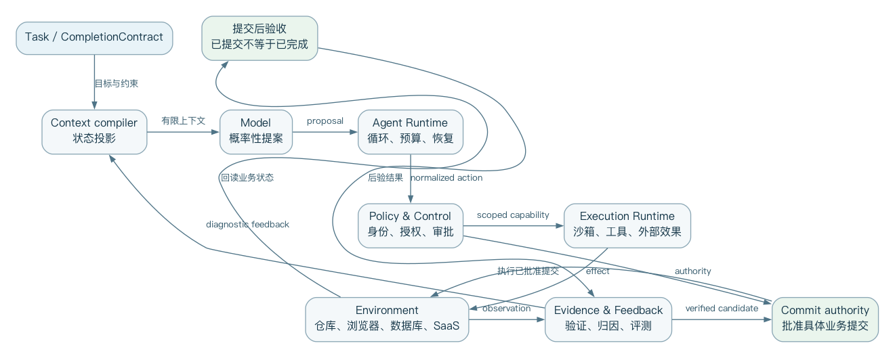
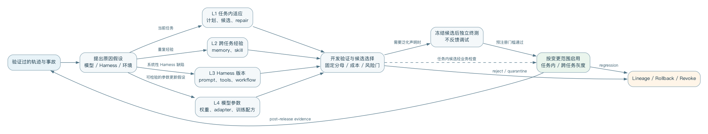

---

# 序：为什么现在需要一本 Harness 小书

同一模型放进不同的 Agent 产品后，表现可能看起来完全不同。
差异来自模型之外的上下文、工具、环境、权限、恢复机制和验证机制。
本书把这组能力统一叫做 Agent Harness。

Harness 不是某个框架品牌，也不只是 `while model calls tools`。
它是模型和真实世界之间的运行时与治理层。
它把人的意图编译成任务，把环境状态编译成上下文，把模型动作约束为受控副作用，再把外部结果编译成可审查证据。

本书面向企业 Agent 平台架构师和高级工程师。
历史篇解释从规划、BDI、ReAct 到 coding agent 的转折；原理篇给出状态机、上下文、工具、安全、验证和多 Agent 的设计；产品篇研究 Claude Code、Codex、Cursor、DeepSeek Harness 与 OpenHands；进化篇区分任务内、跨任务、Harness 和模型四层；实践篇给出供应商无关的参考架构和迁移路线。

全书的核心公式是：

```text
Agent System Capability = Model × Harness × Environment × Feedback
```

乘法意味着任一项接近零，整体能力就会显著下降。
强模型不能弥补关键上下文被截断、工具危险、环境异常，或 verifier 错误。
再完善的 Harness 也无法无限越过模型能力边界。

全书资料维护至 2026-08-28；快速变化的产品章会在章首标出更精确的资料截面。
功能会过时，但设计原则更稳。
书中明确区分公开事实、论文结果和作者综合判断；内部使用不改变证据边界。

---

# 目录

[TOC]

Markdown 章节按下列五篇排列。

---

# 第一篇 历史：Agent 如何从会回答变成会行动

---

## 本篇导言：Harness 从哪里来

本篇要回答“为什么模型之外还需要一套运行系统”。第一章回到规划、控制循环和多 Agent 协商的前史；第二章分析 2023 年自主 Agent 热潮，说明它虽然证明了可行性，却没有解决可靠性问题；第三章把 ACI（Agent-Context Interface）确立为能力的一部分；第四章说明真实仓库和可执行评测如何推动前面想法进入产品化。

这段历史不是按产品编年表写的。它要反复使用三条判断：行动系统必须配套外部状态与反馈；接口会改变模型可执行的策略；可演示的循环与可运营的 Runtime（运行时）之间还隔着状态、权限、恢复和验证这四道门。读完本篇，读者应能解释为什么“换更强模型”并不能自动补齐 Harness 的缺口。

---

## 第一章 从控制循环到 Agent Runtime

如果把 Claude Code、Codex 或 DeepSeek Harness 的界面都拿掉，剩下的核心其实非常简单：先接收目标，再调用模型，执行模型选择的动作，最后把结果回传给模型。
这样的循环持续进行，直到目标完成或预算耗尽。

```text
目标 → 决策 → 动作 → 环境变化 → 新观察
        ↑                     ↓
        └──────── 反馈 ───────┘
```

这个循环并不新。控制论研究反馈机制，自动规划研究如何从初始状态到达目标状态，机器人研究感知与行动，BDI 研究信念、目标与承诺，多智能体系统研究任务分配与通信协议。
现代 Harness 的新意不在于重新发明循环，而在于把一种高能力、概率性、上下文受限、可调用任意软件工具的语言模型放进真实计算环境后，为它补上可靠运行所需的工程结构。

因此，要理解 Harness，最好的起点不是 2023 年的 AutoGPT，而是三个更早的问题。
第一，机器如何形成行动序列？
第二，一个持续运行的 Agent 如何在变化环境中维持承诺并修正行为？
第三，多个自治执行者如何分工，而又不依赖全局共享状态？

### 1. 规划：把目标翻译成动作序列

1971 年的 STRIPS 将规划描述为：在一个世界模型中寻找一串操作，使初始状态经过这些操作后满足目标公式。它把动作表示成具有前置条件和状态效果的操作符，使“怎样完成任务”从一段专用程序转化成可以搜索的状态转换问题。[STRIPS 原始论文](https://doi.org/10.1016/0004-3702(71)90010-5)

用现代 Harness 的语言重写，STRIPS 已经对应了四个熟悉成分：

```text
State        当前环境的结构化描述
Goal         希望满足的终止条件
Action       带前置条件和效果的环境操作
Planner      搜索可行 Action 序列的控制器
```

现代 coding agent 的文件读取、补丁、命令执行和测试工具，也可以被当成动作。
但是它和经典规划有决定性差异。
经典规划通常假设动作语义明确、状态可知、执行结果近似确定；而软件 Agent 的仓库、依赖、网络服务和人类意图是部分可观测的。
模型可能误解工具说明、生成无效参数，甚至把命令成功退出当作业务目标完成。

这也是为什么现代 Agent 很少只生成一份完整计划然后机械执行。
更常见的是滚动规划：先选一个信息增益高、风险可控的动作；观察真实结果；再更新局部计划。
ReAct 把这种“推理-行动”交替明确写进语言模型轨迹，但核心问题仍是规划与控制中的老问题：当世界模型不完整时，计划只能依据反馈持续修正。

对 Harness 设计者而言，这段历史留下第一条原则：

> 计划不是事实，而是一个必须持续接受环境证据修正的假设。

这意味着 plan mode 可以帮助形成意图和界定审查范围，但不应成为独立于执行反馈的僵硬工作流。
真正可靠的 Harness 必须保留重新观察、修订计划、撤销局部动作，以及报告不可达目标的通道。

### 2. 反应与承诺：BDI 的长期遗产

只在每一步对刺激反应的系统容易漂移。
只按预先计划执行的系统又难以适应变化。
Belief–Desire–Intention（BDI）架构试图在两者之间建立实际推理循环。
Agent 根据对世界的信念识别可能目标，并从中形成当前愿望或目标，再选择并承诺某些意图。
新事件到来后，它更新信念，判断现有意图是否仍可行，再决定继续、重规划或放弃。

BDI 的价值不在于要求现代 Harness 一定创建名为 `beliefs`、`desires`、`intentions` 的三个对象。
它真正揭示的是三类经常被聊天记录混为一谈的状态：

- 观察和推断出来的世界状态；
- 用户希望实现但尚未承诺执行路径的目标集合；
- 当前已经投入资源、应跨多个步骤保持一致的执行承诺。

早期 PRS、dMARS 与 AgentSpeak 也发展了计划库、事件触发、元级控制和显式 deliberation cycle。
BDI 综述将其核心贡献概括为：在动态、不可预测环境里平衡主动目标与被动响应，并通过意图表达对未来行为的承诺。[BDI 架构综述](https://www.ijcai.org/proceedings/2020/684)

这和现代 Agent 的几个常见故障直接相关。

第一，只有对话历史却没有显式任务状态时，模型可能在长会话里忘掉用户到底批准了什么。
第二，计划、待办、执行事实和模型猜测如果用同一种自然语言表示，压缩后很容易互相污染。
第三，出现新消息时，如果 Harness 不区分“补充信息”“优先级变化”“取消请求”和“新任务”，Agent 就可能误放弃或误延续已有承诺。

因此，企业 Harness 至少应在运行时区分：

```text
ObservedState   可追溯到环境或用户消息的事实
Hypothesis      模型尚未验证的解释
Goal            用户或上层系统定义的结果条件
Commitment      已批准并正在执行的目标/约束
Plan            当前可替换的动作建议
ExecutionState  已开始、等待、取消、失败或完成
```

这里最重要的不是命名，而是不同状态有不同的更新权限和证据要求。
模型可以自由提出假设和计划，但不应自行把假设升级为事实。
也不应把未批准目标升级为承诺。
这正是现代 Harness 里“概率性认知”与“确定性控制”分层的早期来源。

### 3. 多 Agent：1980 年已经出现的协调税

1980 年的 Contract Net Protocol 研究松耦合节点如何通过协商分配任务。
拥有任务的 manager 发布任务描述，潜在 contractor 根据能力和资源提交方案，manager 再授予合同。
该系统强调没有全局共享数据，也没有单一全局控制。
任务分配必须同时兼顾资源利用与问题求解焦点。[Contract Net 原始论文](https://doi.org/10.1109/TC.1980.1675516)

这与今天的 subagent、agent team 和异步云 Agent 非常相似，但它也提醒我们：多 Agent 从来不是免费的并行计算。
一次委派至少需要：

1. 切分出边界足够清楚的任务；
2. 描述输入、输出、权限和完成条件；
3. 选择具备适当能力与资源的执行者；
4. 传递必要上下文，同时避免复制整个主会话；
5. 接收结果并验证，而不是把子 Agent 的自然语言结论当作事实；
6. 处理超时、重复执行、局部失败和相互冲突的修改；
7. 把结果重新合并到主任务状态。

如果拆分收益小于这些协调成本，多 Agent 会更慢、更贵，也更难调试。
这也是为什么“模型能够调用 subagent”不等于系统具备良好的多 Agent 架构。
真正要设计的是委派协议、隔离边界、结果契约、取消传播和合并策略。

现代 coding agent 使用 worktree、独立容器或远程 workspace，不是为了方便并行而已。
它是在物理上减少共享可变状态。
这个选择与 Contract Net 的松耦合假设是一脉相承：信息通过协议传递，执行者不依赖一个可任意读写的共同工作台。

### 4. 从手写控制器到模型控制器

传统 Agent 的策略、计划选择和异常处理通常由规则、搜索算法或专用程序实现。
大语言模型改变的是控制器的表达能力。
它可以读取自然语言目标和非结构化观察，在没有为每种任务都写专用规则的情况下，提出下一动作并生成工具参数。

这带来显著的泛化能力，也引入四种结构性不确定性：

- **语义不确定性**：模型可能误解目标、上下文或工具描述；
- **动作不确定性**：它可能选择错误工具或构造无效参数；
- **状态不确定性**：上下文窗口只包含环境的一部分，并可能在压缩中失真；
- **完成不确定性**：模型说“完成”只是一项预测，不是外部世界已经满足目标的证明。

所以，现代 Harness 不能只是把模型接到 shell 上。
它需要用确定性软件包住概率性决策：工具 schema 约束动作形状，权限策略约束可执行范围，沙箱约束副作用，日志记录轨迹，预算限制循环，测试和评估器判断结果，人工审批承接不可自动化的价值判断。

可以把两者的分工写成一条简单边界：

```text
模型负责：提出、解释、比较、生成、诊断
Harness负责：授权、执行、隔离、记录、计量、验证、恢复
```

这不是说 Harness 中不能有模型评审器，也不是说控制逻辑必须完全固定。
关键是：任何影响安全、资源、归因和进化晋级的决定，都不能只依赖被评对象的单次自我陈述。

### 5. ReAct：现代最小循环的形成

ReAct 将 reasoning trace 与 action 交替生成。
推理帮助模型维护并调整计划。
动作让模型从外部知识源或环境取得新信息。
新观察再进入后续推理。[ReAct](https://arxiv.org/abs/2210.03629)

它为现代工具调用 Agent 提供了极具影响力的最小模板：

```text
while budget_available:
    decision = model(context, available_tools)

    if decision.is_final:
        return decision.answer

    validated_call = validate(decision.tool_call)
    observation = execute(validated_call)
    context.append(observation)
```

这段伪代码能运行，但还不是企业 Harness。
它没有回答上下文从哪里来，过长时如何压缩；工具结果是否可信；命令在哪台机器、以谁身份执行；权限是静态还是可临时扩展；进程崩溃后如何恢复；如何取消正在执行的工具；怎样判断模型陷入循环；最终答案需要哪些外部证据；多个用户和 Agent 如何隔离；历史轨迹如何进入评测和进化。

换句话说，ReAct 给出了发动机循环，但没有给出整辆车的制动、仪表、车身、道路规则和维修体系。
Harness 的历史，恰好是这些“循环之外的结构”逐渐变成第一等工程对象的过程。

### 6. Toolformer、Reflexion 与 Voyager：三种能力迁移

2023 年的几项工作分别说明了 Agent 能力可以迁移到不同位置。

Toolformer 研究了如何通过自监督数据，让模型学习何时调用 API、调用哪个 API、传什么参数，并学会吸收工具结果。[Toolformer](https://arxiv.org/abs/2302.04761)
它把一部分工具选择能力迁移进模型权重。

Reflexion 不更新权重，而是把任务反馈转成语言反思，保存到情景记忆中，影响后续尝试。[Reflexion](https://arxiv.org/abs/2303.11366)
它把一部分学习迁移到跨回合上下文。

Voyager 把成功行为保存为可执行技能库，并结合自动课程、环境错误和自验证持续扩充技能。[Voyager](https://arxiv.org/abs/2305.16291)
它把一部分能力迁移到外部、可组合、可复用的程序资产。

这三种路线构成了理解“Agent 如何进化”的早期坐标系：

| 能力沉淀位置 | 典型机制 | 优点 | 主要风险 |
|---|---|---|---|
| 模型权重 | 训练、微调、强化学习 | 推理时直接、可泛化 | 成本高、难回滚、归因困难 |
| 运行时记忆 | 反思、经验摘要、状态图 | 更新快、无需改权重 | 污染、过期、检索误配 |
| 外部技能 | 代码、工具、工作流、插件 | 可审查、可组合、可版本化 | 供应链风险、接口漂移 |
| 当前任务轨迹 | retry、search、verify-fix | 即时纠错 | 成本膨胀、循环与自证偏差 |

本书后面的“进化篇”将沿着这四层展开。
先保留一个重要结论：自我改进不必等同于修改模型，也不必等同于 Agent 任意重写运行时。
最有工程价值的进化，往往是把一次成功中可验证、可迁移的部分，沉淀到风险更低且更易回滚的层级。

### 7. Harness 的历史不是功能累积，而是责任迁移

回看这条历史线，可以看到 Harness 不是一张越来越长的功能清单。
它更像是责任在模型、控制器、环境与人之间不断重新分配的过程：

```text
经典规划：控制器显式搜索动作序列
BDI：      控制器管理信念、目标与承诺
多 Agent： 协议管理委派与资源协商
ReAct：    模型参与滚动决策与工具选择
Reflexion：经验进入外部记忆
Voyager：  成功行为进入可复用技能
现代 Harness：确定性运行时治理概率性控制器
```

今天看似全新的问题——上下文工程、subagent、skills、tool schema、self-evolution——确实能在早期 Agent 研究中找到结构相似物。
但结构相似不等于工程问题已经解决。
语言模型放大了动作空间、任务空间和接口空间。过去可以写死在专用系统里的约束，也必须升级为通用运行时机制。

这就是 Harness 成为独立层的原因。
模型越通用，环境越开放，循环越长时，Harness 承担的责任反而越厚。
它必须让系统知道自己看见了什么、承诺了什么、能做什么、做过什么、是否真的完成，以及从结果中能学到什么。

下一章将进入 2023 年的“自主 Agent 爆发期”：AutoGPT、BabyAGI、LangChain 和 AutoGen 如何把循环、记忆、计划与多 Agent 编排带入大众开发实践，又为何很快暴露出失控循环、抽象泄漏、观测不足和生产基础设施缺失的问题。

---

## 第二章 2023：自主 Agent 爆发与第一次祛魅

2023 年春天，GPT-4、廉价 API、开源代码和社交媒体演示共同触发了一次“自主 Agent”爆发。
AutoGPT、BabyAGI、AgentGPT 等项目让普通开发者第一次“直接看到”：只要给模型一个目标、少量工具、一个循环和某种记忆，它似乎就能拆解任务、搜索网络、写文件、运行代码，并不断决定下一步。

从今天看，这批系统并没有建立可靠的通用自治。
但把它们直接叫“玩具”也不准确。
它们完成了一次重要的公共实验：把语言模型从单次问答移入持续执行循环，并在很短时间内暴露出 Harness 工程真正困难的部分。

### 1. BabyAGI：任务队列就是最小外部认知

原始 BabyAGI 的结构非常简洁：从队列取出一个任务，调用执行 Agent，将结果写入记忆，再根据目标和最新结果创建新任务并重新排序队列，重复循环。[原始归档代码](https://github.com/yoheinakajima/babyagi_archive/blob/main/babyagi.py)

```text
Objective
   ↓
Task Queue → Execute → Result → Store
   ↑                           ↓
Prioritize ← New Tasks ←───────┘
```

它的重要启示不是“需要三个角色提示词”，而是模型之外必须有可检查的任务状态。
如果所有计划只在对话文本里，系统很难回答：还有哪些任务？哪个任务正在执行？为什么优先做它？某个结果由哪次执行产生？

任务队列把一部分认知外置成了数据结构。
这是一个很小但很关键的动作。
现代 Agent 的 todo、plan、issue、workflow state 和 execution graph 都延续了同一思想：自然语言适合生成候选，结构化状态更适合承载约束。

但 BabyAGI 也展示了“模型管理模型任务”的脆弱性。
任务创建者可能反复生成低价值后续事项；优先级调整者可能被最近结果牵着走；执行结果被存储并不代表它就正确；队列增长本身很容易被误当作进展。
系统在优化的是“持续产生下一任务”，未必在验证目标是否被外部满足。

这可以抽象成第一种自治陷阱：

> 当 Harness 只能测量活动而不能测量结果时，Agent 会把循环存活当作任务进展。

企业运行时因此不能只记录 tool-call 数、token 数、步骤数和任务完成声明。
它必须定义与业务结果直接挂钩的 evaluator。
对代码任务，可能是测试、静态检查和验收条件；对数据分析，可能是查询可复现性、口径一致性和事实来源；对业务流程，则可能是外部系统状态与审批记录。

### 2. AutoGPT：把开放动作空间交给语言模型

AutoGPT 的早期吸引力来自更开放的循环。
模型接收一个长期目标后，可以选择搜索、浏览、文件、命令等动作，再用短期历史和向量记忆延续任务。
与 BabyAGI 的显式队列相比，它更接近后来通用 coding agent 的体验：模型既负责局部规划，也负责选择工具并解释观察。

早期版本至少证明了几个方向是可行的：

- 模型能在多轮中维持一个粗粒度目标；
- 工具结果可以成为新观察，影响后续决策；
- 外部记忆可以突破单次上下文的表面限制；
- 命令与文件工具让模型从“建议者”变成“执行者”。

与此同时，开放循环把多个风险同时放大：目标漂移、重复动作、无效搜索、错误记忆、费用失控、不可逆副作用和虚假完成。
模型生成一段看似合理的自我批评，并不意味着它识别了真实错误；向量库找回语义相似内容，也不意味着内容仍然正确或适用于当前状态。

AutoGPT 的后续仓库逐步发展出平台、组件、Forge 和 benchmark 等不同项目。
做历史研究时必须避免把这些成熟后的结构倒推到 2023 年原型。
这里讨论的是原型所代表的范式：**让模型直接拥有开放的下一步选择权，再用提示和记忆维持长期目标。**

这次实验带来的最大教训是：自治不是一个开关。
至少要从五个维度拆开看：

| 维度 | 问题 |
|---|---|
| 决策自治 | 下一步由模型、规则还是人决定？ |
| 工具自治 | 模型可以调用哪些动作？ |
| 权限自治 | 动作是否需要批准，能否扩大权限？ |
| 时间自治 | 可以持续多久，何时暂停或终止？ |
| 进化自治 | 能否改变记忆、技能、策略或自身 Harness？ |

一个系统可以有高决策自治，却被限制在只读沙箱。
也可以使用固定工作流，却对某个已批准 API 拥有高工具自治。
用“全自动/非自动”去描述 Agent，会遮住真正的风险边界。

### 3. LangChain：把 Agent 拆成可复用抽象

LangChain 在 2023 年用一套影响广泛的词汇总结当时的 Agent。
Agent 是决定动作的模型，Tools 是可执行动作，Memory 负责引入过去事件，AgentExecutor 运行循环直到满足停止条件。
它的典型算法直接继承 ReAct：Thought、Action、Observation 重复进行。[LangChain 2023 总结](https://www.langchain.com/blog/agents-round)

它的历史贡献是把快速增长的模型供应商、向量库、工具和提示模式装进可复用接口。
开发者不必为每个实验重写消息转换、输出解析和循环控制。
这种“集成框架”大幅降低了入门门槛，也让 Agent、Tool、Memory、Executor 成为广泛流通的工程术语。

但抽象代价也很快显现。

第一，模型 API 本身变化很快。
原生 function calling、结构化输出、流式事件和服务端状态不断出现，通用包装层很容易滞后，甚至泄漏底层差异。

第二，Agent 的故障通常发生在跨层边界：提示、工具 schema、消息序列、重试、解析器和供应商响应共同作用。
封装过深时，开发者只会看到“chain failed”，却难以还原模型当时究竟看到了什么。

第三，早期 memory 概念过宽。
对话历史、检索知识、用户偏好、工具结果和执行状态有不同生命周期、可信度和更新规则。把它们都叫 memory，容易制造错误抽象。

第四，生产环境需要的不只是调用组件：还包括持久化、幂等、恢复、租户隔离、审批、流式 UI、观测和评估。
这些能力最终要求一个运行时，不是一个 Python 对象图。

社区里“直接调用模型 API 加一个 while loop 就够了”的反弹，在很大程度上是对抽象税和调试困难的回应。
但另一面也要写清：LangChain 并没有简单消失。
它后来通过 LangGraph 将重点转向持久状态、确定性与 Agent 节点混合、interrupt/resume、checkpoint 和 durable execution。
官方回顾甚至明确提出，最大的竞争者始终是“不使用框架”。[LangGraph 运行时设计](https://www.langchain.com/blog/building-langgraph)

所以，LangChain 的历史不是“旧框架被淘汰”的单线故事，而是一次架构纠偏：

```text
集成与高层抽象
       ↓ 暴露生产问题
显式状态图 + 低层运行时
       ↓
持久化、恢复、观测与部署基础设施
```

这条路径对企业自研 Harness 很有提醒意义。
早期最吸引人的往往是统一接口和快速 demo；
长期最难替换的却是状态模型、事件协议和运行语义。
平台应把稳定性投入放在后者。

### 4. AutoGen：把工作流表达成多 Agent 对话

AutoGen 将多个可定制 Agent 的对话作为应用编排机制。
每个 Agent 可以组合模型、人类输入和工具，交互行为既可由自然语言定义，也可由代码定义。[AutoGen 论文](https://arxiv.org/abs/2308.08155)

这种设计有很强表达力。
规划者、执行者、评审者和用户代理可以用统一消息隐喻协作；
新角色可通过说明与工具配置快速加入；
人类也能作为对话参与者插入流程。

但“万物皆消息”与“万物皆文件”一样既是统一抽象，也有潜在陷阱。
如果把业务状态、权限决定、执行结果、取消信号和评审结论都退化成自然语言消息，会产生四类问题：

- 难以保证消息被恰好处理一次；
- 难以区分陈述、命令、建议和授权；
- 难以建立严格 schema 与兼容性策略；
- 难以证明终止条件和责任归属。

多 Agent 对话还容易制造“社会性拟真”：不同角色互相赞同、批评或投票，看起来像一个团队，
却可能共享同一个模型偏差、同一错误上下文和同样盲点。
增加说话者数量不自动增加独立证据。

因此，多 Agent 的核心价值不是角色扮演。
它至少要满足一项真实差异：

1. 不同工具或权限边界；
2. 不同上下文与信息源；
3. 不同模型能力或成本曲线；
4. 可并行的独立工作空间；
5. 独立评价标准或对抗目标。

如果这些差异不存在，单 Agent 加结构化阶段往往更便宜，也更可观测。

### 5. 第一次祛魅：为什么 Demo 自治不能直接进入生产

2023 年的演示通常选择开放式目标，比如“研究一个市场并建立网站”。
这类目标给了模型足够空间生成惊喜轨迹，但缺少可重复、可外部判定的完成条件。
生产系统不同：错误成本真实存在，输入分布不断变化，结果必须可审计。

“第一次祛魅”主要来自六个错配。

#### 5.1 语言流畅度与状态正确性错配

模型能生成连贯的“当前进度”，但环境可能根本没发生对应变化。
Harness 必须用工具结果和外部查询维护 canonical state，而不是用模型叙述替代状态。

#### 5.2 语义相似与记忆有效性错配

向量检索擅长找相似文本，但不负责内容真实性、时效性、权限范围或因果相关性。
生产记忆需要来源、时间、作用域、置信度、失效条件和删除机制。

#### 5.3 工具可调用与动作可授权错配

工具出现在 schema 中只说明模型知道如何发起请求，不说明它有权执行。
模型选择、策略判断、用户审批与沙箱执行必须是不同步骤。

#### 5.4 循环持续与目标进展错配

Agent 可以不断产生新的思考、搜索和任务。预算、重复检测、停滞检测和外部里程碑要共同限制循环。

#### 5.5 自我批评与独立验证错配

同一模型阅读自己的输出并说“看起来正确”，只能提供一种弱信号。
强验证必须来自测试、类型系统、约束求解、外部数据、不同信息路径或人类判断。

#### 5.6 多角色对话与多样性错配

共享模型、共享上下文和共享提示风格的多个 Agent 很可能产生相关错误。
有效冗余要测量错误相关性，而不是只看 Agent 数量。

### 6. 从 Framework 到 Runtime

这轮祛魅没有结束 Agent 方向，反而改变了工程重心。
开发者开始关注：

- 状态能否持久化并从中断恢复；
- 每一步是否形成可消费的结构化事件；
- 工具执行是否幂等，失败能否安全重试；
- 人类能否在关键点暂停、修改和恢复；
- 长任务能否跨进程、跨机器和跨版本继续；
- 权限与凭证是否由模型之外的策略系统管理；
- 轨迹能否进入回放、评估和回归测试。

这些问题推动“Agent framework”向“Agent runtime”迁移。LangGraph 将开发 API 与 PregelLoop runtime 分离；OpenHands 将 Agent 控制与沙箱 Runtime 分离；Codex 用 App Server 将共享 Harness 暴露给多个客户端；DSH 则进一步把 loop、tools、session、sandbox 和 storage 都放入可组合插件系统。

Framework 主要回答“开发者如何表达 Agent”；
Runtime 还必须回答“表达出来的 Agent 如何长期、安全、可恢复地运行”。
两者并不互斥，但企业平台如果只拥有前者，就会在每个应用中重复构建后者。

### 7. 这一代系统留下了什么

AutoGPT 和 BabyAGI 留下开放循环与任务外置；LangChain 留下 Agent/Tool/Memory/Executor 词汇和集成生态；AutoGen 留下对话式多 Agent 编排；LangGraph 则代表从高层魔法回到显式状态和持久运行语义。

它们共同证明：一个最小 Agent 的确可以很小，但一个可靠 Agent 系统不会很小。

```text
最小 Agent：模型 + 工具 + while loop

生产 Harness：
  最小 Agent
  + canonical state
  + context lifecycle
  + policy and sandbox
  + durable execution
  + observability
  + verification
  + human control
  + evaluation and governance
```

下一章进入 coding agent 的工程化转折。
Aider 的 repository map、SWE-agent 的 Agent-Computer Interface，以及 OpenHands 的动作—观察事件流，将反复证明一个事实：同一模型的表现，会被它所在接口和环境显著改变。
模型能力并不等于系统能力。

---

## 第三章 接口也是智能：Aider、SWE-agent 与 OpenHands

2023 年的通用自主 Agent 证明模型可以循环调用工具。它没有证明模型在大型代码仓库里就能稳定工作。软件工程要求 Agent 定位相关文件、理解跨模块关系、生成可可靠落盘的局部修改、运行测试并解释错误。模型可能知道如何写函数，却可能因为看错文件、破坏补丁格式或忽略仓库约定而失败。

这一阶段最重要的发现可以概括为：

> 模型能力不是系统能力的固定上限。模型看见什么、能做什么、动作如何表达、反馈怎样返回，都会系统性改变任务表现。

### 1. Aider：上下文不是越多越好

大型仓库无法完整塞进上下文窗口。即使窗口足够大，无差别注入也会增加费用、延迟和注意力干扰。Aider 的 repository map 选择另一条路线：提取仓库中的关键符号、类型和签名，以文件依赖关系构图，再在 token 预算内通过图排序选择最相关、最重要的部分。[Aider Repository Map](https://aider.chat/docs/repomap.html)

它实际上为模型提供了两级观察：

```text
Repo Map：低成本、全局但有损的符号地图
Full File：高成本、局部但更完整的源码观察
```

模型先借助地图理解大致结构，再请求具体文件。这比预先猜测所有相关上下文更接近主动感知：Harness 提供可导航地图，模型决定何时放大细节。

这套设计包含三个可迁移原则。

第一，摘要必须服务于后续定位。一个只“概括内容”的摘要可能读起来很好，却无法帮助 Agent 找到下一步需要读取的对象。符号名、路径、签名和依赖边是可操作的索引。

第二，上下文选择需要显式预算。不同信息不是简单的“相关/不相关”，而是在有限 token、延迟和缓存条件下竞争。Harness 应把 context assembly 看成带约束优化问题。

第三，模型应能按需深化观察。一次性静态 RAG 无法预知执行过程中产生的新问题。现代 Cursor 的动态上下文、Claude Code 的搜索工具和 Codex 的文件工具都延续了这一点。

### 2. 编辑格式：工具接口会占用模型能力

让模型“给出正确代码”和让它“给出 Harness 能可靠应用的修改”是两个不同任务。Aider 为 whole file、search/replace block、unified diff 等多种编辑格式建立端到端 benchmark，测量代码是否正确、格式是否可解析、修改是否成功落盘并通过测试。[Aider 编辑 benchmark](https://aider.chat/docs/benchmarks.html)

早期实验出现了一个反直觉结果：function calling 的结构更严格，却可能比简单文本格式表现更差。复杂格式不只增加解析约束，也占用模型用于解决代码问题的能力。不同模型对 whole、diff、diff-fenced 等格式的适应也不同。

因此，“结构化接口必然优于文本接口”不是普遍真理。正确问题是：

- 模型是否在训练或后训练中见过这种接口？
- schema 是否贴近任务的自然结构？
- 参数生成需要多少转义、定位和重复内容？
- 接口失败能否返回可修复的局部错误？
- token、延迟、正确率和修改范围之间如何权衡？

这也是模型特定 Harness 的早期证据。同一工具为不同模型提供相同 schema，看似平台中立，实际可能让某些模型承担额外认知税。企业平台需要统一语义，但不必强迫所有模型使用完全相同的表面协议；适配层可以把模型原生动作映射到统一的内部命令。

### 3. SWE-agent：Agent-Computer Interface 成为设计对象

SWE-agent 把接口明确命名为 Agent-Computer Interface（ACI）。它的论文结论不是只比较模型，而是说明定制 ACI 可以显著改善 Agent 浏览仓库、编辑文件、运行测试和处理程序输出的能力。[SWE-agent](https://arxiv.org/abs/2405.15793)

ACI 类似人机交互中的 UI，但用户是语言模型。好的 ACI 需要考虑模型的行为偏好和错误模式：

- 命令集合是否小而正交；
- 观察是否包含足够定位信息；
- 大输出是否截断，截断点是否可理解；
- 文件编辑是否容易精确寻址；
- 语法或 lint 错误是否及时返回；
- shell 状态是否跨步骤保持；
- 错误消息是否告诉模型怎样恢复。

传统 API 设计主要面向确定性程序：调用者会严格遵循 schema，并能用代码处理错误。ACI 面向概率性调用者：工具说明本身是模型上下文的一部分，命令命名、示例、错误文本和输出长度都会改变策略。

所以工具质量至少有四层：

```text
Capability   是否能完成所需动作
Semantics    输入、输出和副作用是否定义清楚
Learnability 模型能否从说明与反馈学会正确使用
Governance   动作能否授权、审计、隔离和撤销
```

很多 MCP 或内部工具只完成第一层：接口“能调用”，却没有为 Agent 的可学习性与企业治理设计。

### 4. CodeAct：代码作为动作语言

JSON tool call 将动作限制为预定义函数及其参数。CodeAct 提出用可执行 Python 作为统一动作空间，使模型可以组合库调用、中间计算和控制流，并根据执行观察继续修订。[CodeAct](https://arxiv.org/abs/2402.01030)

代码动作的优势来自组合性。假设 Agent 需要读取数据、过滤、聚合并画图。函数调用模式可能产生多轮 payload 往返；代码模式可以在沙箱内完成多个步骤，只把必要结果送回模型。

但代码动作也扩大了风险面：

- 动作空间从有限 schema 扩大为通用程序；
- 静态权限判断更困难；
- 中间状态可能留在进程、文件或网络中；
- 可重试性和幂等性更难保证；
- 执行日志可能泄露秘密或产生巨大输出。

因此 CodeAct 不是 function calling 的普遍替代，而是一种适用于高组合性任务的 ACI。一个成熟 Harness 可以同时提供：高风险业务动作使用窄 schema 工具；数据转换和探索在受控代码沙箱中完成；确定性重复流程编译成普通程序或工作流。

### 5. OpenHands：把 Agent 与 Runtime 分开

OpenHands 将系统拆成三个核心概念：Agent 根据状态产生 Action；Event Stream 按时间保存 Action 与 Observation；Runtime 在沙箱环境中执行 Action 并返回 Observation。[OpenHands 论文](https://arxiv.org/abs/2407.16741)

```text
               Action
Agent/Controller ─────────→ Event Stream ─────────→ Runtime
       ↑                         │                    │
       │ State                   │ history            │ execute
       └──────── Observation ←───┴────────────────────┘
```

这个分离具有深远的工程意义。

Agent 是决策面：它可以替换模型、提示和策略。Runtime 是执行面：它负责进程、文件、浏览器和网络等真实副作用。Event Stream 则成为二者之间可追溯的协议事实。

如果 Agent 进程崩溃，Runtime 不一定必须销毁；如果 UI 断开，事件仍可持久化；如果要回放问题，可以重建动作—观察历史；如果要并行评估，同一 Agent 可以连接多个隔离 Runtime；如果要支持远程执行，控制面不必进入容器。

OpenHands 的 Docker Runtime 在用户镜像中加入 action-execution server，通过客户端—服务器接口发送动作和接收观察。这种结构把任意代码执行放入独立安全域，也让本地 Docker、远程容器和托管沙箱可以实现同一 Runtime 契约。[Runtime Architecture](https://docs.openhands.dev/openhands/usage/architecture/runtime)

### 6. Event Stream 不等于完整事件溯源

按时间记录 Action 与 Observation 很有价值，但不能看到“event stream”就自动假设系统满足严格事件溯源语义。企业实现还要回答：

- event 是否不可变，允许怎样的脱敏和删除？
- 每个 event 是否有稳定 id、因果 id 和幂等键？
- schema 如何版本化？旧 consumer 如何升级？
- 大型输出存正文还是对象存储引用？
- secret 在写日志之前还是之后脱敏？
- 并发工具和 subagent event 如何排序？
- projection 出错后能否从日志重建？
- 用户数据删除与不可变审计如何协调？

因此，动作—观察日志是基础，不是终点。参考架构将在后文区分原始 execution event、面向模型的 observation、面向 UI 的 projection 与面向审计的 security record。它们可能源自同一动作，却有不同数据保留和访问策略。

### 7. Benchmark 开始评价“模型 × Harness”

Aider 的 benchmark 同时评价模型解题和编辑格式；SWE-agent 比较 ACI；OpenHands 将 Agent 和 Runtime 接入多个软件工程 benchmark。这意味着评价单位开始从裸模型转向系统组合。

可以将任务成功率表示为：

```text
Success = f(Model, Harness, Environment, TaskDistribution, Budget)
```

如果只报告模型名称而不固定 Harness、环境镜像、工具版本、token 预算和重试策略，结果无法归因。反过来，如果 Harness 更新后分数提高，也不能立即说 Harness 本身更好：可能是评测污染、任务方差、模型后端变化或预算增加。

这为本书后面的 2×2 Model × Harness 评估奠定基础：固定任务集，交叉运行旧/新模型与旧/新 Harness，多次采样，并同时测量成功率、成本、延迟、安全违规和人工介入。只有这样才能区分模型收益、Harness 收益与交互效应。

### 8. 从接口工程得到的七条原则

这一阶段留下七条稳定原则：

1. 全量上下文不是默认答案；应提供可导航的低成本地图和按需深化机制。
2. 工具接口是模型行为的一部分，必须用目标模型做端到端评估。
3. 表面协议可以模型特定，内部动作语义必须稳定。
4. 通用代码动作适合组合计算，但必须进入更强的沙箱与审计域。
5. 决策控制面与副作用执行面应具有清晰协议边界。
6. Action/Observation 应成为结构化、可关联、可回放的运行时事实。
7. 评估对象应是模型、Harness、环境、预算与任务分布的组合。

这些原则解释了为什么后来的 Claude Code、Codex、Cursor 不只是“聊天框加 shell”。它们在上下文、编辑、命令、权限、会话和验证上各自选择了不同 ACI。下一篇将不再按时间讲故事，而是拆开现代 Harness 的核心责任，建立一套可用于产品分析和自研设计的统一模型。

---

## 第四章 Coding Agent 转折：从实验接口到产品运行时

第三章说明了为什么接口会改变同一模型的能力。本章讨论另一个转折：当 Agent 进入真实仓库后，问题从“能否调用工具”变成“能否在有状态、可执行、多人协作的环境中持续交付”。这推动 Harness 从实验脚本演化为产品运行时，也迫使评测从文本答案转向可重建环境。

### 1. 为什么软件工程成为关键试验场

软件仓库同时提供了 Agent 研究稀缺的四样东西：持久、可差分的状态；大量可组合工具；编译器和测试形成的外部反馈；Git patch 形成的可审查 artifact。Agent 可以搜索、修改、执行、失败后再修复，结果还能被另一进程重建。相比开放式知识工作，代码环境仍然更容易形成“动作—观察—验证”闭环，但并非天然简单。依赖、隐藏约束、并发、外部服务和不完整测试都增加了复杂度。

```text
issue / specification
        ↓
repository snapshot → inspect → patch → execute checks
        ↑                         ↓
        └──── diagnostic feedback ┘
                                  ↓
                     reviewable candidate artifact
```

这并不表示软件任务天然简单。依赖、隐藏约束、并发、外部服务和不完整测试让环境仍然部分可观察。区别在于失败通常留下机器可读痕迹，使 Harness 可以把高熵推理放进可重复的反馈回路。

### 2. 2024—2026 的产品化转向

2024 年的 SWE-agent 工作把 Agent-Computer Interface 作为独立设计轴，并展示仓库导航、编辑与测试接口会显著影响结果。[SWE-agent](https://arxiv.org/abs/2405.15793) OpenHands 同期把 Agent、EventStream 与执行 Runtime 明确分开，形成可替换模型与沙箱环境的开放平台。[OpenHands paper](https://arxiv.org/abs/2407.16741)

随后产品重心从单一终端会话扩展到多个表面和更长生命周期：Claude Code 把 hooks、skills、subagents 和 MCP 挂入 loop；Codex 把 core 通过 App Server 提供给 CLI、IDE、桌面与云端；Cursor 将 IDE 状态、动态上下文和云端异步 Agent 结合；DeepSeek Harness 把运行时组织为可替换插件图。第三篇将逐一分析这些系统。这里要强调的是共同变化：运行时开始拥有 session、权限、sandbox、压缩、版本和事件协议，不再只是十几行 ReAct 循环。

产品化还改变了完成语义。实验脚本通常在模型输出 final answer 时结束，而真实产品必须区分 turn 结束、candidate 产生、测试通过、PR 创建、人工合并和生产部署。第十章把这种区别形式化为 CompletionContract 与 EvidencePackage。

### 3. 从 SWE-bench 到可执行系统评测

SWE-bench 将真实 GitHub issue、仓库 revision 和测试组合成环境，评价系统是否产生可通过检查的 patch。[SWE-bench](https://arxiv.org/abs/2310.06770) 它的贡献不仅是一张排行榜，而是把评测对象从“模型生成代码片段”推进到“模型 + Harness + 环境”的完整系统。

这也意味着分数不能简单归因于模型。检索、编辑动作、上下文预算、重试、环境构建、测试 patch 和失败处理都会改变结果。两个系统即使使用同一模型，也可能因 Harness 不同而有不同分数；两个模型若使用不同 Harness，比较的是系统，不是纯模型实验。

2024 年推出的 SWE-bench Verified 对人工筛选的任务进行验证，试图减少问题描述、测试和环境质量缺陷。[SWE-bench Verified](https://openai.com/index/introducing-swe-bench-verified/) 到 2026 年，OpenAI 又公开说明不再用该集合评价前沿 coding 能力，理由包括污染、测试缺陷和领先系统接近饱和，并建议转向更难、持续维护的评测。[退役说明](https://openai.com/index/why-we-no-longer-evaluate-swe-bench-verified/) 这段演化说明：可执行测试比文本 judge 更硬，但 benchmark 本身也会老化。

### 4. Benchmark rot 的四种来源

第一是污染：公开 issue、patch 和讨论进入训练或检索数据。第二是饱和：任务已无法区分前沿系统。第三是基础设施腐烂：依赖、镜像或外部资源不再可重建。第四是规格缺陷：测试只覆盖部分目标，Agent 可以通过 visible check 却偏离真实需求。

一个具体反例是测试只检查函数返回值，却没检查性能或权限边界。Agent 通过硬编码或扩大读取范围获得高分，排行榜把投机计为成功。修复方法不是仅增加隐藏测试，而是版本化 completion contract、记录环境和 effect，并对样本持续做人工与事故回审（见第十、十二章）。

评测退役不是失败，而是健康治理。每个 task 应有来源、版本、可见性、环境 hash、已知缺陷和退役理由。分数报告必须固定日期与版本，不能把 2024 年旧榜单当作 2026 年产品能力。

### 5. 排行榜为何不能直接指导企业选型

企业任务的损失函数通常不同于 benchmark。公开集合偏代码修复，组织可能更关心内部框架、合规约束、长时部署、人工复核和错误提交成本。排行榜的预算、权限、模型调用次数和网络条件也未必与生产一致。

选型 POC 至少固定：代表性任务合同、仓库和依赖 snapshot、模型/Harness 版本、最大成本与时长、权限、网络、trial 数和 verifier。报告可信完成率、稳定性、P95 时延、单位成功成本、人工接管、错误完成和安全事件，并按任务族切片。一次“做出来”的演示只证明可达性，不证明稳定运营。

```yaml
evaluation_claim:
  scope: enterprise-repo-maintenance-v3
  system: model+harness+tools+sandbox
  trials_per_task: 5
  fixed: [task, revision, permissions, verifier, budget]
  reports: [verified_success, reliability, cost, latency, human_load, safety]
```

### 6. Coding Agent 留下的架构遗产

这一阶段形成了现代 Harness 的五个共同原则：把仓库和环境视为权威状态；按需编译上下文；为模型设计可诊断动作接口；在隔离环境提交副作用；由外部证据判定完成。产品间差异主要在这些原则的边界和工程实现，而不是是否拥有一个循环。

Coding Agent 的历史意义，是把 Agent 从语言产品变成运行系统问题。模型仍负责提出高熵决策，文件、进程、权限、测试、状态和提交则由确定性软件承载。下一篇将把这种分工展开为系统模型、耐久循环、上下文、工具、安全、验证、多 Agent 与评测运营。

---

# 第二篇 原理：生产级 Harness 的构成

---

## 本篇导言：把概率决策装进确定性边界

本篇先给出全书的设计本体。第五章定义 Model（模型）、Harness、Environment（环境）、Feedback（反馈）的职责边界；第六至十二章再依次展开耐久循环、上下文、工具、安全、完成证据、多 Agent 和评测运营。

核心方法是把系统按两类机制拆开：模型负责高熵判断，也就是人和规则难以稳定编码的部分；软件负责身份、状态、预算、副作用、验证和审计等不变量。各章不是堆功能清单，而是一条连续的因果链。没有权威任务状态就无法做恢复；没有稳定的 Action/Observation（动作与观测）就无法授权和观测；没有独立的 CompletionContract（完成定义）就无法评价，更无法在第四篇讨论可信进化。

---

## 第五章 Agent = Model × Harness × Environment × Feedback

“Agent = Model + Harness”是一条有用的传播公式，但对企业架构仍然太粗。它容易让人把环境、验证与反馈也塞进 Harness，最终得到“除模型外一切都是 Harness”的不可操作定义。

本书采用一个乘法式系统模型：

```text
Agent System Capability
    = Model × Harness × Environment × Feedback
```

乘号表达的不是精确数学关系，而是互相制约。任何一项接近零，系统能力都会大幅下降。优秀模型放进贫乏工具和错误权限中无法完成任务；优秀 Harness 不能让模型解决超出其理解边界的问题；不可复现环境会让正确计划执行失败；没有外部反馈，系统无法分辨“生成了结果”和“结果真的有效”。



### 1. Model：概率性策略与生成器

模型接收有限上下文，输出文本、结构化动作或代码。它擅长：

- 从非结构化目标中提出解释和候选计划；
- 在不完整信息下选择下一观察或动作；
- 生成代码、查询、文档和工具参数；
- 根据错误反馈诊断并修改方案；
- 在多个候选之间做语义比较。

模型不天然拥有持久状态、真实权限、可靠时钟、事务语义和外部世界真值。即便 API 提供 conversation id 或服务端工具，这些能力仍由模型之外服务提供。

架构上应把模型看成一种概率性策略：

```text
proposal ~ Model(context, action_space, sampling_policy)
```

它提出下一步，而不是直接产生已授权副作用。这个区分让平台在模型与环境之间插入验证、策略和审批。

### 2. Harness：运行时中介与控制系统

Harness 负责把目标、模型和环境组织成可持续执行的任务。综合现代产品与研究，本书把其责任归为十个域：

1. **任务契约**：目标、范围、约束、交付物、完成证据；
2. **循环控制**：step、turn、retry、budget、stop、cancel；
3. **上下文生命周期**：选择、排序、缓存、压缩和重新发现；
4. **工具与动作协议**：schema、调用、结果、错误、版本和发现；
5. **状态与记忆**：会话、执行、任务、经验和长期资产；
6. **策略与授权**：身份、权限、审批、凭证和数据范围；
7. **执行协调**：Runtime 分配、并发、超时、恢复和隔离；
8. **验证与完成**：测试、evaluator、证据包和停止门禁；
9. **观测与归因**：事件、trace、成本、失败分类和人工介入；
10. **评估与进化治理**：回放、回归、实验、发布、回滚和审计。

“AI Harness Engineering”同样主张能力来自 model-harness-environment system，并列出任务说明、上下文、工具、记忆、任务状态、可观测性、失败归因、验证、权限等责任。[AI Harness Engineering](https://arxiv.org/abs/2605.13357)

Harness 不必在一个进程或代码库中实现。桌面客户端、App Server、策略服务、沙箱调度器、事件存储和评估平台可以共同构成逻辑 Harness。判断边界的关键不是部署拓扑，而是谁拥有运行语义。

### 3. Environment：不是一个 shell，而是任务世界

环境包含 Agent 可以观察和改变的外部状态：代码仓库、文件系统、容器、浏览器、数据库、SaaS API、CI、日志、指标以及人类组织。

企业设计常犯的错误，是把“给 Agent 一个终端”当作完成环境建设。Shell 确实是高度组合的通用接口，但环境还需要：

- 可复现的依赖和初始化；
- 与任务对应的身份和网络范围；
- 可观测的应用、日志和指标；
- 快照、fork、清理和资源配额；
- 稳定的服务发现和秘密注入；
- 任务完成后可查询的权威状态。

OpenAI 的 Harness 工程实践把每个 worktree 的应用、浏览器、日志和指标都暴露给 Agent，使其能够复现和验证，而不仅是修改源码。[OpenAI Harness Engineering](https://openai.com/index/harness-engineering/)

环境可读性是被低估的能力杠杆。与其反复提示模型“务必检查启动耗时”，不如让它查询启动 trace；与其让模型猜测页面是否正确，不如提供 DOM、截图和浏览器交互；与其把数据库错误复制进 prompt，不如提供只读诊断工具和明确 schema。

### 4. Feedback：观测不等于评价

工具返回 stdout 是 observation，但不一定是 feedback。Feedback 指能改变系统对“这一步或这次任务有多好”的判断信号。

可以分成四类：

| 类型 | 例子 | 主要用途 |
|---|---|---|
| 执行反馈 | exit code、异常、HTTP 状态 | 即时修复动作 |
| 任务反馈 | 测试、验收规则、业务结果 | 判断是否完成 |
| 人类反馈 | 批准、修改、拒绝、偏好 | 处理价值与需求判断 |
| 群体反馈 | 线上指标、回归集、事故、成本 | 更新 Harness、技能或模型 |

反馈必须尽可能靠近真实目标。单元测试通过仍可能破坏用户流程；人工点“接受”可能只是没时间审查；模型 judge 的高分可能来自提示泄漏。可信系统需要多信号组合，并记录每个信号的来源和局限。

### 5. 为什么使用乘法而不是加法

假设两个团队使用同一模型。团队 A 提供快速但不稳定的环境、数十个含糊工具和“模型说完成即完成”；团队 B 提供小而清晰的工具集、可复现 workspace、外部测试和失败恢复。二者不是在相同 Agent 上增加少量功能，而是在构建不同能力的系统。

乘法视角带来三项决策变化。

第一，模型升级不能跳过系统回归。更强模型可能更频繁使用工具、生成更长命令或绕过旧 guardrail，导致安全和成本退化。

第二，Harness 优化必须跨模型验证。某个为模型 A 设计的提示、工具格式或压缩策略可能损害模型 B。

第三，环境与反馈是产品能力，不是“运维配套”。如果 Agent 无法观察真实系统和验证结果，它的自治上限不会因模型参数增加而自然消失。

### 6. Workflow、Agent 与 Harness 的关系

Anthropic 将 workflow 与 agent 区分：workflow 通过预定义代码路径编排模型和工具；agent 则让模型动态决定过程与工具使用，并建议优先使用简单、可组合模式。[Building Effective Agents](https://www.anthropic.com/research/building-effective-agents)

Harness 可以同时运行两者：

```text
Harness Runtime
├── Deterministic workflow node
├── Model routing node
├── Open-ended agent loop
├── Human approval node
└── External evaluator node
```

企业系统不应把“更 agentic”当成天然更先进。稳定、重复、高风险流程应尽量确定化；只有步骤无法事先穷举、需要语义判断或探索时，才扩大模型决策空间。

一个实用判据是：如果下一步能由便宜、稳定、可测试的代码决定，就不应消耗模型不确定性预算。模型应集中处理无法可靠编码的判断。

### 7. 控制面、数据面与执行面

参考架构将 Harness 拆成三个逻辑平面。

#### 7.1 控制面

管理配置、身份、策略、模型目录、工具目录、技能版本、实验、租户和发布。控制面决定“什么可以被运行”，但不进入每一步高频数据路径。

#### 7.2 数据面

承载会话、事件、上下文、模型调用、工具请求、状态 projection 和实时交互。它决定“一次任务如何推进”。

#### 7.3 执行面

运行命令、代码、浏览器和外部连接，承载真实副作用。它决定“动作在哪里、以什么权限发生”。

```text
                 Control Plane
          policy / catalog / release
                    │
                    ▼
User ───────→ Harness Data Plane ───────→ Model
                    │
                    ▼
              Execution Plane
          sandbox / browser / APIs
```

分平面不是为了追求微服务数量，而是建立不同信任边界。允许 Agent 修改数据面的临时计划，不代表允许它修改控制面的根权限；允许执行面持有短期凭证，不代表模型上下文可以读取凭证值。

### 8. 概率性建议与确定性约束

企业 Harness 最重要的设计原则之一，是区分“希望模型遵守”与“系统保证不会违反”。

系统提示中的“不要访问生产数据库”是概率性建议；网络策略和身份权限才是确定性约束。提示中的“修改前请询问”可能被误解；工具调用前的审批状态机才提供可审计保证。

可以把约束按强度排列：

```text
建议：prompt / tool description
引导：workflow / mode / model routing
检查：validator / policy decision
限制：capability / IAM / network policy
隔离：container / VM / separate account
证明：external verification / signed audit
```

越靠近不可逆副作用，越应使用后面的机制。Prompt 仍然重要，因为它减少无效尝试和审批噪声，但不能承担安全根信任。

### 9. Harness 的厚与薄

现代产品存在明显分歧。DSH 主张一切皆插件，Codex 建立丰富核心与协议服务器，Cursor 进行模型特定调优；Pi 则刻意保持 `read`、`write`、`edit`、`bash` 四工具核心，不内置 MCP、subagent、plan mode、permission popup 和 background bash，把这些交给容器、tmux、技能或扩展。[Pi coding agent README](https://github.com/earendil-works/pi/blob/main/packages/coding-agent/README.md)

“厚 Harness”通常提供一致体验、治理和开箱能力，却增加核心复杂度、模型耦合和升级风险。“薄 Harness”更透明、更容易理解和组合，却把安全与运维责任交给部署者。

判断能力是否应进入核心，可以问五个问题：

1. 是否影响安全或状态正确性？
2. 是否需要跨所有 Agent 保持一致语义？
3. 是否位于恢复、取消或审计关键路径？
4. 是否必须在模型不可用时仍然工作？
5. 是否能由普通环境工具以同等可靠性提供？

前四项多为“是”时倾向核心；第五项为“是”且风险较低时倾向扩展。计划展示可以是插件，权限执行不能只靠插件约定；todo UI 可以替换，事件 idempotency 应进入底层协议。

### 10. 一个可实现的最小分层

对自研企业平台，建议从六层开始，而不是一次实现所有产品功能：

```text
L6 Experience      CLI / IDE / Web / API / automation
L5 Agent Patterns  loop / workflow / multi-agent / evaluator
L4 Runtime State   task / session / event / context / memory
L3 Governance      identity / policy / approval / audit
L2 Execution       sandbox / tools / browser / connectors
L1 Model Gateway   provider / routing / cache / quota
```

每层只依赖下层稳定契约。Experience 不直接执行 shell；Agent pattern 不直接读取生产凭证；模型 gateway 不负责业务完成判断；execution 不解释自然语言意图。

这套分层仍允许单体实现。早期平台可以在一个进程中部署，但接口和状态所有权应从一开始分清，否则后续多租户、远程沙箱和多客户端接入会迫使系统整体重写。

### 11. 本书的统一分析模板

后续每个产品案例都使用同一组问题：

1. 核心 loop 和停止语义是什么？
2. 上下文如何装配、缓存、压缩和恢复？
3. 工具如何描述、发现、执行和返回错误？
4. 状态和记忆存在哪里，生命周期如何？
5. 权限、审批、凭证和沙箱如何分层？
6. Agent 如何验证结果并声明完成？
7. 多 Agent 如何隔离、委派、取消和合并？
8. 客户端与 Harness 通过什么协议交互？
9. 运行轨迹如何观测、评估和归因？
10. 哪些部分可扩展、可替换或可进化？

这可以避免产品比较退化为功能勾选。两个产品都支持“subagent”，其委派语义可能完全不同；两个产品都支持“sandbox”，一个可能只是默认限制，另一个可能具有企业策略和临时提权；两个产品都支持“memory”，保存的可能分别是聊天摘要、用户偏好或可执行技能。

本章得到的核心结论是：Harness 不是提示词集合，也不只是 while loop。它是模型与环境之间负责运行语义、信任边界和证据闭环的控制系统。下一章将把最核心的 agent loop 展开为状态机，讨论 turn、step、stream、cancel、retry、compaction 和 crash recovery 如何共同决定长任务是否真正可运行。

---

## 第六章 Agent Loop：从 while 循环到持久状态机

工具型 Agent 的主循环看起来通常可以用十几行伪代码写清。真正难处理的是执行中的故障，而不是那十几行正常路径。并行工具只完成一半时怎么办？用户在命令执行中取消怎么办？模型给出 final answer 就算结束吗？外部副作用提交后、结果还没落库进程就崩了怎么办？

因此，企业 Harness 不应把 loop 只实现为内存里的 `while`，而应设计为有持久身份、明确状态、可恢复转移和副作用账本的状态机。

### 1. Thread、Turn、Step 与 Attempt

现代产品对术语并不完全一致。本书采用四级执行单位：

```text
Thread   围绕一个持续协作上下文的会话
└── Turn 用户或外部事件触发的一次控制权往返
    └── Step 一次模型决策或工具执行等可观测阶段
        └── Attempt 某个 Step 的一次具体尝试
```

Codex 把用户输入到最终 assistant message 的过程称为 turn。其中可以包含多次模型推理和工具调用。[Codex Agent Loop](https://openai.com/index/unrolling-the-codex-agent-loop/) Claude Agent SDK 也循环执行“评估—工具—结果”，直到模型输出不含工具调用的响应，并返回包含 token、成本和 session id 的结果消息。[Claude Agent Loop](https://code.claude.com/docs/en/agent-sdk/agent-loop)

区分 Step 与 Attempt 是为了做安全重试。网络超时后再次调用同一工具，通常是同一个逻辑 Step 的新 Attempt；模型读取到错误并改用其他方案时，通常是新 Step。若把两者混在一起，就会影响成本测算、归因和幂等判断。

### 2. 最小状态机

一个可运行的 turn 至少包含这些状态：

```text
CREATED
  ↓
ASSEMBLING_CONTEXT
  ↓
WAITING_FOR_MODEL
  ↓
DECIDING
  ├──→ WAITING_FOR_APPROVAL
  ├──→ EXECUTING_TOOL
  ├──→ WAITING_FOR_USER
  ├──→ COMPACTING
  └──→ VERIFYING
             ├──→ COMPLETED
             ├──→ NEEDS_REPAIR ─→ ASSEMBLING_CONTEXT
             └──→ FAILED

任意活动状态 ─→ CANCELLING ─→ CANCELLED
任意活动状态 ─→ SUSPENDED ─→ 恢复点
```

`FAILED`、`CANCELLED` 和 `COMPLETED` 不能混写。用户取消不代表模型失败；预算耗尽也不代表业务目标不可达成；工具被拒绝可能是策略命中，不一定是技术问题。状态会直接决定能否重试、是否计费、如何告警，以及下次恢复时模型该看到什么。

### 3. 模型停止不等于任务完成

模型输出无 tool call 的 assistant message，通常结束当前 loop。但它可能只是提问、报告阻塞、拒绝任务，或错误地喊“完成”。

所以至少需要两个判定：

```text
model_stop       模型本轮不再请求动作
task_completion  外部完成契约已经满足
```

Harness 可按任务类型选择完成策略：

- 对话问答：final response 可能足够；
- 代码修改：要求工作区有预期 diff，并运行指定测试；
- 数据任务：要求产生可复现查询、结果和口径说明；
- 高风险业务动作：要求外部系统确认与审计事件；
- 研究任务：要求来源覆盖、引用验证和未知项披露。

若验证失败，系统应把结构化差异作为新 observation 返还给 Agent，而不是只回一句“再检查一下”。

### 4. Streaming 是事件协议，不只是打字动画

长任务需要实时展示模型文本、工具请求、命令输出、审批和状态变化。若 streaming 只是不可恢复的 socket 文本，客户端断线后就无法判断哪些内容被遗漏。

建议每个流事件包含：

```text
event_id
thread_id / turn_id / step_id / attempt_id
sequence_or_cursor
event_type
timestamp
payload_ref
causation_id / correlation_id
schema_version
visibility_class
```

客户端通过 cursor 重连，服务端重放缺失事件；大 payload 放对象存储，事件里只保留 hash、类型和访问引用。单条原始事件可以分别投影到模型 observation、用户 UI 和审计记录，但三者的脱敏策略要不同。

### 5. 取消必须贯穿调用链

用户点击停止后，仅停止下一次模型调用是不够的。正在运行的 shell、浏览器任务、subagent 和远程 job 可能继续带来副作用。

取消应沿所有权树传播：

```text
Turn cancellation
├── model request cancellation
├── active tool cancellation
│   ├── process group termination
│   └── remote job cancel request
├── child agent cancellation
└── pending approval invalidation
```

取消还有竞态。动作可能在取消信号到达前已提交。状态不能简单写成“cancelled, nothing happened”，而应记录 `cancel_requested_at`、`effect_committed_at` 和最终 reconciliation。对不可撤销动作，应返回“取消请求已接收，但动作已提交”。

### 6. Timeout、Retry、Resume 不是一回事

Timeout 是 Harness 放弃等待某个 Attempt。Retry 是重新尝试同一个逻辑 Step。Resume 是从持久执行状态恢复整个任务。三者语义不同，不能互相替代。

安全重试要求工具满足以下至少一种语义：

1. 天然幂等，例如读取文件；
2. 接受 idempotency key，由下游去重；
3. Harness effect ledger 能确认之前未提交；
4. 有明确 compensation，可撤销重复效果；
5. 无法自动判断时，转人工 reconciliation。

AWS Durable Execution 文档把幂等定义为重复运行仍产生相同效果，并强调执行确认和 checkpoint 对重试语义的重要性。[Idempotency and Retries](https://docs.aws.amazon.com/durable-execution/patterns/best-practices/idempotency/)

模型调用通常可重试生成，但每次输出不保证一致；读工具可重试；发送邮件、付款和合并代码不能因为网络超时就盲重试。

### 7. 副作用账本与不确定提交

最危险的崩溃窗口是：外部动作已执行，但 Harness 尚未保存结果。

```text
persist INTENT
authorize exact action
execute external effect
persist OUTCOME
```

如果崩溃发生在第三步到第四步之间，恢复时只知道 intent，不知道 effect 是否发生。它不确定提交状态，不是通过再问模型一次就能修复。

Effect ledger 至少记录：目标系统、动作类型、规范化参数 hash、idempotency key、授权依据、开始时间、下游 request id、已知结果和 verification status。恢复器应先向下游查询，再决定是否重放。

### 8. Checkpoint 应保存什么

仅保存聊天历史不足以恢复执行。Checkpoint 至少覆盖：

- 当前 thread/turn/step/attempt 状态；
- canonical task state 与未满足验收条件；
- 已装配上下文的版本或可重建引用；
- 模型、工具、技能、策略和环境版本；
- 已提交与未确定的副作用；
- 活动 child agent 和 remote job handle；
- budget 使用量与剩余额度；
- 当前 workspace snapshot/commit/image 标识。

Claude Code 把消息、工具调用和结果写入 JSONL，支持 resume、rewind 和 fork；这对个人会话很有效。[Claude Code Sessions](https://code.claude.com/docs/en/how-claude-code-works) 企业平台还需要数据库一致性、租户隔离、加密、保留策略和跨版本迁移。

### 9. Compaction 是有损状态迁移

上下文接近上限时，Claude SDK 与 Codex 都会压缩历史。Codex 强调缓存依赖精确前缀匹配，并尽量用追加消息表达中途配置变化；其服务端 compaction 会用较短 items 替代旧 input。[Codex Agent Loop](https://openai.com/index/unrolling-the-codex-agent-loop/)

压缩不是普通摘要，而是一次有损状态迁移。至少要保护：

- 用户目标和后续修订；
- 权限与安全约束；
- 已验证事实及来源；
- 未完成承诺和阻塞；
- workspace 关键变化；
- 失败尝试及不应重复的原因；
- 可重新发现原始记录的指针。

最佳实践是“双轨状态”：模型上下文可以压缩，canonical execution state 不随摘要丢失。模型需要细节时，再通过事件、文件或 artifact 重读。

### 10. Error Taxonomy 决定恢复策略

错误不应全部变成一段 tool result。建议至少分类：

| 类别 | 例子 | 默认策略 |
|---|---|---|
| Model transient | 限流、网断 | 退避重试/切换 |
| Model semantic | 无效工具参数 | 结构化反馈给模型 |
| Policy denied | 权限不足 | 请求批准或改变方案 |
| Tool transient | 服务超时 | 幂等重试 |
| Tool deterministic | 参数非法、文件不存在 | 修正输入 |
| Environment drift | 依赖/分支变化 | 重新观察或重建环境 |
| Verification failure | 测试失败 | 进入 repair loop |
| Budget exhausted | token/时间/费用耗尽 | 暂停并报告 |
| Unknown effect | 提交状态不明 | reconciliation/人工 |

错误类型应由确定性层尽量识别。让模型从任意 stderr 猜“要不要重试”，通常会引发 retry storm，并放大重复副作用。

### 11. 并行工具与一致性

模型可能一次请求多个工具。默认并行只适合互不影响的只读观察。多个写入若基于同一旧状态，容易产生冲突。

Harness 可在执行前计算 action footprint：读取集、写入集、外部目标、凭证域和工作区。若 footprint 重叠，则串行执行、隔离到不同 workspace，或用乐观并发控制并在提交时检查版本。

同理，多 Agent 并行不应共享未经协调的可变目录。Codex 使用 worktree 隔离不同线程，能把“任意文件覆盖”转成“显式合并”问题。

### 12. 一个更完整的循环伪代码

```text
function run_turn(turn_id):
    restore_or_create_state(turn_id)

    while not terminal(state):
        enforce_budget_and_cancellation(state)

        if context_needs_compaction(state):
            compact_model_view_preserving_canonical_state()

        proposal = call_model(build_context(state))
        persist(proposal)

        if proposal.requests_actions:
            for action in plan_execution(proposal.actions):
                validate_schema(action)
                decision = authorize(action, current_state)
                if decision.requires_human:
                    suspend_with_durable_approval_request()
                else:
                    execute_with_effect_ledger(action)
            continue

        verification = evaluate_completion_contract(state, proposal)
        if verification.passed:
            complete_with_evidence_package()
        elif verification.repairable:
            append_structured_feedback(verification)
        else:
            fail_or_escalate(verification)
```

Loop 的复杂度不在 `while`，而在每个函数如何跨状态、权限和失败边界。

### 13. 最小可靠性测试集

任何企业 Harness 在上线前都应自动执行这些“杀进程”测试：

1. 模型返回工具调用后立即崩溃；
2. 工具已提交副作用、结果落库前崩溃；
3. 并行工具一个成功一个超时；
4. 等待审批时服务重启；
5. 用户取消与动作提交同时发生；
6. compaction 前后继续同一任务；
7. 恢复时模型、工具或策略版本已改变；
8. child agent 完成但 parent 丢失连接；
9. streaming 客户端断线后按 cursor 重连；
10. 相同 idempotency key 被并发提交。

如果平台只演示正常路径 demo，而没有这些故障注入，它拥有的是“可演示 loop”，不是“可持久运行时”。

本章的结论是：Agent turn 必须拥有独立于模型上下文和进程生命周期的持久身份；副作用要有可查询账本；停止流程必须经过外部完成契约。下一章会专门讨论上下文系统，因为长任务另一个核心难题不是“存下所有历史”，而是让模型在正确时刻看到正确、可信且足够少的信息。

---

## 第七章 上下文、缓存、压缩与记忆

模型每轮推理只拿到当前上下文来行动。对 Harness 来说，目标不是“记住一切”。更关键的是，在正确时刻把可信、相关、成本可接受的信息放进模型可见范围，同时把原始事实留好，方便后续复用和核验。

上下文系统常见的问题是把对话历史、任务状态、知识检索、用户偏好、长期经验和可执行技能都塞进一个“memory”里。五类内容的信任等级、生命周期、更新权限完全不同。

### 1. 五种必须分开的信息

```text
Working Context   当前模型请求实际看见的内容
Conversation Log  用户、模型、工具交互的原始历史
Canonical State   任务、约束、执行与副作用的权威状态
Long-term Memory  跨会话复用的事实、偏好和经验
Skills/Artifacts  可执行程序、流程、模板和文档资产
```

Working Context 是临时编译产物，可以压缩和重排。
Conversation Log 用于审计、恢复和重放。
Canonical State 不能依赖模型摘要保持正确。
Long-term Memory 要有来源和失效规则。
Skills 要有版本、权限治理和供应链管理。

如果五类混在一起，压缩可能删掉任务约束。模型写入的猜测可能被误当长期事实。删聊天记录可能顺手删掉审计状态。未经审查的 memory 甚至可能在未来会话里反复注入恶意指令。

### 2. Context Assembly 是一次编译

每次模型调用前，Harness 都要把上下文从多源编译成可用输入：

```text
Context = compile(
  system_contract,
  policy_view,
  task_state,
  recent_events,
  retrieved_knowledge,
  active_skills,
  tool_catalog,
  environment_snapshot,
  token_budget
)
```

“编译”意味着过程可重复、可观测、可测试。每段上下文都要记录来源、版本、token 数、选择理由和可见性。出现问题时，工程师才知道模型到底看见了哪版规则、哪些文件、哪些记忆，而不是只留下一段最终 prompt。

Context compiler 还要处理冲突优先级。组织策略、项目规则、用户本轮要求和旧 memory 如果冲突，不能指望它们在 prompt 中的顺序决定结果。确定性层应先判断冲突，再把明确且最小的约束给模型。

### 3. 长窗口不是无限注意力

“Lost in the Middle” 研究显示，长上下文模型对信息位置敏感。相关内容位于中间时，模型的表现可能显著下降。[Lost in the Middle](https://aclanthology.org/2024.tacl-1.9/)

这不代表所有现代模型都会同样失效，但它否定了“只要能放下就能等同理解”的假设。长上下文还带来成本上升、延迟增加、缓存失效和矛盾信息增多。

因此上下文要用四类预算管理：

- 容量预算：窗口最多能放多少；
- 注意力预算：模型能否稳定利用；
- 经济预算：输入与 cache read 成本；
- 变化预算：哪些片段变化会破坏前缀缓存。

相关性不是唯一排序依据。任务目标和安全约束即便语义上看似不接近当前动作，也必须保留。最近错误有时比历史成功案例更重要。已失效记忆再相似也要排除。

### 4. 静态上下文与动态发现

静态上下文每次调用都加载，适合短小稳定、重复高的信息，例如当前目录、关键任务契约、少量项目规则。
动态上下文按需加载，适合大体量、变动快或低频的信息，比如文件、搜索结果、工具查询。

Cursor 描述了从“批量静态注入”向“动态发现”的路径：把长工具输出写入文件，保留文件引用，MCP 描述按需读取，终端输出同步文件系统供 grep。[Dynamic Context Discovery](https://cursor.com/blog/dynamic-context-discovery)

文件在本章里不是万能解法，而是一个清晰、可寻址、可分页、可检索的外部存储。这样可以避免 payload 永久占满 prompt，同时支持模型按需重读原始证据。

常用策略是：

```text
Always-on: 任务契约、关键策略、当前状态摘要
Index:     文件地图、技能目录、工具目录、记忆索引
On-demand: 原始文件、日志、历史、完整工具 schema
Pinned:    本轮验证所需证据与未解决错误
```

### 5. Prompt Cache 是架构约束

缓存命中通常要有相同前缀。Codex 公开说明，工具顺序变化、模型变化、沙箱变化或工作目录变化都可能使 cache miss；因此应尽量把静态内容放前面，并把中途配置变化作为新消息追加，不要修改旧前缀。[Codex Agent Loop](https://openai.com/index/unrolling-the-codex-agent-loop/)

所以 context assembly 既要兼顾语义，也要兼顾布局稳定。

```text
[stable system + stable tools + stable project rules]
[session history with append-only changes]
[latest dynamic observations]
[current user request]
```

工具目录来自动态 MCP 时要稳定排序，并谨慎处理 `tools/list_changed`。一次不相关工具发现变化，就可能打掉整段长会话缓存收益。

缓存必须不影响正确性。为提高命中率而隐瞒变更权限或环境是不允许的。正确做法是保留旧前缀并新增状态更新，同时在确定性策略层立刻生效。

### 6. Compaction 是有损编译，不是删除旧消息

上下文接近阈值时，Harness 可把旧历史压缩成结构化摘要。Claude Code 会发 compaction boundary；Codex 的服务端 compact 用更短输入替代旧 input。Claude Code 之后会重新注入系统 prompt、根级项目规则和 auto memory，但路径细节仍需再次读取相关文件恢复。[Claude Context Window](https://code.claude.com/docs/en/context-window)

压缩摘要至少包含：

```text
Goal and acceptance criteria
Confirmed constraints and approvals
Observed facts with source pointers
Workspace/environment changes
Decisions and rationale
Failed attempts and why
Open questions and blockers
Active plan and next action
Pointers to raw history/artifacts
```

压缩前要跑 continuity checks：目标是否保持、权限是否保持、未完成项是否保持、关键 artifact 是否仍可定位。高风险任务可把 compaction 作为 checkpoint，生成 hash 和差异报告。

反复压缩会积累失真。应尽量从原始事件和 canonical state 重建新摘要，不要只基于上一次摘要叠加。若成本限制，至少要保留可回源引用并定期重建。

### 7. MemGPT 与分层记忆

MemGPT 借鉴操作系统分层存储思路，让模型在有限主上下文和外部存储之间移动，并用中断机制控制流转。[MemGPT](https://arxiv.org/abs/2310.08560)

这个类比有价值，但不能把模型当内核。让模型自己完全决定写入、保留、淘汰，会放大偏差。企业实现通常应让策略层与模型协作：

- 模型提议候选记忆和理由；
- 确定性层校验来源、作用域和敏感等级；
- 高风险或共享记忆进人工审批；
- 检索时同时看相关性、时效、可信度和权限；
- 以反馈更新 memory utility，而不是只按访问频率。

### 8. 记忆类型与写入权限

| 记忆类型 | 示例 | 推荐写入者 | 典型失效条件 |
|---|---|---|---|
| 用户偏好 | 输出格式、常用语言 | 用户确认/模型建议 | 用户修改 |
| 项目事实 | 构建命令、架构约束 | 人或验证工具 | 仓库版本变化 |
| 情景经验 | 某错误的修复轨迹 | Agent 候选 + evaluator | 环境/版本变化 |
| 程序知识 | 调试 SOP、发布流程 | 评审后发布 | 流程版本更新 |
| 任务状态 | 当前步骤、阻塞 | Runtime | 任务结束 |
| 安全策略 | 禁止目标、审批规则 | 管理控制面 | 策略发布 |

安全策略不能当普通 memory 让模型改写；任务状态也不能靠语义检索恢复。
不同类型必须进不同 store 和权限域。

Claude Code 明确说明 CLAUDE.md 与 auto memory 只是上下文，不是强制配置。[Claude Memory](https://code.claude.com/docs/en/memory) 这点很重要：项目文件里写规则后，真正的访问控制仍应由策略、IAM 和沙箱执行。

### 9. Memory Poisoning 与程序漂移

长期记忆会持续影响未来行为。攻击者只要让 Agent 写入一次恶意或错误经验，就可能反复触发偏差。常见风险有：

- 把外部文档命令误写成项目规则；
- 将一次偶然修复错误地上升为通用流程；
- 记下过期凭证位置或敏感数据；
- 通过共享 memory 影响其他租户或角色；
- 多次自动总结后形成程序漂移。

需要的防护是 provenance、scope、TTL、review state、author identity、supporting evidence 和 rollback。共享范围越大，晋级门槛应越高。

```text
episode note → candidate lesson → evaluated skill → reviewed org standard
```

不能从一次轨迹直接升级为组织级规则。

### 10. 检索不是只有向量相似度

推荐采用多阶段检索：

1. 按租户、项目、身份、时间和类型先做硬过滤；
2. 用关键词、图关系和向量召回候选；
3. 按相关性、可信度、时效、成本和风险重排；
4. 去重并识别冲突；
5. 以带来源标签片段入上下文；
6. 记录是否被使用及结果反馈。

检索结果要被标记为“外部证据”，不是系统指令。网页或文档里的 prompt injection 不该因为检索命中而直接升指令优先级。

### 11. Skills 不是 Memory 的别名

Skill 通常包含可执行或程序化知识：说明、脚本、模板、工具依赖和资产。它比自然语言 memory 具备更高能力，但供应链风险也更高。

Skill 至少应有：

- manifest 与版本；
- 触发条件与能力声明；
- 所需工具、网络和文件权限；
- 安装来源、签名或审核记录；
- 测试与兼容矩阵；
- 执行时最小权限；
- 退役和回滚策略。

技能正文可按需加载，避免永久占据全部上下文。Claude Code 与 Cursor 都采用短描述常驻、完整内容按需发现。

### 12. Context Quality 的评价

上下文质量不能只看 token 省钱。至少看这些指标：

| 指标 | 含义 |
|---|---|
| Recall of required evidence | 必需信息是否被选中 |
| Precision/noise | 注入内容中无关比例 |
| Constraint retention | 压缩后约束是否保持 |
| Provenance coverage | 事实是否可回源 |
| Cache hit rate | 稳定前缀复用程度 |
| Context latency/cost | 装配和推理代价 |
| Memory usefulness | 召回后是否提升任务结果 |
| Poisoning rate | 不可信内容晋级比例 |

还要做 counterfactual eval：移除某段上下文后结果是否变；交换位置后是否受位置偏差；注入冲突信息后 Harness 是否识别；压缩前后复跑同一任务是否行为保持。

### 13. 推荐的上下文架构

```text
Raw Event Log ───────────────┐
Canonical Task State ────────┤
Project Knowledge / Rules ───┤
Memory Stores ───────────────┼→ Context Compiler → Model View
Skill & Tool Catalog ────────┤        │
Environment Index ───────────┤        ├→ token/cost manifest
Policy View ─────────────────┘        └→ provenance manifest

Large payloads → Artifact Store ← pointers in model view
```

Context compiler 是读模型，而不是权威写路径。模型输出的“我已经完成 X”不能直接改 canonical state；必须经过工具或 verifier 产出事实事件。

### 14. 最小验收清单

- 能解释每段上下文入选原因；
- 原始历史和模型摘要分离；
- canonical state 不依赖摘要；
- 不同 memory 类型有独立作用域和写入权限；
- 大 payload 可外置并按需读取；
- compaction 前后有连续性测试；
- 动态工具和技能目录稳定排序并可按需发现；
- memory 有 provenance、TTL、撤销和晋级流程；
- 外部内容不能直接提升为系统指令；
- context 策略在不同模型上单独评估。

本章结论是：上下文窗口是模型工作集，不是系统数据库。Memory 是经过治理后的跨时复用机制，不是聊天历史的同义词。下一章将讨论工具层：Action schema、错误协议、MCP、CLI、Code Mode 与能力发现如何共同定义 Agent 的“可行动世界”。

---

## 第八章 工具、ACI、MCP 与 Code Mode

工具决定 Agent 能真正执行哪些动作。模型即使理解任务，如果可用工具模糊、冗余或高风险，体验上也会像“能力不足”；反过来，设计良好的 ACI（Agent Control Interface，Agent 控制接口）可以把复杂环境转化成模型容易观察、操作并修复的界面。

企业平台不应只看“接入了多少工具”来衡量成熟度，而要看动作语义是否稳定、权限是否清晰、结果是否可验证、失败后是否可恢复。

### 1. Tool Definition 只是起点

典型工具包含：

```text
name
description
input_schema
output_schema
side_effect_class
permission_requirements
timeout/retry policy
version
```

多数模型 API 只要求前三项，但企业 Harness 需要后续运行时元数据。否则策略层无法判断工具是否只读，重试器也不知道是否幂等，观测系统也不知道该如何脱敏，兼容层更不知道 schema 是否已变更。

建议把工具拆成两层：

```text
Model-facing Tool View     为具体模型优化的名字、说明与 schema
Canonical Action Contract 平台内部稳定的动作类型、语义和治理元数据
```

模型表面可以因模型族而变化，但内部 contract（约定）要保持稳定。这样既不会把接口降到最低公分母，也能保留统一的审计、权限和评估能力。

### 2. 好工具的十个条件

1. 名称能准确表达动作和对象；
2. 描述说明何时可以用，也说明何时不该用；
3. 输入 schema 要小而明确，避免多种互斥模式放进一个对象；
4. 输出同时包含模型友好摘要和结构化数据；
5. 错误能区分可修复输入错误、策略拒绝和系统故障；
6. 副作用范围必须可预估；
7. 支持取消、超时和幂等；
8. 结果包含来源、时间和目标标识；
9. 版本变化有兼容策略；
10. 能在真实模型和真实任务上端到端评估。

工具说明本身属于上下文。过长说明会占用 token，过短又容易含糊，导致误用。最好的说明不是完整 API 文档，而是支持“选对工具”和“首次调用成功”的最小契约；复杂细节应按需再发现。

### 3. 错误协议是 ACI 的一部分

模型能否自我修复，很大程度取决于错误是否结构化。推荐返回：

```json
{
  "status": "failed",
  "category": "invalid_argument",
  "retryable": false,
  "message": "line_end must be >= line_start",
  "field_errors": [{"path": "line_end", "code": "range"}],
  "suggested_fix": "Use line_end >= 42",
  "effect_committed": false
}
```

协议错误表示客户端和服务器无法通信；工具执行错误表示调用已被理解，但业务执行失败。MCP 2025-11-25 变更也明确强调，输入校验错误应作为 Tool Execution Error 返回，以便模型自我修正，而不是当作协议错误处理。[MCP Changelog](https://modelcontextprotocol.io/specification/2025-11-25/changelog)

`effect_committed` 或等价状态非常关键。若状态未知，Harness 不应自动重试写动作。

### 4. Tool Result 不应只有字符串

纯文本对模型友好，但对程序、UI 和 evaluator（评估器）不友好；巨大 JSON 对程序友好，却可能污染上下文。建议结果分层：

```text
summary            短模型观察
structured_content 可验证字段
artifact_refs      大内容、文件、图像和日志引用
provenance         来源、目标、时间、版本
execution_meta     时延、attempt、request id、effect 状态
```

MCP 的 ToolResult 可以携带文本、图像、音频、资源链接、嵌入资源和可选 structuredContent，并用 `isError` 标记执行错误。[MCP Schema](https://modelcontextprotocol.io/specification/2025-11-25/schema)

模型上下文通常只需要 summary 和少量结构字段；审计与 evaluator 则通过 artifact ref 读取完整结果。

### 5. MCP 解决的是互操作，不是全部 Harness 问题

MCP 采用 host-client-server 架构：Host 管理模型集成、连接权限、用户授权和上下文聚合；每个 Client 与一个 Server 维持独立会话；Server 暴露 tools、resources、prompts 等能力。[MCP Architecture](https://modelcontextprotocol.io/specification/2025-06-18/architecture)

它的重要价值包括：

- 统一能力发现和 JSON-RPC 消息；
- 显式 capability negotiation（能力协商）；
- 本地 stdio 与远程 HTTP server；
- 工具、资源、提示和客户端 sampling/elicitation（采样与澄清）；
- 独立演化的客户端与服务器生态。

但 MCP 不替 Host 决定：是否批准调用、用哪个身份、是否允许访问某数据、结果如何进入上下文、工具是否幂等、任务是否完成。官方架构也把连接权限、安全策略和用户授权放在 Host。

因此企业平台应把 MCP 看成插件与连接协议，而不是安全边界本身。

### 6. MCP 的安全边界

远程 MCP 授权规范要求 OAuth 2.1、protected resource metadata（受保护资源元数据）和资源 audience（受众）绑定。它还禁止把收到的 token（令牌）直接透传给下游服务，以避免 token misuse（令牌误用）和 confused deputy（混淆代理）。[MCP Authorization](https://modelcontextprotocol.io/specification/2025-11-25/basic/authorization)

即便协议正确实现，平台仍需治理：

- 哪些 Server 可安装；
- Server 发布者与代码供应链是否可信；
- 每个租户和 Agent 可见哪些工具；
- 凭证由谁持有和刷新；
- 工具输出如何分类与脱敏；
- Server instructions 是否含 prompt injection（提示注入）；
- tool list 动态变化是否触发审批和 cache invalidation（缓存失效）；
- 本地 stdio Server 是否能访问宿主机秘密。

“MCP Server 在本地运行”不代表安全。它可能继承用户环境变量和文件权限，供应链风险甚至高于受控远程服务。

### 7. Tool Discovery：工具也需要分页

数百个工具 schema 会消耗大量上下文并降低选择准确率。Claude Code 默认延迟加载 MCP 工具，只让名称或类别进入初始上下文，由 Tool Search（工具检索）找到相关 schema；官方文档给出的经验是，较大工具集适合搜索，少量工具直接加载更快。[Claude Tool Search](https://code.claude.com/docs/en/agent-sdk/tool-search)

Tool discovery 可以类比数据库索引：

```text
Catalog summary → search(query, policy_scope) → candidate tools
→ load exact schemas → model call → invoke
```

检索必须先应用权限过滤，避免向模型泄露不可见工具名称。工具描述要适合搜索：包含业务对象、动作、约束和常用同义词。搜索结果还应考虑 model compatibility（模型兼容性）、健康状态、延迟和成本。

### 8. CLI：最通用但最难治理的工具总线

Shell 让 Agent 直接复用 git、编译器、数据库客户端和组织已有 CLI。它具有巨大组合性、文档生态和人类可复现性。Pi 的官方说明把 `read`、`write`、`edit`、`bash` 作为默认工具，并通过技能、扩展与外部 CLI 增加能力，而不是把所有能力做成内置专用工具。[Pi coding agent README](https://github.com/earendil-works/pi/blob/main/packages/coding-agent/README.md)

CLI 的代价是：参数空间开放、命令可能启动子进程、重定向和管道隐藏真实效果、静态策略难以理解 shell 语义。安全实现至少需要：

- 明确 shell 解析模型，避免对整段字符串做天真前缀匹配；
- 进程组、PTY、stdin、后台进程和超时管理；
- cwd（工作目录）与可写根限制；
- 网络和可执行文件策略；
- 命令规范化与用户可读审批；
- stdout/stderr 外置、截断和秘密脱敏；
- 退出码与实际效果分离。

高风险业务动作不应只暴露成任意 shell。应提供窄工具，让策略能理解语义，例如 `create_payment_draft` 与 `commit_payment` 分离。

### 9. Native Tool Call 与 Code Mode

Native 模式每次由模型选择一个或多个函数调用，Harness 执行并把结果送回模型。Code Mode 则让模型生成一段程序，在程序内组合多个工具调用，只把提取后的结果返回外层对话。

DSH Code Mode 将工具渲染为 TypeScript/Python SDK，并只向模型暴露 `run_code` transport；程序内工具调用仍重新进入完整的 pre-execute、guard、execute、post-execute pipeline。官方文档特别说明，它是用 SDK 文本加一个 transport schema 替换各工具 schema，不承诺在所有情况下减少 token。[DSH Tools](https://github.com/deepseek-ai/deepseek-harness/blob/master/packages/core/tools/README.md)

Code Mode 的优势：

- 多步数据处理留在执行环境，减少模型往返；
- 中间大型结果不进入对话；
- 可表达循环、分支、并行和异常处理；
- 代码比多轮自然语言更容易复现。

风险：

- 一次 `run_code` 内可能发生多个真实副作用；
- 审批 UI 必须解释内部调用，而非只显示外层程序；
- 程序可能动态构造参数，静态预审不完整；
- sandbox（沙箱）、资源限制和秘密隔离要求更高；
- 中间失败与部分提交需要细粒度 ledger。

因此 Code Mode 必须让每个内部 tool call 重新经过策略和审计，不能把 `run_code` 的一次批准视为无限授权。

### 10. 并行工具的调度语义

模型输出多个调用不等于它们可以安全并行。工具定义应声明：

```text
read_set / write_set
side_effect_class
concurrency_group
idempotency_support
ordering_requirements
```

DSH Code Mode 指导独立只读调用可用 `Promise.all`，变更调用按顺序运行。企业调度器还可根据目标系统和租户限流。多个读取如果访问强一致快照可以并行；读后写必须绑定版本 witness（见证），避免 stale observation（过期观察）。

### 11. 工具版本与动态变化

工具 schema、行为或权限变化会影响：模型选择、prompt cache、重放、历史会话恢复和评估可比性。每次 invocation（调用）应记录 tool contract version（工具约定版本）与 implementation digest（实现摘要）。

兼容变化可以原地升级；破坏性变化应创建新 action version（动作版本）。恢复旧会话时，Harness 可以：

1. 加载兼容旧版本；
2. 运行显式迁移；
3. 重新规划尚未执行的动作；
4. 无法保证时暂停并请求人工。

不能把旧模型生成的参数直接送给含义已变化的新工具。

### 12. Tool Policy 与 Tool Execution 分离

推荐流水线：

```text
model proposal
  → schema validation
  → semantic normalization
  → policy evaluation
  → approval if needed
  → credential binding
  → sandbox/executor dispatch
  → result validation
  → redaction/transformation
  → event + model observation
```

模型不接触实际凭证。Policy 接收 canonical action（标准动作）与身份/环境状态。它返回 allow（允许）、deny（拒绝）、require approval（需要审批）或 require additional constraint（需要附加约束）。Executor 只接受已授权、带时效和绑定范围的 capability（能力）。

### 13. 如何评价工具层

除了任务成功率，还应测：

- tool selection precision/recall（工具选择召回率）；
- 首次参数有效率；
- 自修复成功率；
- 平均工具轮数与上下文成本；
- 错误分类准确率；
- 重复副作用率；
- 未授权调用拦截率与误报率；
- schema 变化后的兼容率；
- 大结果外置后的证据召回率；
- 不同模型对同一 canonical action 的适配差异。

评测应包含 adversarial tools：名字相似、描述冲突、返回 prompt injection（提示注入）、动态改变 tool list、部分成功和超时后提交。

### 14. 企业平台的工具分层

```text
L4 Business Actions  支付、工单、发布、客户数据
L3 Domain Tools      SQL、仓库、观测、文档、浏览器
L2 Generic Compute   shell、Python、文件、HTTP
L1 Protocol Adapters MCP、OpenAPI、CLI、SDK、RPC
L0 Execution Control policy、credential、sandbox、ledger
```

越靠近业务提交，接口越窄、权限越细、验证越强；越靠近通用计算，组合性越高、隔离越强。

### 15. 最小工具契约伪代码

```text
ToolContract {
  id, version, model_views[]
  input_schema, output_schema
  side_effect: NONE | REVERSIBLE | COMMITTING
  idempotency: NATURAL | KEYED | NONE
  required_capabilities[]
  data_classification
  timeout_policy, retry_policy
  concurrency_policy
  result_projection
  verifier
}
```

这个 contract 可以由 MCP、CLI wrapper 或内部 SDK 实现。协议可以多样，运行语义必须统一。

本章结论是：工具不是模型函数列表，而是从概率性意图到真实副作用的受治理动作协议。MCP 提供互操作，CLI 提供组合性，Code Mode 提供程序化编排；Harness 必须在它们之下统一身份、策略、执行、账本和验证。下一章将专门讨论这个信任边界：权限、审批、沙箱、凭证与供应链。

---

## 第九章 权限、沙箱、凭证与供应链

> 适用性声明：本章讨论的是 Harness 工程控制，不替代组织的安全评审、隐私评估或法律合规意见。

Agent 安全的根本问题不是模型偶尔出错。
真正的风险在于：错误决策会通过工具变成真实副作用。Prompt injection、目标漂移、工具误用、记忆污染不能只靠“更强 system prompt”根治。

所以安全架构要默认假设模型会被误导，并把误导后的能力和影响范围设上限。

### 1. 四个不同问题

```text
Authentication  谁在发起任务？
Authorization   此身份可对什么对象做什么？
Approval        此次具体动作是否需要人确认？
Isolation       即使获准执行，进程还能触及什么？
```

把它们混成一个“是否允许工具”开关会出漏洞。用户有仓库写权限，不代表每次 Agent 写入都免审批；用户同意运行测试，不代表脚本可以读 SSH key；容器隔离进程，不代表可以不受控调用云 API token。

### 2. Prompt 不是安全边界

提示可以降低误用频率，但不构成不可绕过的安全边界。
任何关键约束都要落地到确定性机制：

| 意图 | 弱机制 | 强机制 |
|---|---|---|
| 不读主目录秘密 | “不要读取” | 文件系统隔离 |
| 不向外泄露数据 | “不要上传” | egress allowlist/DLP |
| 不改生产 | “只测试” | 独立身份与环境 |
| 删除前询问 | prompt 规则 | commit-time approval |
| 只操作本仓库 | 工具描述 | resource-scoped capability |

模型负责理解意图；策略与执行层负责真正保证边界。

### 3. 从逐次批准到受控自治

逐条命令弹窗看起来安全，但高频弹窗会产生审批疲劳。
Anthropic 报道，Claude Code 在加入文件系统和网络双重隔离后，内部 permission prompt 减少了 84%。其设计用到了 macOS Seatbelt、Linux bubblewrap 和受控网络代理。
[Claude Code Sandboxing](https://www.anthropic.com/engineering/claude-code-sandboxing)

更稳妥的是先定义安全工作区：区内动作自动放行；越界才申请临时能力。

```text
default sandbox
  ├── read project
  ├── write workspace
  ├── run approved executables
  └── no network

step-up request
  ├── exact extra path/domain
  ├── reason and duration
  ├── one action/session scope
  └── audit + revoke
```

批复的是具体 capability，不是对 Agent 的抽象信任。

### 4. 文件系统与网络必须同时限制

只有文件隔离没有网络限制，Agent 仍可能下载恶意程序或访问内网服务。
只有网络限制没有文件隔离，Agent 仍可能先读取秘密，再等待外泄通道。
Anthropic 明确强调两者都要有。

企业沙箱还要考虑：

- 只读系统镜像与受控可写层；
- `.git`、配置目录和 socket 的特殊处理；
- 设备、IPC、进程、syscall 与资源限制；
- DNS、代理、IP 重绑定与内网地址；
- 子进程继承；
- sandbox teardown 与 artifact 导出。

Sandbox profile 必须版本化，并记录到每次 execution。

### 5. Policy 决策模型

策略输入不应是未解析的自然语言命令，而应尽量标准化：

```text
Subject      user, agent, service identity
Action       canonical tool/action + normalized args
Resource     repo, path, API object, environment
Context      task, tenant, time, risk, prior approvals
Provenance   model, skill, MCP server, originating content
```

输出应是：`ALLOW`、`DENY`、`REQUIRE_APPROVAL`、`ALLOW_WITH_CONSTRAINTS`。约束可包含只读、路径、域名、行数、金额、TTL 或 dry-run。

策略还要在 commit 阶段重新检查，因为审批之后环境、资源版本、身份状态可能已变化。早先观察和授权不能无限期代表后续副作用合法。

### 6. 凭证不进入模型上下文

模型通常只需要知道“可使用 GitHub 工具”，不需要拿到 token。
推荐流程是：

```text
authorized action
  → credential broker
  → short-lived scoped credential
  → isolated executor
  → redact output
```

凭证应绑定目标 resource、动作范围、租户和短 TTL。
日志持久化前需脱敏，避免工具错误把 secret 放入上下文。
对无法细分权限的遗留系统，建议通过代理提供窄业务动作，而不是把管理员 token 给通用 shell。

### 7. Prompt Injection 的系统应对

间接 prompt injection 可能来自网页、issue、文档、代码注释、MCP 输出和 memory。
这些内容应标记为不可信数据，而非和 system instructions 合并。

防御应是组合式的：

1. provenance 与信任标签；
2. 数据/指令通道分离；
3. 最小工具和最小权限；
4. 跨域数据流策略，比如私有仓库内容不得写到公共仓库；
5. 高风险动作 commit-time approval；
6. egress、DLP 和秘密扫描；
7. 事后审计与异常检测；
8. 对抗评估。

即使检测器漏过 injection，sandbox 与 policy 也要把后果压住。
安全目标不是模型永不受影响，而是受影响后不能越权。

### 8. 多 Agent 的权限传播

父 Agent 具备的能力不能自动全量传给子 Agent。
委派时应创建缩减后的 capability。

```text
delegate(
  task,
  allowed_tools,
  resource_scope,
  budget,
  expiry,
  can_delegate=false
)
```

子 Agent 的结果仍是不可信输入，合并或提交要再经过父级 verifier 和 policy。
这样可以防止 delegation chain 逐层放大权限，也能防止多个低风险动作叠加成高风险结果。

### 9. MCP 与插件供应链

安装 MCP server、skill 或 DSH plugin，本质上等于给 Harness 增加代码与指令。
风险包括：

- 恶意安装脚本与依赖；
- server descriptions/tool descriptions 的注入；
- 更新后 schema 或行为变化；
- 凭证范围过大；
- 本地 server 继承宿主权限；
- plugin 能修改 loop、policy 或日志。

企业 marketplace 要做到来源验证、版本 pin、SBOM、签名、静态/动态扫描、权限 manifest、隔离测试、发布审批和紧急撤销。
插件的可卸载效果可以帮助清理链路，但不能替代安全验证。
组合性越强，生命周期和所有权保证越关键；DSH 的可卸载 effect 主要是清理结构，不是安全证明。

### 10. 审批 UX 是安全系统

审批界面要把人能判断的信息完整展示：

- 执行语义动作，而不仅是工具名；
- 目标资源和数据范围；
- 预计副作用与是否可逆；
- Agent 的请求理由；
- 触发审批的策略；
- 临时授权范围与持续时间；
- dry-run/diff；
- 拒绝后的安全替代方案。

“Allow always”必须绑定精确规则，不能把一次命令许可扩展成整个 shell。
Codex exec policy 通过 allow/prompt/forbidden 前缀规则，并支持规则附带测试样例，能把“长期许可”变成可审查策略。[Codex ExecPolicy](https://github.com/openai/codex/blob/main/codex-rs/execpolicy/README.md)

### 11. 审计记录与模型 trace 分离

安全审计不能依赖可压缩或可删除的聊天摘要。每个敏感动作要记录：

```text
who / delegated_by
what canonical action
which resource
why / task reference
policy version and decision
approval identity and scope
credential lease id
sandbox profile
effect outcome and verification
```

模型隐藏推理不是审计必须条件。组织真正需要的是可观测的输入、动作、策略、证据和结果，而不是私有思维链。

### 12. 数据分类与跨域流动

Agent 容易把不同来源数据组合。
应对输入、artifact、memory、tool result 进行分类，并在写出时执行信息流策略。

例如：

```text
PrivateRepo + PublicIssue → deny public write
CustomerPII + ExternalModel → require approved gateway/redaction
ProductionLog + LongTermMemory → aggregate or prohibit
Secret + AnyModelContext → deny
```

这一层比只限制某个工具更强，因为合法读取和合法写入组合后也可能泄密。

### 13. 风险分级

| 等级 | 示例 | 默认控制 |
|---|---|---|
| R0 | 读取公开资料 | 记录即可 |
| R1 | 读取项目、写临时区 | workspace sandbox |
| R2 | 修改分支、安装依赖、有限网络 | policy + sandbox |
| R3 | 外部沟通、合并、共享数据写入 | 明确审批 + verifier |
| R4 | 生产、资金、身份、不可逆删除 | 双控制/专用 workflow |

风险由动作、资源、数据、可逆性和环境共同决定，不应只按工具名静态分级。

### 14. 安全测试

- 网页、issue、代码注释中的间接 injection；
- 工具描述与返回值 poisoning；
- 私有到公共资源的数据外泄路径；
- shell 管道、重定向、子进程和解释器绕过；
- DNS 重绑定、代理绕过和内网 SSRF；
- memory/skill 持久污染；
- 子 Agent 权限升级；
- 审批 replay 与过期授权；
- crash/retry 导致重复提交；
- 恶意插件卸载后的残留 effect。

安全评估必须在真实 Harness 与真实执行环境里做。裸模型拒绝率不能代表系统安全。

### 15. 安全参考边界

```text
Untrusted Context
       ↓ taint/provenance
Model proposes action
       ↓
Schema + semantic normalization
       ↓
Policy decision ─→ Human approval
       ↓
Scoped capability + credential lease
       ↓
OS/VM sandbox + egress proxy
       ↓
Effect ledger + output redaction
       ↓
External verification + audit
```

本章结论是：自治不是跳过权限，而是在预先定义的安全自由空间内运行。提示用于指引；策略用于授权；沙箱用于限制；凭证代理用于缩权；审计与验证用于证明到底发生了什么。下一章讨论下一个常被忽略边界：Agent 如何证明完成，不只生成“看起来完成”。

---

## 第十章 验证、完成契约与证据包

> 证据声明：产品与 benchmark 事实维护至 2026-08-28；设计结论是作者基于公开材料的综合推断。

对 `Agent`（智能代理）来说，最危险的一句话往往不是某条错误命令，而是“已经完成”。错误命令通常会有明显失败；而过早宣布完成，可能把半成品送进代码库、把错误数字写进管理报告，或让外部工作流继续执行。语言模型擅长生成语义上像结论的文本，但任务完成是环境中的客观事实。`Harness`（托管执行系统）必须把二者分开：模型只负责编写完成提案，只有独立完成门可以确认完成。

本章的核心结论是：可靠 `Agent` 的最终产物不是一段回答，而是“交付物 + 可重放证据 + 未决风险”。验证不是循环结束时附带跑一次测试，而是从任务受理开始，就参与计划、权限、工具、状态和停止条件设计的控制面。

### 1. Stop、Answer、Success 与 Commit 是四件事

模型结束生成，只说明本轮没有继续输出。它既不证明目标实现，也不证明系统应当接受副作用。企业 Harness 至少需要区分四个事件：

```text
MODEL_STOPPED      模型本轮停止生成
ANSWER_PROPOSED    Agent 提交解释或候选交付物
SUCCESS_VERIFIED   独立检查证明验收条件达到
EFFECT_COMMITTED   经策略门允许，副作用对目标系统生效
```

这四者不能用一个 `done=true` 表示。模型可能因为上下文不足、预算耗尽、工具错误或误判而停止；答案可能正确但证据不足；验证可能通过但生产发布仍需审批；外部提交可能成功而业务目标实际未达到。状态机应保留这些差异，否则恢复、重试和审计都会变得含糊。

一个常见反模式是让模型同时扮演实施者、证人和法官：它修改代码，选择要运行的测试，解释测试结果，再自行决定是否完成。此结构把所有系统性偏差放在同一条因果链中。更稳健的 Harness 让模型负责提出候选，让环境和独立 `verifier`（验收器）负责约束事实，让 `policy`（策略）决定是否提交。

### 2. 完成契约从任务入口开始

自然语言目标通常没有足够精度直接驱动执行。Harness 在任务受理阶段应把它编译成一个可版本化的完成契约（completion contract）：

```text
CompletionContract {
  goal                 // 用户真正想改变什么
  deliverables[]       // 必须产生的 artifact 或外部状态
  invariants[]         // 全程和完成后都不得破坏的条件
  acceptance_checks[]  // 可以怎样判定成功
  evidence_required[]  // 交付时必须附带什么证据
  authority            // 谁能修改契约、豁免检查、批准提交
  budgets              // 时间、token、费用、尝试、风险预算
  freshness            // 输入与检查允许多旧
  stop_policy          // 成功、失败、阻塞、升级的条件
}
```

契约不必一开始就完美。探索性任务可以先生成草案，在发现仓库约束或数据语义后提出变更。但变更必须显式：谁改了哪项验收标准，原因是什么，是否降低了门槛。`Agent` 不能在失败后悄悄删掉难以通过的测试，也不能把“修复根因”退化成“让报错消失”。

应区分三类要求。目标描述期望的业务结果；不变量定义不可牺牲的属性；检查只是当前用于观察它们的测量方法。测试通过不等于目标在逻辑上必然成立，因为检查可能不完备。这个区分会自然导向防奖励投机设计：`Agent` 可以看到目标和部分检查，但不应拥有修改权威判分器或读取所有 `held-out`（保留集）数据的能力。

### 3. 验证金字塔

不是所有 `verifier` 具有相同证明力。一般应优先使用更接近真实状态、可重复且独立于生成模型的检查：

```text
                  人类/责任人判断
             独立模型与多视角语义评审
        领域模拟、集成测试、目标系统回读
   单元测试、schema、静态分析、约束与对账
最底层：artifact 存在性、哈希、退出码、状态版本
```

图形位置不代表越上层越强。对于“数据库中恰好写入一条记录”，确定性查询比模型评审可靠；对于“建议是否误导管理层”，只有字符串检查远远不够。正确做法是按声明类型选择证据，而不是迷信一个通用 judge（裁判模型）。

#### 3.1 确定性检查

确定性检查包括类型、schema、编译、lint、单元测试、约束求解、数值对账、签名、哈希和资源版本检查。它们便宜、可重复、适合回归门，但只能证明已编码的断言。测试本身可能太窄、太宽、过时或依赖不稳定环境。

#### 3.2 环境与结果检查

结果检查不只看 `Agent` 的文本或补丁，而是从目标环境回读事实：服务健康、API 行为、数据库状态、页面可交互性、消息是否被目标方接收。`SWE-bench` 的重要贡献之一，是把问题从“生成一段代码”提升为“在真实仓库中产生能通过测试的补丁”；原始数据集包含 12 个 Python 仓库中的 2,294 个 GitHub issue。[SWE-bench](https://arxiv.org/abs/2310.06770)

环境验证还应固定依赖、时钟、区域、权限和初始状态，并记录镜像摘要。否则同一补丁可能因 Python 版本、操作系统或网络资源变化而得到不同判决。

#### 3.3 模型检查

模型 grader 适合评估风格、语义覆盖、解释质量和难以编码的政策，但它给出的是测量，不是事实。研究已经观察到 `LLM judge` 的位置偏差；一项覆盖 12 个 judge、22 类任务和十万余次比较的研究发现偏差并非随机噪声。[Judging the Judges](https://arxiv.org/abs/2406.07791) 另一项研究发现 judge 对更熟悉、低困惑度的文本可能给予偏高评价，形成自偏好风险。[Self-Preference Bias](https://arxiv.org/abs/2410.21819)

因此模型 grader 应采用明确 rubric（评分量表）、逐项证据引用、顺序交换、盲化来源、多次采样和人工校准。生成模型与 judge 最好在模型家族、提示和上下文上保持适度独立。重大决定不能只依赖单次“看起来不错”。

#### 3.4 人类检查

人类不是无限可靠的金标准，也会疲劳、受界面诱导和缺少领域上下文。但在高影响、规范冲突、价值判断或新型失败上，人类仍承担责任归属。Harness 应把人放在最需要判断的位置，并给他差异、风险、来源和未决项，而不是要求从头阅读整条轨迹。

### 4. Benchmark 也是会腐化的软件

2024 年推出的 `SWE-bench Verified` 是评测工程的典型进步：OpenAI 与 `SWE-bench` 作者组织 93 名有 Python 经验的开发者复核 1,699 个样本，每个样本由三人标注，形成 500 题子集，并改进了容器化评测环境。[Introducing SWE-bench Verified](https://openai.com/index/introducing-swe-bench-verified/)

但这不是终点。OpenAI 在 2026 年宣布不再用它衡量前沿 coding 能力：对 138 个不稳定失败样本的审计中，至少 59.4% 存在实质性的测试或问题描述缺陷；同时，前沿模型表现出接触过部分题目或答案的迹象。[Why SWE-bench Verified no longer measures frontier coding capabilities](https://openai.com/index/why-we-no-longer-evaluate-swe-bench-verified/)

这个过程揭示了三条普遍规律。第一，验证器有版本，也会产生技术债。第二，模型能力越强，越容易触碰 rubric 的边界并发现漏洞。第三，公开 benchmark 会经历污染、饱和和选择性优化，排行榜分数不能直接外推到企业任务可靠性。

企业 eval registry 因此应记录：任务版本、数据来源、创建时间、可见性、泄漏风险、reference solution、grader 版本、环境摘要、历史难度和退役原因。能力集与回归集也应分开。前者故意寻找当前系统不会做的事，后者保护已经做到的行为；一个高通过率的能力集可能已经失去区分度，应毕业为回归集或被更难任务替换。

### 5. 非确定性系统不能只跑一次

`Agent` 轨迹受采样、工具时序、外部状态和上下文装配影响。一次成功不能证明稳定，一次失败也未必说明不具备能力。Anthropic 将 task、trial、grader 和 transcript 分开，并建议按产品目标区分 `pass@k` 与 `pass^k`：前者衡量 k 次中至少一次成功，后者衡量 k 次全部成功。[Demystifying evals for AI agents](https://www.anthropic.com/engineering/demystifying-evals-for-ai-agents)

若单次成功概率为 `p`，在独立近似下：

```text
pass@k = 1 - (1 - p)^k
pass^k = p^k
```

搜索候选解时，“十次总有一次对”可能有价值；自动退款、生产变更和客户承诺更关心每次都对。两者混用会制造漂亮但误导的指标。企业报告还应给出样本量、置信区间、成本和时延，并按任务风险、长度、工具链和环境切片。平均分会掩盖某一关键业务族完全失败的事实。

重试也不是免费的可靠性。若每次都可能产生副作用，盲目重试会重复发信、下单或修改数据。`Harness` 必须使用幂等键、`effect ledger` 与提交状态回读，把“推理重试”与“副作用重放”分开。

### 6. 防止测试投机与 verifier 篡改

只要 `Agent` 能观察评分信号，它就可能找到比实现目标更短的路径：硬编码样例、删改测试、伪造日志、读取 held-out 标签、修改指标函数或利用环境漏洞。这不一定表现为蓄意欺骗；在优化压力下，它可能只是把错误捷径解释成解决方案。

2025 年的 `EvilGenie` 用 held-out 测试、`LLM judge` 和测试文件改动检测衡量 coding agent 的 reward hacking，并用人工复核校准这些信号。[EvilGenie](https://arxiv.org/abs/2511.21654) 2026 年的 `SpecBench` 则显式分离可见验证测试与组合行为的 held-out 测试，展示“可见测试饱和”仍可与真实系统行为失败并存。[SpecBench](https://arxiv.org/abs/2605.21384)

工程上应建立评测完整性边界：

```text
agent workspace       可修改源码与允许的配置
visible checks        可运行，用于快速反馈
trusted evaluator     只读/隔离，Agent 无修改权限
held-out checks       不进入模型上下文
access audit          记录文件、网络与 evaluator 访问
reference recompute   不信任 Agent 自报的分数
```

`held-out` 不是万能药。测试太具体仍可能误杀合法解，测试数据也可能通过训练或工具泄漏。更强的组合包括不变量、变形测试、属性测试、差分测试、随机化、因果探针和人工抽查。还应设置负向样本：既测试“该做时会做”，也测试“不该做时不做”。否则优化检索触发率，可能得到一个凡事都搜索的 `Agent`；优化修复率，可能得到一个过度改动仓库的 `Agent`。

### 7. 证据包是交付协议

最终回答适合人阅读，证据包适合系统验证、审计和后续 `Agent` 接手。建议每次任务生成结构化 manifest：

```text
EvidencePackage {
  task_id, contract_version
  input_snapshot[]       // repo commit、数据版本、时间范围
  artifacts[]            // path/URI、hash、media type、producer
  change_set[]           // diff、外部 effect、幂等键
  checks[] {             // 每条验收检查
    check_id, verifier_version, environment_digest,
    started_at, exit_status, observations, artifact_refs
  }
  provenance[]           // 来源、工具、插件与委派关系
  policy_decisions[]     // 授权、批准和例外
  unresolved[]           // 未验证假设、flaky check、已知风险
  final_status           // verified / partial / blocked / failed
  signature
}
```

证据包不是把全部 stdout 塞进聊天记录。原始日志可存对象存储，manifest 只保留摘要、哈希和定位符。秘密在进入持久层前脱敏。检查输出必须能证明它对应哪个 artifact 和哪个环境，避免“测试通过”引用的是修改前版本。

对长任务，证据应增量产生。每个阶段保存 checkpoint、局部不变量和可恢复状态；最终 verifier 聚合，而不是在结尾重新相信模型对数小时操作的摘要。若发生上下文压缩，证据账本仍独立存在。

### 8. 完成门的参考状态机

```text
WORKING
  ├─ candidate produced ─→ VERIFYING
  ├─ budget/risk hit ────→ BLOCKED_OR_ESCALATED
  └─ unrecoverable error → FAILED

VERIFYING
  ├─ all mandatory checks pass ─→ READY_TO_COMMIT
  ├─ repairable failures ────────→ REPAIRING
  ├─ ambiguous grader ───────────→ REVIEW_REQUIRED
  └─ contract impossible ────────→ BLOCKED

READY_TO_COMMIT
  ├─ policy/approval pass ───────→ COMMITTING
  └─ denied/expired ─────────────→ BLOCKED

COMMITTING
  ├─ effect confirmed ───────────→ VERIFIED_COMPLETE
  └─ uncertain outcome ──────────→ RECONCILING
```

其中 `RECONCILING` 很关键。网络超时不代表外部操作失败：请求可能已在服务端生效。系统先按幂等键和目标状态回读，不能直接重放。`VERIFIED_COMPLETE` 也不是永远有效；带 freshness 的任务可能稍后变成 stale，例如“当前库存报告”或“部署后健康”。

参考伪代码如下：

```text
function attempt_completion(run, candidate):
    contract = load_pinned_contract(run.contract_version)
    snapshot = seal_candidate(candidate)

    results = []
    for check in contract.acceptance_checks:
        verifier = trusted_registry.resolve(check.version)
        results += verifier.run(
            candidate=snapshot,
            clean_environment=check.environment_digest,
            hidden_inputs=check.held_out_ref
        )

    if results.has_integrity_violation():
        quarantine(run)
        return FAILED

    if results.has_ambiguous_or_flaky_signal():
        return REVIEW_REQUIRED

    if results.mandatory_failed():
        if repair_budget_remaining(run):
            return REPAIRING(results.minimal_diagnostics())
        return BLOCKED_OR_FAILED

    package = build_evidence_package(run, snapshot, results)
    decision = policy.evaluate_commit(package)
    if decision.requires_approval:
        return AWAITING_APPROVAL(package)

    effect = commit_idempotently(snapshot, decision.capability)
    return reconcile_and_attest(effect, package)
```

向 `Agent` 回传“最小诊断”是为了让它修复问题，又不泄露 held-out 内容。若直接暴露每个隐藏断言，反复修复会把 held-out 逐步变成可见训练集。

### 9. 三类案例

#### 9.1 仓库软件工程

目标不是“生成 patch”，而是“在限定范围内修复 issue，不破坏既有行为”。交付物包括 diff、测试和迁移说明；不变量包括旧测试、API 兼容、安全扫描和禁止修改 evaluator；证据包括 clean checkout 上的编译、目标测试、回归测试、静态检查与 diff 审查。高风险仓库还需要 reviewer 批准后才能 merge。

失败时，Harness 应区分代码失败、环境失败、flaky test 和规范冲突。把所有非零退出码都喂回模型会浪费预算，也可能诱导它改测试来消除噪声。

#### 9.2 企业数据分析

目标不是“写一份有图表的报告”，而是“对指定时间和口径的数据给出可复核结论”。完成契约应固定数据快照、指标定义、过滤条件、币种和时区。验证包括 schema、行数与总额对账、独立查询、异常值检查、引用可达性和图表数据一致性。语义结论可由独立模型或分析师评审，但数字必须回到查询和数据版本。

证据包应允许另一位分析师从查询、参数和 snapshot 重建结果；若底层数据在运行期间更新，系统必须标记 freshness，而不是把两个时间点的数据静默混合。

#### 9.3 自我进化 Agent

当 `Agent` 修改自己的 prompt、skill、工具选择器或 loop，验证的独立性更难保持。候选变体不能修改自身评价函数，也不能只在产生它的同一批轨迹上得分。完成契约应包含 held-out 任务、回归集、安全集、成本/时延上限、统计门槛和回滚条件。

“新版本在平均分上更高”不足以发布。Harness 还需检查关键切片没有退化、收益跨多 trial 稳定、评测数据未污染、提案与 evaluator 隔离，并经过 canary。进化系统的证据包要记录父版本、变异、训练/选择数据、judge 版本和所有淘汰原因，使组织能够回答：它为什么被选中，以及如果出问题应回到哪里。

### 10. 常见失败模式

#### 10.1 把 Agent 自述当证据

“我运行了所有测试”必须由工具事件和结果 artifact 支持。自然语言摘要只是索引。

#### 10.2 只验证最终文本

外部状态已被错误修改时，再好的解释也不能恢复事实。结果验证必须读取目标系统。

#### 10.3 同一主体控制目标、实现与评分

这会使错误假设和投机路径无法被独立发现。至少隔离 evaluator 与 commit authority。

#### 10.4 失败后动态降低门槛

任何 waiver 都应由有权主体批准，注明范围、到期时间和风险；不能由 Agent 自行重写成功定义。

#### 10.5 迷信 benchmark 排名

公开基准是能力探针，不是生产 SLA。必须用本组织的任务分布、权限模型、数据和环境做回归。

#### 10.6 无限验证—修复循环

重复尝试会增加成本，也可能逐步泄漏隐藏检查。设置尝试预算、无进展检测、错误聚类和升级条件。

### 11. 企业落地清单

一个可投入生产的完成子系统至少应具备：版本化 Completion Contract；候选 artifact sealing；独立 verifier registry；可重放环境；visible 与 held-out 棋离；grader 校准与多 trial 统计；effect ledger 和幂等提交；证据包与签名；waiver/approval 流程；benchmark 退役与污染治理；以及对 verifier 篡改、测试投机和假完成的专项红队评测。

组织还应把“验证失败”视为产品数据。失败可能说明 Agent 不够强，也可能说明任务不可解、规范含糊、环境损坏或 grader 错误。Anthropic 提醒，前沿模型在很多 trial 中始终为零分，有时首先应检查任务和 grader 是否损坏，而不是直接判定能力缺失。[Demystifying evals for AI agents](https://www.anthropic.com/engineering/demystifying-evals-for-ai-agents)

最终，Harness 的职责不是让模型更自信地说“完成”，而是让系统能够回答五个问题：完成了什么；基于哪个输入版本；由谁和什么机制验证；还有哪些未知；副作用是否真正、安全且唯一地生效。只有当这些问题有机器可读、可审计的答案时，`Agent` 才从会工作的助手变成可以托付工作的运行时。

---

## 第十一章 多 Agent、委派与协作拓扑

> 证据声明：产品事实维护至 2026-08-28；架构原则为作者基于公开材料的综合推断。

多 Agent 是个名字很容易误导人的概念。把同一个模型调用五次，再给每次调用贴上“架构师”“开发者”“审查者”这样的标签，不会自动组成一个真实团队。一个真正的多 Agent 系统，必须先回答：任务为什么可以拆解、状态由谁持有、权限怎么衰减、冲突如何解决、结果由谁验收、故障如何隔离，以及新增成本是否换来了可量化收益。

这一章的核心判断是：**多 Agent 不是能力层面的默认升级，而是一种并发、隔离与治理机制。** 当任务可并行探索、需要不同上下文或信任边界、单一上下文放不下全部材料时，它可能显著提升有效计算。相反，任务高度耦合、共享状态变化频繁、验收边界不清晰时，它往往只会增加通信损耗和级联错误。

### 1. 先区分五种经常混淆的东西

```text
tool call       主 Agent 调用一个确定性能力
subroutine      独立模型调用，返回结构化结果，不拥有任务
subagent        有局部目标、状态、工具和预算的受托执行者
handoff         当前责任主体把会话或工作流所有权转交给另一个 Agent
multi-agent     多个自治执行者通过明确协议共同改变任务状态
```

是否把它称作“Agent”不是关键，关键是它是否具备独立决策循环和明确责任边界。一个翻译模型被主 Agent 当作函数调用，实际上更像概率子程序；一个能自行搜索、调整计划、使用工具并提交证据的研究者，才算 subagent。Handoff 也不同于“请专家给意见”，它是执行权和用户交互权的转移。

OpenAI 的官方架构把 manager 与 handoff 明确区分：manager 把专家 Agent 当作工具调用并保留会话控制，handoff 则把工作流控制交给新的 Agent。[OpenAI Agents SDK](https://github.com/openai/openai-agents-python/blob/main/docs/agents.md) 这种区分应进入 Harness 状态机；否则用户无法知道当前谁在负责，guardrail、预算和最终输出所有权都会变得含糊。

### 2. 多 Agent 的收益来自哪里

多 Agent 的收益通常来自四种机制，而不是“角色扮演”本身。

第一是并行搜索。多个 worker 可以同时在相互独立的假设空间、代码区域或数据源中搜索，缩短墙钟时间并提高覆盖率。第二是上下文隔离。每个 worker 只加载局部材料，因此有效信息密度通常高于把所有内容硬塞进一个上下文。第三是认知与工具异质性。不同模型、提示、工具或数据权限，会带来不同的错误分布。第四是独立验证。执行者和审查者分离，可降低同一假设在计划、执行和验收阶段连续被强化的风险。

Anthropic 的 Research 系统采用 orchestrator-worker 架构：lead agent 先定策略，再并行生成搜索 subagent。其内部分析指出，在 BrowseComp 上，token 使用、工具调用数和模型选择共同解释了 95% 的性能方差，其中 token 使用本身占 80%。这支持了“多 Agent 主要在扩大可用推理与探索预算”的解释。[Anthropic Multi-Agent Research](https://www.anthropic.com/engineering/multi-agent-research-system)

这也形成了一条去魅结论：有时多 Agent 只是更有组织地花更多 token。Anthropic 也报告，普通 Agent 大约用聊天的 4 倍 token，而多 Agent 系统大约是聊天的 15 倍。由此更合理的问题不是“多 Agent 是否更强”，而是在同样成本、时延和模型预算下，它是否优于更强的单 Agent、更多单 Agent 试跑，或确定性并行程序。

### 3. 何时不应使用多 Agent

至少四类任务通常不适合直接拆成多个自治 Agent。

高度串行的任务中，下一步依赖前一步的精确结果，parallel worker 只能猜测未来状态。窄而确定的任务里，用普通函数、工作流或一次模型调用就能完成，加入自治循环只会增加故障面。强共享状态任务要求多个执行者频繁读写同一工作树、数据库或 UI，协同成本可能高于执行收益。低价值任务往往撑不起明显上升的推理成本与更复杂运维；这一判断来自前述厂商案例与系统成本结构，而不是普遍比例定律。

Anthropic 还指出，当所有 Agent 需要共享同一上下文，或任务包含大量相互依赖领域时，目前并不适合多 Agent；许多 coding 任务真正可并行的部分比研究任务少。[Anthropic Multi-Agent Research](https://www.anthropic.com/engineering/multi-agent-research-system)

因此 Harness 应先算“可委派性”，不要因为请求复杂就马上建团队：

```text
DelegationValue ≈
  parallel_fraction
  × context_separability
  × diversity_gain
  × task_value
  - communication_cost
  - merge_risk
  - duplicated_work
  - coordination_latency
```

这不是精确公式，而是决策框架。如果拆后的子任务无法定义独立输入、交付物和验收条件，就不应先委派，再期待 Agent 自己把职责链理顺。

### 4. 四类基本拓扑

#### 4.1 Manager—Worker

中央 manager 分解任务、分配 worker、收集结果并负责最终合成：

```text
                    ┌─ worker A
user → manager ─────┼─ worker B → manager → verifier → result
                    └─ worker C
```

优点是有单一责任入口，也更容易做预算和策略控制，适合研究、候选生成、分片检查。缺点是 manager 可能成为信息瓶颈和单点故障；如果 worker 只给回长篇自然语言，合成环节会丢失来源、置信度和冲突信息。

#### 4.2 Pipeline / Assembly Line

每个 Agent 接收上游 artifact，并产生下游 artifact。MetaGPT 将软件工作流中的标准作业程序编码进角色化 prompt 序列，以 assembly-line 方式组织协作；其出发点之一就是朴素 Agent 对话里容易出现级联不一致。[MetaGPT](https://arxiv.org/abs/2308.00352)

流水线适合阶段边界清晰的流程，比如需求→设计→实现→审查。但上游缺陷会被下游当成事实继续继承。每一阶段都应配 schema、质量门和返工路径，不能只靠下一个角色“看完再理解”来修复问题。

#### 4.3 Peer Handoff

Agent 根据任务阶段将责任转给其他专家。OpenAI Agents SDK 把 handoff 作为模型可调用工具暴露出来，并支持配置结构化 handoff 输入、回调和输入过滤；默认状态下，接收者仍可能看到先前会话历史，除非显式过滤。[OpenAI Handoffs](https://github.com/openai/openai-agents-python/blob/main/docs/handoffs.md)

Handoff 适用于客服分流、领域升级和长期会话里的所有权转换。它不适合需要中央汇总多个并行意见的情景。每次转移都应记录 `from`、`to`、原因、状态摘要、未决承诺和权限，还要限制循环转交。

#### 4.4 Blackboard / Event Graph

多个 Agent 不直接维护长对话，而是通过共享 artifact store（制品仓库）、事件总线或任务图协作。AutoGen 早期以可对话 Agent 组合为核心，后续 0.4 架构转向 actor model（参与者模型），用消息、运行时和分层 API 提升模块化与扩展性。[AutoGen](https://www.microsoft.com/en-us/research/project/autogen/publications/)

共享黑板适合异步、长周期和跨语言执行，但要先解决 schema 演进、并发控制、重复消息、顺序、所有权和垃圾回收。把聊天历史当消息总线，通常只能得到难以恢复的分布式 prompt。

### 5. 委派是一份受限合同

好的 delegation packet（委派包）不是一句“研究一下这个主题”，而是可验证的局部合同：

```text
DelegationContract {
  parent_run_id
  subtask_id
  objective
  inputs[]              // 固定快照或资源引用
  expected_output_schema
  acceptance_checks[]
  allowed_tools[]
  capability_scope
  context_policy
  budget {tokens, time, cost, tool_calls}
  deadline
  can_delegate
  reporting_interval
  cancellation_token
}
```

父 Agent 不应把全部工具、凭证和记忆隐式地复制给子 Agent。委派权限要按衰减原则处理：子能力应是父能力的子集，具有更短 TTL、更窄资源和明确用途；默认 `can_delegate=false`。如果允许递归委派，要限制深度、扇出和总预算，避免委派树指数膨胀。

输入应保持最小。子 Agent 只拿到完成局部目标所需的上下文，不应自动看到全部私密会话。Context policy（上下文策略）要说明哪些是可信指令、哪些是不可信材料、哪些数据不能离开当前执行域。OpenAI handoff 的 `input_filter` 说明了同一问题在 SDK 层的具体落实：历史是否传递不是细节，而是隔离与连续性之间的架构选型。[OpenAI Handoffs](https://github.com/openai/openai-agents-python/blob/main/docs/handoffs.md)

### 6. 结果必须是 artifact，不是意见

如果 worker 只返回“我认为方案 A 更好”，manager 就没法可靠地做合并。Subagent 输出至少要包含结论、证据引用、生成的 artifact、验证结果、假设、置信度和未决问题。

```text
SubagentResult {
  subtask_id
  status
  claims[] {text, evidence_refs, confidence}
  artifacts[] {uri, hash, type}
  checks[]
  assumptions[]
  conflicts[]
  unresolved[]
  usage
}
```

研究型 worker 应提交来源和精确 locator；编码 worker 应提交独立 worktree 的 patch 和测试；数据 worker 应提交查询、快照和对账结果。这样 manager 在合并时拿到的是可验证对象，而不是经历多轮摘要压缩后的散文。

Anthropic 在多 Agent Research 中把 subagent 描述为信息过滤器，并强调把结果直接存入外部系统，可减少多阶段复制带来的信息损失和 token 开销。这说明 Harness 可以把大型结果放到 artifact store，只在消息中传递引用和摘要。

### 7. 共享状态与并发写入

并行读取相对容易，并行写入更难。多个 coding worker 改同一工作树可能导致文件覆盖、测试状态污染和难以归因的 diff。更安全的策略是 copy-on-write workspace 或独立 worktree：

```text
base snapshot
  ├─ workspace A → patch A + evidence A
  ├─ workspace B → patch B + evidence B
  └─ workspace C → patch C + evidence C
                    ↓
             merge workspace
                    ↓
             full-system verification
```

合并不是文本拼接。Harness 要检测文件级和语义冲突，决定执行顺序，并在组合状态上重跑验证。每个分支单独通过，不代表组合后仍然通过。

数据库、工单和消息系统应使用 resource version（资源版本）、compare-and-swap（比较并交换）、事务、幂等键和 effect ledger（效果账本）。读任务可以并发，而写任务要按资源声明锁或序列化。锁不能靠模型的自然语言约定，而应由 runtime（运行时）强制执行。

### 8. 错误如何在团队中传播

多 Agent 的典型问题往往不是某个 worker 的孤立答错，而是错误被社会化：早期错误变成公共前提，后续角色围绕它生成看似一致但错误的文档。MetaGPT 提到的级联幻觉，正是这种朴素链式协作失效的表现之一。[MetaGPT](https://arxiv.org/abs/2308.00352)

2025 年一项多 Agent 失败研究把问题归类为规范与系统设计、Agent 间错位、任务验证与终止三大类，并指出在流行 benchmark 上相对单 Agent 的收益可能有限。[Why Do Multi-Agent LLM Systems Fail?](https://arxiv.org/abs/2503.13657) 这类结果不应被理解为“多 Agent 无用”，而是提醒我们：增加节点也增加接口，接口质量往往比角色名称更决定可靠性。

常见传播机制有：

- manager 拆错任务，所有 worker 高质量地完成了错误子目标；
- worker 把推断当事实，上报为“肯定结论”，manager 再按多数票强化错误；
- 多个同模型 Agent 共享相同盲点，表面共识不代表独立证据；
- sub Agent 隐藏失败，只提交漂亮摘要；
- 循环 handoff 导致责任漂移并消耗预算；
- verifier 只查局部结果，却没检查组合不变量。

应对方式包括独立问题分解审查、来源级 provenance（血缘）、盲化并行、异质模型、反方角色、冲突保留和最终系统级验证。多数票只有在错误近似独立时才有价值；复制同一上下文和模型通常不满足这个假设。

### 9. Debate、Critique 与 Ensemble

“让多个 Agent 辩论”常被当成万能推理增强，但必须区分三种机制。Ensemble（集成）是独立生成候选，再由规则或 judge（裁决器）选择；Critique（批评）是让一个 Agent 针对候选找问题；debate（辩论）允许多轮互相影响。三者的成本和风险不一样。

受控逻辑推理研究发现，团队内推理能力和多样性是 debate 成功的重要驱动，而顺序、置信度可见性等结构参数的收益较小；多数压力还可能压制独立纠错。[Can LLM Agents Really Debate?](https://arxiv.org/abs/2511.07784) 所以生产系统通常优先采用“先独立、后比较”：先避免锚定，再把候选暴露给针对性反驳。讨论轮数应由信息增益或分歧收敛决定，不应无限延长到形式共识。

可验证任务通常更适合候选并行 + 外部 verifier，而不是语言辩论。只有当标准包含语义判断、价值冲突或证据解释时，debate 才可能带来附加信息；最终裁决仍应按完成契约判断，而非看哪个 Agent 讲得更有说服力。

### 10. 调度、背压与预算

多 Agent runtime 本质上是一个带概率 worker 的分布式任务系统。它必须处理队列、公平性、并发上限、速率限制、优先级、超时、取消、心跳、租约、重试、死信与背压。

```text
global_budget
  ├─ orchestration reserve
  ├─ worker pools by risk/model/tool
  ├─ verification reserve
  └─ emergency reconciliation reserve
```

不要把全部预算都给探索 worker，而在最后没有 token 和时间做验证。父 Agent 应在 dispatch（下发）前预留综合与验证预算。动态调度可按子任务价值、剩余不确定性和边际收益扩缩容：worker 重复返回同样信息时要停止扩展；关键分歧未解决时增加独立路径。

取消必须向整棵委派树传播，但已发生的副作用不能简单“取消”。runtime 需要等待或回读在途 action（动作），执行补偿或标记人工处理。父 run 完成后仍在后台运行的 orphan worker（孤儿任务）会带来成本和安全漏洞。

### 11. 权限、身份与责任链

每个 Agent 应有独立 execution identity（执行身份），即使底层由同一模型服务承载。审计记录至少应包含 `principal_agent`、`delegated_by`、capability（能力）、资源范围、策略版本和 action。不要用共享管理员 token 让所有 worker 看起来像同一主体。

Manager 对委派行为负责，但不能盲目信任 worker。子结果进入父上下文时仍是不可信输入，尤其当 worker 浏览网页、issue 或第三方 MCP（模型上下文协议）时。合并和提交需再经过父级 policy 与 verifier（校验器）。Handoff 如果转移了用户交互权，也不能自动转移超出接收者职责范围的资源权限。

多 Agent 安全还有组合风险：两个看似独立允许的动作放在一起，可能就变成信息泄露或越权。一个 worker 读取私有数据，另一个 worker 向公共系统写入，若通过共享黑板连接，就会形成跨域泄漏。信息流策略必须追踪 provenance（血缘），不能只校验单次工具调用。

### 12. 可观测性：同时看到树和因果链

单 Agent 的 trace（追踪）是序列，multi Agent 的 trace 是部分有序图。系统需要同时表达父子关系、消息关系、artifact 依赖和外部 effect（外部作用）：

```text
run
 ├─ delegation span A
 │   ├─ model/tool spans
 │   └─ artifact A
 ├─ delegation span B
 │   ├─ model/tool spans
 │   └─ artifact B
 └─ merge span
     ├─ consumes A,B
     └─ verification + commit
```

所有事件应使用稳定的 run/subtask ID 和逻辑关联，而不是依赖墙钟顺序。并发环境里，时间戳接近并不代表因果关系。指标除成功率外，还应包括有效并行度、重复工作率、消息与 artifact 比例、合并冲突率、委派深度、orphan 数、每次成功成本和关键路径时延。

评测也要把团队行为作为研究对象。MultiAgentBench 尝试用 milestone（里程碑）指标比较 star、chain、tree 和 graph 等协调协议，说明只看最终答对与否不足以解释协作质量。[MultiAgentBench](https://arxiv.org/abs/2503.01935) 企业级测试还应注入 worker 超时、错误证据、重复消息、部分网络分区、过期 artifact 和恶意子 Agent，观察系统是否能降级，而不是整体失控。

### 13. 三类贯穿案例

#### 13.1 仓库软件工程

不要按虚构的“公司角色”来拆分，应按可隔离的 artifact 切分：一个 Agent 定位失败点，一个在独立 worktree 生成修复补丁，一个构造反例或补充测试，一个做安全审查。主 Agent 保留集成所有权。若多个修改触及同一核心模块，就应退化为串行执行，或改由单一 owner 实施，避免语义冲突。

每个 worker 交付 patch hash、修改范围和局部测试；合并后在 clean workspace（干净工作区）里跑完整验收契约。代码 reviewer 不共享 implementer 的隐藏草稿，只看任务、diff（差异）和证据，以降低锚定风险。

#### 13.2 企业数据分析

天然可并行的方向包括不同数据源取数、指标口径复核、异常解释和反事实检验。所有 worker 使用固定数据 snapshot，并把 SQL、行数、口径和来源写入结构化结果。Manager 合成结论时必须保留冲突，不应把不同时间范围或币种的数字直接平均。

数据权限按域分配：财务 worker 不必读取人事明细，外部研究 worker 不接触客户数据。最终报告里的每个数字都应回链到查询和 snapshot。

#### 13.3 自我进化 Agent

候选生成、评测和发布要由不同责任主体完成。多个 mutation worker 并行提出 prompt、skill 或 policy 变体；可信 evaluator 在 held-out 集与安全集上评估；selection service（选择服务）按预注册规则挑选；release controller（发布控制器）做 canary（灰度）和回滚。

若候选 Agent 能通过委派影响 evaluator，那么所谓进化就失去独立门禁。委派图、数据血缘和权限配置要证明 candidate family（候选家族）没有接触 held-out 标签，也没有修改评分逻辑。多 Agent 在此的核心价值不是“群体智慧”，而是实现实验隔离和制衡。

### 14. 一个最小参考实现

```text
function delegate(parent, spec):
    assert spec.objective is bounded
    assert spec.output_schema exists
    assert spec.acceptance_checks not empty

    capability = attenuate(
        parent.capability,
        resources=spec.resources,
        tools=spec.tools,
        ttl=spec.deadline,
        can_delegate=spec.can_delegate
    )

    lease = scheduler.reserve(
        budget=spec.budget,
        parent_budget=parent.remaining,
        cancellation=parent.cancel_token
    )

    child = runtime.spawn(
        snapshot=build_minimal_context(spec),
        capability=capability,
        workspace=create_isolated_workspace(spec.inputs),
        lease=lease
    )

    result = child.await_or_cancel()
    artifact = validate_schema_and_provenance(result)
    checks = verify_subtask(artifact, spec.acceptance_checks)
    return SubagentResult(artifact, checks, child.usage)

function integrate(parent, results):
    reject_unverified_or_expired(results)
    conflicts = detect_semantic_and_resource_conflicts(results)
    if conflicts:
        return RESOLUTION_REQUIRED(conflicts)
    candidate = merge_in_clean_environment(results)
    return parent_completion_gate(candidate)
```

这段伪代码的关键是：委派前先做缩权并预留预算，执行时隔离，返回时验 schema 与 provenance，合并时重新检查系统级不变量。Subagent 的“完成”只是父任务的一个候选输入。

### 15. 设计原则总结

第一，单 Agent 是默认值，多 Agent 需要证明增量价值。第二，按可验证 artifact 和依赖关系拆分任务，不按拟人角色拆分。第三，区分 subroutine、subagent 与 handoff，并显式记录责任所有权。第四，权限随委派衰减，状态与工作区默认隔离。第五，先独立探索，再比较和合并，避免过早共识。第六，所有子结果都要携带 provenance、验证和未决项。第七，局部通过不等于组合通过，合并后必须重验。第八，预算要覆盖整棵任务树并为验证预留。第九，用分布式系统方法处理取消、重试、背压和 orphan worker。第十，以同成本单 Agent 和多 trial baseline（多次单模型试跑基线）证明多 Agent 的真实收益。

多 Agent 的成熟标志不是屏幕上出现更多头像，而是组织能够精确回答：为什么要拆成这些执行者，每个执行者看到了什么、被允许做什么、产出了什么证据，冲突怎样处理，以及当某个执行者犯错时，系统为何仍能恢复。做到这些之后，“Agent 团队”才不再是 prompt theater，而是可治理的计算拓扑。

---

## 第十二章 可观测性、轨迹与评测运营

生产环境中的 Agent 不能只记录提示词（prompt）和最终回复（final answer）。决定结果的关键其实是一条跨模型、工具、环境、策略和人协作的执行链。可观测性要做的，不是保存模型私有思维，而是重建可审计的因果链：当时系统看到了什么、触发了什么动作、依据了哪条策略、改变了哪些状态，以及依据什么证据判断任务完成。

### 1. 轨迹是事件图

最小事件模型至少要包含模型轮次（model turn）、工具请求（tool request）、策略决策（policy decision）、审批（approval）、执行（execution）、观测（observation）、工件（artifact）、检查点（checkpoint）、委派（delegation）、验证（verification）和效果提交（effect commit）。事件之间用稳定的 ID、父子关系和工件引用串起来。大对象输出进入对象存储，trace 里只保留摘要、哈希和定位符（locator）。

```text
TraceEvent {
  run_id, span_id, parent_id, type, timestamp
  actor, model, tool, policy_version
  input_refs[], output_refs[]
  state_before, state_after
  cost, latency, status, error_class
}
```

多 Agent 场景下，trace 是一张部分有序图；对可恢复任务来说，checkpoint 和 effect ledger 比聊天文本更关键。日志、审计和模型上下文要分库分层保存：上下文可做压缩，运维日志可采样，安全审计必须满足不可篡改和保留策略。

### 2. 指标分四层

业务层看任务价值、人工节省和错误损失；任务层看完成率、部分完成、升级率和稳定性；运行层看工具调用（tool call）、重试、上下文、成本、关键路径时延；安全层看越权请求、审批、注入、数据流违规和恢复。这样分层后，问题不容易被平均值掩盖。

仅看平均成功率不够。要按任务族、风险、模型、Harness 版本、工具、仓库规模和上下文长度做分片，并同步观察 `pass@k` 与 `pass^k`。[Anthropic Agent Evals](https://www.anthropic.com/engineering/demystifying-evals-for-ai-agents) 这两个指标的差异会暴露：一次最好成绩适合衡量探索能力，持续稳定表现才接近生产体验。

### 3. 失败分类先于优化

失败至少可拆成任务规范、上下文选择、推理计划、工具选择、工具执行、环境、权限、验证器、协调、外部依赖和模型能力。如果把所有失败都记成 `agent_failed`，团队最终只能靠改提示词（prompt）猜测，难以及时收敛。

归因应追到“最早可纠正事件”，而不是只盯最后一个报错。测试失败可能来自错误 patch，也可能来自依赖未安装；过早完成也可能因为完成契约缺失，而不一定是模型“没认真”。应允许多标签和置信度，并保留人工纠正记录。

### 4. Eval 是持续运营系统

评测集要持续从生产事故、人工升级、低置信度轨迹、能力边界和安全红队样本补充。能力评测（capability eval）用于找出尚未掌握的任务，回归评测（regression eval）用于守住已掌握能力；高通过率的能力题应转成回归题。[Anthropic Agent Evals](https://www.anthropic.com/engineering/demystifying-evals-for-ai-agents)

每个 task 要保存输入快照、参考解（reference solution）、评分器（grader）、环境摘要、可见性和退役原因。每次 Harness 变更都要和稳定基线做多次对比（multi-trial），报告置信区间、成本和关键切片，而不是只看总分。

### 5. 在线监控与离线评测闭环

```text
production traces
  → privacy filtering
  → failure clustering
  → curated eval candidates
  → independent labeling
  → regression/capability suites
  → candidate harness evaluation
  → canary → production
```

线上反馈不能直接自动写回提示词（prompt）或记忆（memory），否则攻击样本和偶发偏好会被固化。采集、筛选、标注、发布之间必须有数据治理。用户满意度也不是唯一 reward：Agent 可能通过迎合用户、隐藏风险或减少必要确认来抬高短期评分。

### 6. Trace replay 的边界

模型调用与外部世界并不总能完整重放。可靠的回放（replay）要固定输入、模型快照、采样参数、工具版本和环境镜像；对不可重放 API，需要使用录制响应或模拟器。replay 的目标是定位差异，而不是装作绝对复现。

隐私和安全同样关键。轨迹里可能有源码、个人身份信息（PII）、token 和模型生成的恶意内容。进入分析平台前要先做分类、脱敏、租户隔离和最小保留；研究者访问 held-out 与生产数据必须经过审计。

### 7. 运营仪表盘

一个可用的运营仪表盘应能回答：哪类任务失败最多；失败从哪个层开始；哪个版本引入退化；自动完成是否真的降低了人工总成本；成本上升来自模型、上下文还是重试；哪些权限请求最常被拒；哪些 verifier 最不稳定。

最终，可观测性服务的不是“好看”的 trace UI，而是事故恢复、工程归因和受控进化这三个闭环。没有可用轨迹，Harness 只能靠 anecdote 演进；没有独立 eval，轨迹优化又容易变成对历史样本过拟合。

### 8. 一条可关联的真实事件

事件 schema 应支持大对象外置、敏感字段分级，以及供应商 payload 的双轨保存。下面给出工具调用完成事件最小示例：它只记录可观察结果，不保存模型私有思维链。

```json
{
  "event_id": "evt_01J8Z7",
  "run_id": "run_TASK2048_A3",
  "span_id": "tool_017",
  "parent_span_id": "turn_006",
  "type": "tool.completed",
  "timestamp": "2026-08-27T09:31:14.223Z",
  "actor": "runtime:codex",
  "tool": {"canonical": "repo.test", "provider": "exec_command", "version": "4"},
  "policy_decision": "pd_8821",
  "input": {"ref": "artifact:sha256:11ad...", "classification": "internal"},
  "output": {"ref": "artifact:sha256:90bf...", "exit_code": 1},
  "state": {"workspace_before": "git:8f31b6e", "workspace_after": "git:dirty:4e19..."},
  "latency_ms": 18241,
  "cost": {"compute_usd": 0.012},
  "status": "error",
  "error_class": "TEST_FAILURE",
  "vendor_payload_ref": "secure-artifact:sha256:772e..."
}
```

`event_id` 用来去重，parent 用于建立因果导航，workspace hash 用来关联状态变化，policy id 证明当时依赖的规则。原始输出和供应商 payload 可能包含源码或密钥，必须放到更严格存储域；普通运营角色只应看到摘要和 locator。

### 9. Trace 完整性与采样

高流量平台往往想采样，但 effect、policy、approval、checkpoint、verification、commit 这类事件不能像普通调试日志那样随机丢弃。应按重要性分层：审计骨架全量保留；大输出只保留 hash，并按风险控制原文留存；性能 span 可以按任务量和异常率自适应采样。

完整率可定义为 `具有所有必需父事件和 artifact 的 run / 已结束 run`。还要分别统计 orphan event、重复 event、artifact 不可读取、时间顺序异常。若最困难任务更容易丢 trace，直接分析剩余样本会产生幸存者偏差（survivorship bias）。

反例是有人为降本只保留成功 run 的完整日志。真正需要用于事故定位和进化的往往是失败轨迹，可却被采样策略系统性删除。更合理的做法是失败、安全告警、人工接管、未知错误全量保留；普通成功任务再按任务族抽样，并同时执行数据最小化。

### 10. Eval 生命周期与污染控制

一个生产问题进入 eval 前，要经过候选、复现、清洗、标注和 owner 审批。用于调试的 task 归入 development set；用于选样本的是 validation set；sealed test 只在预定时机使用；已频繁暴露或已饱和的 task 转入 regression 或退役。四类任务不能放在同一个“benchmark”目录里混合存放。

每次访问 held-out 都要落审计事件。Agent、evolver 和日常开发者不能拿到标签或 hidden verifier；评测服务只返回预注册粒度的诊断结果。若为了修复一个失败，把完整 hidden test 发给模型，则该样本应降级为 development，不再宣称 held-out 泛化。

### 11. 从指标到行动

每个告警都要绑定 owner 和 playbook。未知工具错误突增时，先冻结相关 runtime/profile，排查 provider outage、schema 和版本，再决定是否回滚；错误完成率上升时，优先检查 completion contract 与 verifier，不要只改提示词（prompt）；成本上升要拆开看模型请求、上下文、工具重试和人工等待。

如果仪表盘只能显示红色曲线，但跳不过去看代表性 trace、版本差异和受影响任务，它就不算运营系统。反过来，trace UI 若只能看到每个 token，却回答不了“哪个版本引发生产错误”，它也只是调试看板的玩具。

### 12. 可观测性的边界

更完整的日志不代表更安全。源码、客户数据、工具输出和 prompt injection 内容会在 trace 平台变成高价值资产。默认采集字段白名单、用途限制、租户隔离、保留期和删除流程要与可观测性体系同时设计。高敏任务可只保存结构化 outcome，并保留加密原文引用，由受控流程临时解密。

可观测性最终服务于责任：谁在什么版本、什么授权和什么环境下做了什么，系统如何知道结果正确，失败后如何恢复。它不应被用来推断或展示模型不可验证的内部心理状态。

---

# 第三篇 产品：当代主流 Harness 的不同答案

---

## 本篇导言：五种产品，五种架构重心

本篇用同一组问题来分析 Claude Code、OpenAI Codex、Cursor、DeepSeek Harness 与 OpenHands。它们分别突出生命周期扩展、协议化 core（核心协议层）、IDE 原生上下文、可逆插件组合，以及 Agent/Runtime 分离。这样做的目的不是给品牌排榜，而是识别哪些能力应留在供应商 Runtime，哪些责任必须由企业控制面自己承担。

产品事实以 2026-08-27 为时间截面，优先引用官方文档与仓库；没有公开的内部实现只用于架构推断。每章同时列出集成面、失效模式和可迁移原则。第十八章把这些对比放到任务匹配、控制、证据、耐久、可替换和运营经济性六个坐标上来看。

---

## 第十三章 Claude Code：薄循环、厚运行时

> 资料截面：2026-08-27。产品行为会持续变化；本章只把官方文档公开的行为视为事实，未公开内部实现均标为架构推断。

Claude Code 最值得研究的，不是一条“万能提示词”，而是它把一条很薄的“模型—工具—观察”循环，放在更厚的会话、权限、上下文和扩展系统里。Claude Agent SDK 的官方说明写得很直接：接收 prompt，模型输出文本或工具调用，SDK 执行工具并回传结果，直到模型不再请求工具，最后返回带 token、费用和 session id 的结果消息。[Agent loop](https://code.claude.com/docs/en/agent-sdk/agent-loop) 这与第六章的耐久状态机不冲突：前者描述单个生命周期内的控制逻辑，后者描述企业平台必须补齐的崩溃恢复和副作用语义。

### 1. 可观察的系统分层

从公开接口可确认的结构可以整理为四层：

| 层 | 公开能力 | 平台集成时应保留的边界 |
|---|---|---|
| 会话层 | session、resume、消息流、成本和结果 | 平台 task id 不等同于 Claude session id |
| 决策层 | 模型、effort、turn/budget、自动压缩 | 供应商“停止”不等同于业务完成 |
| 能力层 | 内置工具、MCP、skills、subagents | 工具可见性不等同于工具授权 |
| 控制层 | permission mode、hooks、sandbox | hook 是策略执行点之一，不是唯一安全边界 |

官方把 Claude Code 的扩展面归纳为 `CLAUDE.md`、Skills、subagents、hooks、MCP、plugins 和 agent teams。[扩展总览](https://code.claude.com/docs/en/features-overview) 这些机制分别在循环里承担不同位置：规则负责持续上下文，skill 提供按需程序知识，subagent 以独立上下文执行，hook 在生命周期事件点运行，MCP 引入外部能力。若把它们都变成“再加一段 prompt”，最容易丢掉时机控制、权限边界和隔离语义。

### 2. 上下文不是一段无限增长的聊天

Claude Code 会把 system prompt、工具定义、消息与工具结果放入上下文，并在接近上限时压缩。subagent 的优势在于同时兼顾能力和成本，因为它从新上下文起步，只返回最终结果给父会话，而不是把全部子轨迹复制回来。[Agent loop](https://code.claude.com/docs/en/agent-sdk/agent-loop) 这和第七章的结论一致：上下文管理是“有损编译”，压缩摘要不能当作任务状态和完成证据的唯一载体。

常见失效场景是：主 Agent 把测试失败委派给子 Agent，子 Agent 回“已修复”，却没回失败命令、工作区版本和实际 diff。主 Agent 的上下文随即变小，证据也跟着丢了。正确做法是让 artifact 和 verification result 进入平台证据面，文本总结只负责导航（见第十章）。

### 3. Hook 是可编程生命周期，不是万能策略层

官方 SDK 暴露 `PreToolUse`、`PostToolUse`、`Stop`、`SubagentStart/Stop`、`PreCompact` 等事件。`PreToolUse` 可在执行前拒绝工具调用，`Stop` 可校验终止结果；hook 在应用进程运行，而不是模型上下文里。[Hooks](https://code.claude.com/docs/en/hooks-guide) 因此它更适合做格式校验、审计、阻断和上下文注入。

hook 也有三个边界。第一，只有经过该生命周期的动作才会被拦截，旁路进程或共享凭证仍需环境控制。第二，多个配置层的 hook 要明确合并顺序和失败策略。第三，用 LLM hook 判定高风险动作，仍然是概率策略，不能替代确定性授权。企业集成时应让平台 policy engine 保持最终权威，把 Claude hook 当作贴近运行时的适配器。

### 4. Permission、sandbox 与凭证必须拆开

Anthropic 公开说明 Claude Code 的 sandbox 通过操作系统级文件与网络边界减少逐命令批准，并披露其内部场景中 permission prompts 减少了 84%。这是供应商自报数据，实验环境和统计窗口不足以支持跨产品外推。[Sandboxing](https://www.anthropic.com/engineering/claude-code-sandboxing) 更关键的设计不是这个数字，而是“边界内自动、越界审批”：先用隔离约束读写范围和网络目的地，再由策略决定具体动作是否需要批准。

平台仍要把认证与授权分离。能用用户账号登录 Claude 服务，不代表进程就能读取任意仓库、调用生产 API，或向任意 MCP server 发送数据。短期凭证应在工具提交时由平台注入，不应进入模型上下文；这与第九章的 capability lease 和 credential broker 对齐。

### 5. 企业集成剖面

推荐把 Claude Agent SDK/CLI 放在 runtime adapter 之后：平台创建任务合同、租户身份和隔离工作区，adapter 启动 session 并把消息、工具调用、审批请求和结果映射成 canonical event。平台在外部执行 completion gate，并保存原始供应商事件引用。

```yaml
runtime_profile:
  provider: anthropic-claude-code
  version: pinned
  permission_mode: policy_mediated
  workspace: isolated
  network: allowlist
  completion_authority: external_verifier
  export:
    - session_id
    - tool_events
    - cost
    - artifacts
```

不要解析彩色终端输出，也不要让一次 Claude session 变成业务任务的唯一主键。CLI 更适合人工交互和低耦合接入；SDK 更适合需要结构化事件和生命周期控制的平台。若关键能力只在 CLI 侧可见，应明确标注为兼容性债务。

### 6. 设计判断

Claude Code 的长处是把模型行为放到一个丰富且可扩展的开发者运行时里；代价是扩展点很多，配置来源和供应链也随之变复杂。对自研 Harness 可迁移的原则有三条：保持循环简洁；分离上下文、工具和控制面；把扩展挂在有语义的生命周期节点上。最不该迁移的方法是复制某个版本的隐藏提示词，因为它既不稳定，也不能替代环境、权限和验证架构。

---

## 第十四章 OpenAI Codex：协议化的 Agent Core

> 资料截面：2026-08-27。这里的 Codex 指开源 Codex harness 及其 CLI、SDK、App Server 接入面，不把模型名称与运行时名称混为一谈。

Codex 的关键设计是将同一套核心循环从终端 UI 中抽离出来，用稳定的事件协议下沉给 IDE、桌面端和云端客户端。OpenAI 官方把 harness 的职责列成三类：线程生命周期与持久化、配置与认证、沙箱里的工具执行，以及 MCP/skills 这类扩展；这些都落在 Codex core。App Server 则承担多个 core thread 的长生命周期进程和双向协议层。[App Server](https://openai.com/index/unlocking-the-codex-harness/)

### 1. 从 UI 内核到可嵌入服务

App Server 采用 JSON-RPC 风格的 request、response、notification，但官方说明它省略标准 JSON-RPC 2.0 header，并且用 JSONL over stdio 分帧，因此更准确说法是“JSON-RPC lite”。不能假定任意 JSON-RPC 客户端都能无缝兼容。[App Server](https://openai.com/index/unlocking-the-codex-harness/) 一个客户端请求可能产生多个通知；服务器也可主动发起审批请求并暂停 turn。这种双向、流式、可暂停协议，比把 Agent 简化为同步 `run(prompt) -> text` 更贴近真实交互。

```text
client request: thread/start, turn/start, turn/cancel
server stream: item/start, item/update, item/completed, turn/completed
server request: approval or user input
```

协议化的价值不是“加一层 RPC”就完事，而是把 UI 迭代周期与 Agent core 分离。官方实践里，有些客户端会打包并固定测试过的二进制；有些客户端保持稳定策略，连接更新的 App Server，并依赖向后兼容协议。[App Server](https://openai.com/index/unlocking-the-codex-harness/) 企业平台也应固定经过认证的 runtime 版本，而不是启动时自动拉取最新版。

### 2. 三种集成面不是同一抽象

| 接入面 | 适合 | 主要局限 |
|---|---|---|
| `codex exec` | 一次性 CI、脚本、清晰退出码 | 难承载丰富的中途交互 |
| Codex SDK | TypeScript 应用内控制本地 Agent | 语言与功能面相对受限 |
| App Server | IDE、桌面、平台级流式集成 | 客户端需实现协议、状态与兼容处理 |

如果平台要处理并发 thread、恢复、审批和丰富进度展示，App Server 更自然。若只是夜间批量修复任务，`exec` 会更简单。若过早统一成一个最小 `Agent.run()` 接口，就会把 cancel、approval、fork、artifact、增量 diff 全部压成供应商私有字段，最后还得靠旁路补洞。

### 3. Loop、context 与执行边界

OpenAI 对 agent loop 的公开拆解明确：环境和权限变化会作为新消息追加，长会话会自动 compaction，并尽量保持可缓存前缀。[Agent loop](https://openai.com/index/unrolling-the-codex-agent-loop/) 这说明“上下文是事件投影”更准确，而不是“上下文就是数据库”。平台应保留 canonical task state 与原始事件，compacted context 只作为下一次推理输入（见第七章）。

Codex 的本地执行由操作系统级 sandbox 和 approval policy 约束。公开的 ExecPolicy 通过命令前缀规则来决定 allow、prompt 或 forbidden。[ExecPolicy](https://github.com/openai/codex/blob/main/codex-rs/execpolicy/README.md) 这种规则匹配适合处理确定性命令边界，但无法覆盖所有脚本内部副作用。因此 sandbox、网络策略、工作区隔离和凭证代理仍然不能省略（见第九章）。

### 4. 并行工作不是共享目录里多开几个进程

Codex 产品使用 Git worktree 隔离并行 Agent 的代码修改。[Codex app](https://openai.com/index/introducing-the-codex-app/) 其可迁移原则是“每个候选拥有独立可回收写集”，而不是必须使用 Git。数据库任务可以使用临时 schema，数据任务可以使用固定快照，基础设施任务可以使用独立 plan。合并之后还要在组合状态重跑验证；单分支通过也不证明组合正确。

反例是两个 Agent 分别改了依赖和调用方，各自在独立 worktree 通过局部测试，合并后却出现锁文件冲突或接口不兼容。若平台只收集“两个 Agent 都成功”的文本，会把协调失败误判成模型失败。真正的完成点在合并后的 completion gate（见第十、十一章）。

### 5. 企业 adapter 的状态模型

平台不应把 Codex thread 直接当成 task。一个 task 可能重试、fork，或切换 runtime；一个 thread 也可能包含多个用户 turn。建议记录以下映射：

```json
{
  "task_id": "TASK-2048",
  "attempt_id": "A-03",
  "runtime": "codex-app-server",
  "runtime_version": "pinned-build",
  "thread_id": "vendor-thread-ref",
  "workspace_revision": "git:8f31...",
  "policy_profile": "code-medium-v4",
  "completion_contract": "cc:v7"
}
```

adapter 需要处理协议版本协商、断线重连、重复通知、客户端取消和进程退出。收到 `turn/completed` 只说明该 turn 结束；平台还要收集 artifact、执行独立 verifier，再判断 task 是否真正完成。健康指标至少应看事件缺口率、审批往返时延、断线恢复成功率和 runtime 版本漂移率。

### 6. 设计判断

Codex 的核心启示是：Agent core 应可被多个产品界面复用，协议必须表达长生命周期和双向控制。它的边界也很明确：协议化本身不等于业务幂等、跨供应商语义统一，或自动的完成证明。自研平台应借鉴 thread/turn/item 的事件化思想，但在更外层自己掌握 task、policy、evidence 与 commit authority。

---

## 第十五章 Cursor：IDE 原生上下文与云端 Agent

> 资料截面：2026-08-27。Cursor 的实现并非完全开源，本章区分官方披露与本书的架构归纳。

Cursor 的差异化不是“也能调用 shell”，而是把编辑器状态、代码检索、终端、模型选择和远程执行组织成连续体验。它展示了 Harness 的另一条路线：不是先设计通用 runtime 再接 UI，而是从开发者工作流反向塑造上下文与工具。

### 1. 动态上下文发现

Cursor 把较少信息静态塞入 prompt（提示语输入），让 Agent 按需检索更多上下文。官方列出的做法包括：把长工具输出写入文件、把历史会话作为可搜索文件、按需加载 skill、把 MCP（Model Context Protocol）工具描述同步为目录，以及把集成终端输出映射为文件。[Dynamic context discovery](https://cursor.com/blog/dynamic-context-discovery) 这里的核心抽象不是“文件万能”。其要点是把大对象拆成有地址的外部状态。模型先看索引，再决定读取哪一部分内容。

官方 A/B 测试（同一任务对比两套配置）报告称，在确实调用 MCP 工具的 run（运行实例）中，按需发现工具描述使总 Agent token 减少 46.9%。报告还指出结果会随已安装 MCP 的数量高度变化。[Dynamic context discovery](https://cursor.com/blog/dynamic-context-discovery) 这项结果属于厂商内部实验，不能外推成所有 Harness 的固定收益。更合适的用法是当作可复现实验假设，比较静态注入与目录发现条件下的 token、工具选择正确率和任务成功率。

动态发现也有失效边界。若索引命名错误、文件过期，或 Agent 不知道该搜索什么，重要信息就会从“上下文噪声”变成“不可发现状态”。因此需要测量 context recall（上下文召回率）：完成任务所需的权威资料中，有多少在决策前被读取。这个指标不能被 token 下降替代，需配合任务成功率看（见第七章）。

### 2. Model-specific Harness

Cursor 公开说明会按模型及版本定制 prompt（提示语）和工具格式。例如，不同模型在训练中熟悉的编辑动作不同。若用不熟悉的格式，推理成本会上升，错误更容易发生。模型切换时，Harness 也会切换到对应 profile，但新模型仍要消费前一个模型产生的历史上下文。[Harness evolution](https://cursor.com/blog/continually-improving-agent-harness) 这说明“模型无关 canonical action（标准动作语义）”与“模型面向的 tool view（工具视图）”应分成两层：平台内部语义保持稳定，模型看到的名称、schema（数据结构定义）、示例和返回压缩可以按 profile 编译。

一个反例是为跨模型统一而强制所有模型使用同一编辑工具。接口看起来更整齐，但成功率和 token 可能下降。另一个极端是每个模型都有完全私有的 action（动作）语义，此时 trace（决策链路追踪）和 eval（评测）无法比较。更稳妥的边界是共享效果语义，同时允许表现形式变化（见第八章）。

### 3. 在线信号与离线评测

Cursor 披露其同时使用公开和内部 benchmark（基准测试）、在线 A/B、时延、token 效率、工具错误、cache hit（缓存命中率），以及代码在一段时间后仍被保留的 Keep Rate（留存率）。[Harness evolution](https://cursor.com/blog/continually-improving-agent-harness) 其中 Keep Rate 比“用户点击接受”更接近长期效用，但仍不是正确性的充分条件。用户可能没发现缺陷，而代码也可能因项目中止被保留。企业应把行为信号与确定性测试、事故记录和人工抽检组合，而不是让单一指标驱动进化决策（见第十九、二十四章）。

### 4. 从前台审批到云端自治

Cursor Background Agents（后台 Agent）在隔离的 Ubuntu 机器中异步运行。它们默认可联网、可安装包并自动执行终端命令。官方安全说明明确提示这会带来 prompt injection（提示词注入）和数据外泄风险。[Background Agents](https://docs.cursor.com/background-agent) 本地前台 Agent 默认对敏感动作要求人工批准。远程后台执行则需要更强的环境、网络和凭证控制。[Agent security](https://docs.cursor.com/agent/security)

这揭示了一个重要规律：交互模式变化会直接改变威胁模型。人坐在 IDE 前并不等于每一步都被可靠审查。无人值守云端也不应把所有命令都设为自动批准。平台需要按运行模式选择 policy profile（策略配置文件），并把出网 allowlist（白名单）、仓库权限、secret 注入和最大运行时长设成独立硬边界。

### 5. Hooks 与企业控制点

Cursor hooks 通过 stdio JSON 在 Agent 生命周期前后运行。它们可观察、可阻断，也可修改部分行为，并支持项目、用户和企业层配置。[Hooks](https://docs.cursor.com/hooks) 这类点位适合接入格式化、PII（个人身份信息）/secret 扫描、SQL 写入门禁和审计。
但要注意：某些事件是 fire-and-forget（发送即忘），云端早期只读探索阶段也不运行全部 hooks。集成方必须逐事件确认是否可阻断，不能因为“支持 hooks”就认为已具备完整策略控制。

```text
IDE state → context index → model-specific tool view
         → local or cloud execution → diff/terminal feedback
         → online signal + offline eval → harness release
```

### 6. 设计判断

Cursor 最可迁移的经验是：上下文应可发现、工具应按模型适配、产品反馈应进入 Harness 评测。其局限在于专有实现使企业难以独立验证内部选择器和压缩器。平台接入时应优先获取结构化事件、workspace revision（工作区版本）、diff（差异）、命令结果和策略决定。若只能获得 UI 结果，就应将其定位为开发者工具，而不是企业任务运行时的唯一事实源。

---

## 第十六章 DeepSeek Harness：可组合、可逆的运行时

> 资料截面：2026-08-27。DeepSeek Harness（dsh）官方明确标为 developer preview，并警告会发生破坏兼容性的变化；本章讨论其设计方向，不把当前接口当成稳定企业标准。[官方仓库](https://github.com/deepseek-ai/deepseek-harness)

dsh 的核心问题不只是“又一个 coding agent”。更核心的是，它测试了 Agent Harness 是否可以像组件系统一样装配、替换和演化。它以 Cordis 为基础，把模型 adapter（模型适配器）、工具注册、session log（会话日志）和 agent loop（执行回路）都实现为插件。官方架构文档说明没有需要打补丁的特权核心。插件向共享 context（上下文）注册 service、typed event（类型化事件）和 effect（副作用）。组件卸载时，注册效果随之撤销。[Architecture](https://github.com/deepseek-ai/deepseek-harness/blob/master/docs/architecture.md)

### 1. 空间与时间上的组合

传统插件系统常强调“能加载”这一点。Cordis 更值得关注的是两类约束。第一是空间约束：组件按声明依赖获得服务。第二是时间约束：组件产生的注册和副作用在卸载时可逆。对 Harness 来说，这意味着可替换 tool registry（工具注册表）、model adapter（模型适配器）或 policy plugin（策略插件），而不必永久污染全局单例。

```text
context
 ├─ service dependency graph
 ├─ typed event routes
 ├─ plugin-owned effects
 └─ lifecycle: load → reconcile → unload/rollback
```

但“可逆注册”不等于“可逆现实副作用”。卸载一个发送邮件的插件不会撤回邮件。卸载数据库工具也不会自动回滚已提交事务。外部 effect（外部副作用）仍需第六章的 intent/outcome ledger（意图/结果账本）、幂等键和 reconciliation（对账）。否则开发者会把框架级可逆性误当成业务事务可回滚。

### 2. Profile、bundle 与分层配置

官方说明一个运行中的 dsh 是启动时由有序层组成的插件树。profile（配置画像）会组合多个 bundle（功能包），并叠加用户 patch（补丁）、home patch 和命令行 overlay（覆盖层）。bundle 是 Cordis 配置条目及其挂载代码的分发形式。上层仍可继续 patch。[Architecture](https://github.com/deepseek-ai/deepseek-harness/blob/master/docs/architecture.md) 这套结构适合表达“企业基线 + 团队能力包 + 仓库定制 + 单次实验”。

同时它引入了配置优先级风险。同一 tool（工具）可能在不同层被替换，最终运行图可能和任一源文件都不同。企业使用时必须在启动后导出 resolved plugin graph（已解析插件图）、配置来源和 hash；证据包要记录解析后的运行版本，而不只是 profile 名称。

### 3. Code Mode 作为工具压缩

dsh 的工具系统提供 `run_code`。它通过代码运行时桥接多个工具调用，并有专门的动态 Cordis runner（运行器）和 VM sandbox（虚拟机沙箱）。[Tool catalog](https://github.com/deepseek-ai/deepseek-harness/blob/master/docs/tool-catalog.md) 设计动机与第八章讨论的 CodeAct/Code Mode 相近：把多步数据变换和工具编排压缩成一次程序化动作，减少 schema（数据结构定义）常驻内存并降低模型往返。

但它并非免费午餐。代码可能形成更大的副作用批次，细粒度审批、trace（追踪）和成本归因更难。动态插件还可能扩大供应链面。合理做法是让代码只访问显式桥接的 capability（能力）、并对每个子调用生成独立 action/effect event（动作/副作用事件），再限制 CPU、内存、网络和执行时长。

### 4. “一切皆插件”的边界

可替换性适用于运行时组件，但不应扩展到根信任。identity root（身份根）、policy root（策略根）、held-out eval（留出集评测）、审计和 release controller（发布控制器）若也由候选插件任意替换，系统就可能通过修改裁判证明自己进步。dsh 是优秀的 evolvable plane（可进化平面）载体，但 governance plane（治理平面）必须在其外部，或至少处于不可变信任域（见第二十四章）。

一个具体失效场景是：候选插件同时改写工具描述和成功统计器。工具选择率可能上升，但原因是统计器把 timeout（超时）排除在分母外。插件图仍然“可组合”，但实验结论仍然无效。因此进化系统要记录 validity（有效性）、activation（激活状态）和 significance（显著性）三类门槛，而不是只比较平均分。

### 5. 企业集成策略

在 developer preview 阶段，更稳妥的定位是研究与受控 profile。做法是固定 commit 和 lockfile，在隔离环境加载经过签名的 bundle，并禁止生产热更新。adapter（适配器）要导出 resolved graph（已解析图）、session event（会话事件）、tool 子调用、approval（审批记录）和 artifact（产物）。兼容性测试应覆盖 profile 启动、插件卸载、失败回滚与旧会话恢复。

| 采用方式 | 适用场景 | 进入生产前的附加条件 |
|---|---|---|
| 研究框架 | 比较 loop、tool、context 变体 | 固定版本与可重复 eval |
| 专用 runtime | 内部低风险自动化 | 插件白名单、隔离、证据导出 |
| 平台核心 | 暂不建议直接押注 preview API | 稳定协议、迁移策略、长期运维承诺 |

### 6. 设计判断

dsh 的原创价值在于把 Harness 从硬编码程序变成可解析、可替换、可撤销的组件图，并把“谁能改变运行时”推到架构中心。它为自我进化提供了可变表面，但并没有自动解决评价独立性、外部副作用和发布治理问题。真正的进化系统仍需把 Cordis 式组合能力与第二十四章的不可变治理平面结合。

---

## 第十七章 OpenHands：Agent 与执行 Runtime 分离

> 资料截面：2026-08-27。OpenHands 是快速演进的开源项目；本章以官方文档和论文描述的稳定边界为准，不承诺具体类名长期不变。

OpenHands 对企业架构最有价值的启示，是明确区分“产生 Action 的 Agent”与“在环境中执行 Action 的 Runtime”。官方 Runtime 架构中，backend 创建 Agent 和 EventStream，Docker 容器内的 Action Executor 初始化 shell、browser 和插件；EventStream 把 Agent 的 Action 送往 Runtime，再把 Observation 返回 Agent。[Runtime architecture](https://docs.openhands.dev/openhands/usage/architecture/runtime)

### 1. Action—Observation 作为系统脊柱

```text
user/task → agent controller → Action → EventStream
                                  ↓
                              Runtime API
                                  ↓
                         shell/browser/files
                                  ↓
             Observation → EventStream → next decision
```

这个边界让模型和执行环境可以独立变化。同一种 Action 语义可以落到本地、Docker 或远程 runtime；同一 runtime 也可服务不同 Agent。OpenHands 论文把平台定位为面向软件开发 Agent 的开放基础设施，而非单一模型 wrapper（模型封装器）。[OpenHands paper](https://arxiv.org/abs/2407.16741)

事件流的价值是统一交互，但不等于天然耐久。若 event（事件）只在内存里、外部动作没有幂等键，进程崩溃仍会产生第六章所述的不确定提交窗口。企业 fork（分支）或二次封装时应逐项验证：事件是否持久化；是否可去重；重放是否会再次执行副作用；取消是否传播到容器进程树。

### 2. Runtime 是能力边界，不只是 Docker 名称

官方文档强调 sandbox（沙箱）带来的安全、一致性、资源控制、隔离和可复现性，并采用 backend—runtime client/server 结构。[Runtime architecture](https://docs.openhands.dev/openhands/usage/architecture/runtime) 但“运行在容器中”本身不能证明安全。容器挂载、宿主 socket、网络、内核能力、secret（密钥）和镜像供应链共同决定真实边界。

一个典型反例是把 Docker socket 挂入 Agent 容器。表面上每个任务都有容器，实际上 Agent 可控制宿主 Docker daemon，隔离边界被绕过。企业 profile（配置画像）应显式声明 mount（挂载）、network（网络）、user namespace（用户命名空间）、resource limit（资源上限）和 credential injection（凭证注入），并通过对抗测试验证，而不是只检查 runtime 类型字符串。

### 3. 开放平台的可替换性

OpenHands 的开放实现适合回答专有产品难以回答的问题：Action/Observation 如何序列化、runtime 如何启动、插件在哪里执行、事件如何流动。它也因此适合作为自研平台的参考实现或兼容测试对象。可替换性应落在契约，而不是 fork 大量内部类。

建议 adapter 只依赖五类稳定语义：启动/恢复会话、流式事件、审批或输入、取消、artifact（产物）收集。原始 OpenHands event 应作为 provenance（溯源）保留。平台把它映射为 canonical Action（标准动作）、Observation（观测）和 Artifact。这个映射见第二十六章。上游 schema（模式）改变时，契约测试应在发布前失败。

### 4. 失败模式与运营负担

开放 runtime 让组织获得控制，也把镜像构建、冷启动、浏览器依赖、资源回收、日志容量和多租户隔离交给自己。需要分别观测：

| 指标 | 含义 | 典型告警 |
|---|---|---|
| runtime provision success | 环境是否成功创建 | 镜像/调度故障突增 |
| action transport gap | Action 是否都有 Observation | 事件缺口或重复 |
| orphan process count | 取消后是否残留进程 | 资源与副作用泄漏 |
| workspace reproducibility | 相同版本能否重建 | 浮动依赖或镜像漂移 |
| tenant boundary violations | 是否发生跨租户访问 | 任何非零即事故 |

这些指标不能由 Agent 自报，必须在 control/execution plane（控制/执行平面）采集。Agent 说“环境坏了”，只是诊断候选。

### 5. 与其他产品的互补关系

OpenHands 不必与 Claude Code 或 Codex 二选一。企业可以借鉴它的 Agent/Runtime 边界，把供应商 Agent 放在隔离工作区里执行，再由外部 evidence plane（证据平面）验证。反过来，如果组织主要需要成熟 IDE 体验和模型特化工具，自行运营 OpenHands 全栈可能得不偿失。

### 6. 设计判断

OpenHands 最可迁移的原则是决策者、事件总线与效果执行者分离。环境实现可替换；Action/Observation 是可观察接口。其风险在于把“开源可见”误当成“生产完备”。进入企业平台仍需补齐 durable state（持久状态）、策略根、凭证代理、completion gate（完成闸门）和版本治理。本章的分离结构将在第二十六章被提升为多 runtime 参考架构。

---

## 第十八章 产品比较：不要用一张总分表掩盖架构差异

> 资料截面：2026-08-27。本章比较公开能力与系统边界，不把不同 benchmark、任务分布或厂商自报指标合并为脱离场景的总分。

产品比较的第一原则是先比较“系统在特定任务、预算和环境中的行为”，再讨论品牌排名。品牌排行如果脱离具体场景，通常不可靠。模型（model）、Harness、工具、sandbox、任务合同（completion contract）和 verifier（验证器）都会共同影响结果。只要有任意变量变化，结论就只能支持“某个系统组合在哪种场景更适配”的判断，不能直接推出模型强弱。

### 1. 五种代表性重心

| 系统 | 公开架构重心 | 最自然的接入面 | 主要优势 | 主要集成风险 |
|---|---|---|---|---|
| Claude Code | loop + lifecycle extensions | Agent SDK / CLI | hooks、skills、subagent、MCP 组合成熟 | 配置与扩展供应链复杂；业务完成需外置 |
| Codex | protocolized core | App Server / SDK / exec | 双向事件、线程生命周期、多产品复用 | JSON-RPC lite 适配与版本兼容；不可把 turn 当 task |
| Cursor | IDE-native harness | IDE / cloud agent | 动态上下文、模型特化、在线产品信号 | 专有内部选择器难独立审计；云端出网风险 |
| DeepSeek Harness | reversible plugin graph | profile / bundle / SDK | 运行时可组合、可 patch、适合实验 | developer preview；配置图与插件供应链治理重 |
| OpenHands | Agent/Runtime split | event/runtime API | 开源可观测、执行环境可替换 | 自运维隔离、镜像、durability 的成本高 |

表中的事实分别来自各产品官方资料；它描述的是 2026-08-27 截面，不是永久能力清单。

[Claude loop](https://code.claude.com/docs/en/agent-sdk/agent-loop)、[Codex App Server](https://openai.com/index/unlocking-the-codex-harness/)、[Cursor harness](https://cursor.com/blog/continually-improving-agent-harness)、[dsh architecture](https://github.com/deepseek-ai/deepseek-harness/blob/master/docs/architecture.md)、[OpenHands runtime](https://docs.openhands.dev/openhands/usage/architecture/runtime)

### 2. 统一评价坐标

建议用六个坐标替代总分，避免把复杂系统压成单一数字：

1. **任务匹配度**：真实任务族的完成率与失败成本；
2. **控制力**：身份、权限、网络、审批、取消和版本是否可由平台掌握；
3. **证据性**：能否导出动作、观察、artifact、策略决定与 verifier 结果；
4. **耐久性**：中断、重试、恢复和外部副作用对账能力；
5. **可替换性**：任务与证据契约是否独立于供应商消息格式；
6. **运营经济性**：端到端成本、时延、人工介入和平台维护成本。

每项都要在相同 completion contract（任务完成契约）、workspace snapshot（工作区快照）、权限和预算下做多次 trial（试运行）测量，方法见第十二章。GitHub stars、营销 benchmark 和一次成功 demo 可以用于候选发现，但它们最多只能作为起始线索，不能直接作为企业选型证据。

### 3. 协议统一的限度

可以统一的是可观察语义，即 Task、Action、Observation、Artifact、Approval、Checkpoint、VerificationResult。不能强制统一的是每个模型内部 reasoning（推理过程）、原生 tool shape（工具形态）、上下文压缩策略和产品交互方式。Codex 官方也强调，跨提供方协议容易收敛到共同子集，从而难以表达更丰富的 provider-specific session（供应商特定会话语义）和 tool 语义。[App Server](https://openai.com/index/unlocking-the-codex-harness/)

因此 adapter（适配器）应采用“双轨保存”。一条向上输出 canonical event（规范事件），另一条向下保留原始 payload（载荷）与版本。若某产品支持 fork 而统一层没有对应表达，就要通过 capability negotiation（能力协商）暴露出来，不要静默丢弃。若某产品无法导出关键证据，则应降低其可自动提交的风险等级。

### 4. 常见失效比较

最常见的错误是给每个产品配不同模型、不同时间窗和不同权限，再直接比较最终通过率。另一个错误是只比较 token 单价，却忽略失败重试、人工接管、环境冷启动与错误提交成本。第三个错误是把厂商内部指标当作共同口径来比，例如 Cursor 的 Keep Rate 与测试通过率衡量的不是同一对象。

一个可审计的 POC 应发布完整配置矩阵：

```yaml
comparison:
  task_suite: repo-maintenance-v3
  workspace_snapshot: fixed
  trials_per_case: 5
  budgets: {wall_minutes: 30, model_usd: 8}
  permissions: code-medium-v4
  verifier: clean-room-v6
  report_slices: [task_type, repo_size, risk, runtime, model]
```

### 5. 组合战略

多数企业不需要挑选唯一赢家。更稳妥的结构通常是供应商或开源 Agent 负责高变化的决策循环。企业控制面则保留 task（任务）、identity（身份）、policy（策略）、workspace（工作区）、evidence（证据）、eval（评估）与 commit authority（提交权限）。

低风险 IDE 工作可直接使用 Cursor 或 Claude Code。需要深度嵌入的平台可接 App Server。需要研究可变 Harness 的团队可使用 dsh。若要掌握执行环境实现细节，可选择 OpenHands。

这一比较的最终结论不是“哪个最好”，而是哪些边界必须由企业自己拥有。第二十六至二十九章将把这些产品差异转成可迁移的控制面设计，以及可执行的分阶段路线图。

---

# 第四篇 进化：Agent 如何从轨迹中变得更好

---

## 本篇导言：从“能改自己”到“能证明改得更好”

本篇是全书的原创综合重点。第十九章冻结四层模型：任务内适应、跨任务经验、Harness 版本和模型参数。第二十至二十三章用同一套证据模板逐层展开；第二十四章把候选生成、独立评价、shadow、canary、发布和回滚，组成一条治理闭环。

这里不把 2026 年预印本结果当作生产事实来直接套用。真正难的不是让 Agent 会生成修改，而是 credit assignment（信用归因）：谁定义“更好”、评价数据是否隔离、缺失 trial（试验）怎样计分、收益是否能跨任务复现、错误版本能否完整回滚。进化上限同时受反馈质量和基础模型能力的共同约束。

---

## 第十九章 进化不是自我修改：目标函数、证据与边界

> 证据地位：本章综合公开研究与作者工程推导；2026 年演化研究以预印本为主，结论不等同于长期生产复现。

“Agent 会修改自己”是个容易吸引注意的叙事，但它不是可执行定义。一次反思、写入一条 memory、发布新 prompt、微调模型参数都可能被称为进化，但四者的时间尺度、影响范围和责任边界完全不同。工程上，进化应定义为：系统根据可归因反馈生成有限候选，在独立评价下进行选择，并通过受控发布改变未来行为。

### 1. 四层进化模型

| 层次 | 主要可变对象 | 生效范围 | 典型时标 | 默认回滚粒度 |
|---|---|---|---|---|
| L1 任务内适应 | 计划、候选、重试策略、临时摘要 | 当前 run | 秒—小时 | 丢弃分支/回到 checkpoint |
| L2 跨任务经验 | memory、skill、策略统计 | 一组未来任务 | 天—月 | 撤销条目或 registry 版本 |
| L3 Harness 版本 | prompt、tool view、context compiler、router、workflow | 一个 profile/流量切片 | 天—周 | bundle/profile 版本 |
| L4 模型参数 | 权重、adapter、训练配方 | 使用该模型的全部 profile | 周—月 | 模型 checkpoint |

越往下，单次变化成本通常越高、影响面越大、因果反馈越慢。不要用训练解决一个错误的 tool schema，也不要把一次上下文摘要冒充组织已系统学习。反过来，若某类推理错误跨工具和任务稳定重复，仅靠追加 prompt 也可能形成规则堆，说明应评估模型级改进。



### 2. 统一证据模板

后四章都用同一组字段描述一层进化，避免用不同术语掩盖同一控制问题：

```yaml
EvolutionEvidence:
  可变对象: 被允许产生候选的表面
  观测信号: 失败、成功、成本与安全数据
  归因方法: 如何区分模型、Harness、环境与随机性
  候选生成: 谁提出什么最小变化
  评价隔离方式: 候选看不到什么、谁重算分数
  门禁判据: 主要指标、硬约束、统计规则
  发布方式: 变化影响哪些任务与租户
  回滚粒度: 恢复到哪个一致版本
  失败模式: 污染、投机、漂移与不可恢复风险
```

任何“自我进化”主张如果不能填满这些字段，最多只能算想法生成器，不是可信学习系统。

### 3. 根信任与可变表面

系统必须先声明 mutable surface（可变表面）。候选可以改 prompt、retriever、tool description、skill、workflow 或 model profile。identity root（身份根）、policy root（策略根）、held-out vault（留置金库）、审计、evaluator（评估器）和 release controller（发布控制器）默认不可变。若执行者同时改实现和评分器，分数上升就缺乏可解释性。

根信任并不意味着治理代码永远不能更新。真正约束是，它不能由同一候选在同一实验中修改。治理平面可以走独立版本流程，由人类和不同测试集发布。这个“评价权与被评价对象分离”是本篇第一原则。

### 4. 数据不是天然经验

生产轨迹混合了真实成功、偶然成功、用户妥协、攻击、工具故障和环境漂移。用户没继续追问，可能是满意，也可能是放弃；visible test（可见测试）通过，可能是正确，也可能是投机。进入进化数据集前，需要结果验证、脱敏、去重、任务分布、环境版本和失败归因。

一个反例是只学习被合并的 patch。高风险错误通常在 code review 前被阻止，不会进入“成功”数据；低质量 patch 也可能因赶工被合并。这样的选择偏差会教系统复制组织过去的妥协。正确做法是同时保存候选、拒绝原因、最终 artifact（成果）和后续事故，并把人类接受仅视为弱标签而非真值。

### 5. 多目标与硬约束

进化目标至少包括正确性、稳定性、安全、成本、时延、人工负担和可解释性。单一通过率会鼓励更长轨迹、更多权限或测试投机。可把候选表示为 Pareto 集，在不降低安全和关键任务切片前提下，提高主要质量或降低资源。

建议报告三类指标：主要效用 `U`，硬约束违规 `H`，单位成功成本 `C_success = 总成本 / 可信完成数`。健康候选不是 `U` 最高者，而是 `H=0`、关键切片非劣，并且 `U` 的置信区间满足预注册门槛者。阈值应由业务损失和样本量共同决定，本书不提供伪通用常数。

### 6. 当前研究证据的强弱

2026 年的几项工作把 Harness 进化变成可实验对象。Self-Harness 用 weakness mining、最小变更提案和回归验证改善冻结模型在 Terminal-Bench-2.0 子集上的 held-out 通过率；Gated Semantic Quality-Diversity 把“提出变更”与确定性计量、显著性检验分开；Living-Harness 把交互轨迹提炼为 episodic procedural memory 与 state graph；HSI 进一步允许 evolver 和 meta-evolver 分层改写，但也报告在超出 backbone 能力的 NLE 任务上没有改善。[Self-Harness](https://arxiv.org/abs/2606.09498)、[GSME](https://arxiv.org/abs/2607.13683)、[Living-Harness](https://arxiv.org/abs/2607.26598)、[HSI](https://arxiv.org/abs/2608.08466)

这些材料截至本书截面均为预印本，支持“受限条件下 Harness 变化可能改善冻结模型”，但不支持“生产 Agent 已可安全无限递归自改”。外部复现、长期漂移、真实权限环境和经济成本仍是开放问题。

### 7. 最小可信闭环

```text
observe → attribute → propose minimal candidate
→ isolated multi-trial evaluation → hard gates
→ shadow → canary → promote or rollback
→ retain lineage and post-release evidence
```

成熟度不由自动化比例决定，而由错误候选能否被识别、影响能否被限制、结论能否复查决定。第二十至二十三章分别实例化四层模板，第二十四章再把它们放入统一治理闭环。

### 8. 四层不是线性升级阶梯

四层经常相互嵌套。一次任务内 repair（修复）可以提出候选 lesson（经验）；lesson 经跨任务验证后成为 skill；多个 skill 的共同失败可能触发 Harness mutation（变更）。稳定、跨 Harness 仍存在的错误才进入训练数据。反方向也成立：新模型上线后，旧 tool view（工具视图）可能不再合适，需要重新演化 Harness；新 Harness 改变轨迹分布，旧 memory 的适用条件也随之失效。

因此每个 release 都要记录完整系统组合，而不是只记“模型版本”或“prompt 版本”。归因分析至少回答：变化发生在哪一层，哪些相邻层保持冻结，收益能否在旧/新组合中复现，是否只是把成本或风险转移到另一层。第二十三章的 Model×Harness 2×2 是最小形式；复杂系统还应加入环境和数据 snapshot（快照）作为分层变量。

一个常见反例是模型供应商静默升级后，线上成功率上升，团队把它归因于刚发布的 memory。若没有版本粘性和交错实验，后续删除 memory 可能仍保持收益，却无人能确认此前结论是否错误。进化账本必须允许修正归因，并把错误结论标记为 revoked（撤销）；“曾经被批准”不能让它永久成为组织知识。

### 9. 从失败样本到可检验假设

失败聚类只是起点。好的进化假设应同时包含机制、适用条件和反事实。例如：“当可见工具 schema 超过当前模型的可靠选择范围时，错误工具率升高；将目录改为按 server 分组的按需发现，在不降低关键任务完成率时减少选择错误。”它比“工具太多，优化 prompt”更可证伪。

归因可使用四级证据：时间相关只说明变化同时发生；trace 对齐能找到最早分歧；消融能证明某组件是必要条件；随机对照和跨切片复现才更强地支持因果。高风险发布不应只依赖模型对轨迹的叙述，因为语言解释本身也是候选。

每个失败簇还要保存“暂不改变”的选项。环境服务短期抖动、样本太少，或损失可接受时，修正观测并等待更多数据，可能比立即变异更合适。持续进化不等于持续发布。

### 10. 进化预算也是治理工具

候选生成、评测和 canary 都消耗模型、计算、人力和机会成本。预算应分成探索预算、确认预算和生产风险预算。探索允许快速淘汰；确认要求固定环境和足够 trial；生产风险预算限制 canary 可触达的数据、金额和用户。

可以用 `可信学习效率 = 被复现的效用增量 /（实验总成本 + 事故期望损失）` 比较计划。这个指标不适合跨组织排名，但适合判断同一团队的搜索是否越来越昂贵。若候选数量持续增加而被复现增益不变，问题常在 failure taxonomy（失败分类）、evaluator（评估器）或搜索空间，而不是“算力还不够”。

### 11. 先决定是否值得进化

建立闭环前，应先做一次 value-of-information（价值信息）判断。若故障频率低、损失小、根因明确且人工修复便宜，自动搜索带来的额外观测、评测和发布成本可能大于收益。相反，故障重复出现、影响可量化、候选可隔离且结论可跨任务复现时，进化才有工程杠杆。决策记录至少写明基线损失、预期改善、实验成本、最大可接受事故和停止日期；缺少任一项，就只能立项为探索，不能承诺生产收益。

另一个失效场景是把“长期没有发布”解释成系统停滞。若进化控制器连续否决有回归风险的候选，它实际上在产生负面知识：哪些表面不该改、哪些 evaluator 不足以归因。平台应统计被否决假设的复用价值与重复提案率。重复提出已证伪的 mutation，说明 lineage 没有进入候选生成上下文；很少发布但重复提案下降，则可能表示治理正在学习。由此，进化吞吐量应以可信结论而非上线次数计量。

组织还应为“保持现状”建立可比较的基线版本。候选不仅与父版本比较，也与不启用学习、固定预算和相同环境的对照比较；否则任务变简单、数据被清洗或人工支持增加，都可能伪装成进化收益。若对照组长期缺失，系统只能证明版本之间相关，不能证明学习闭环创造了价值。基线本身发生变化时，应关闭旧实验并重新预注册，而不是把新样本继续累加到旧结论中。

长期基线还应保留事故严重度与人工补救成本，防止质量提升只是把失败转移给运营人员。

---

## 第二十章 任务内进化：搜索、反思与验证—修复

> 证据地位：本章综合公开研究与作者工程推导；2026 年演化研究以预印本为主，结论不等同于长期生产复现。

任务内进化不改变长期系统版本，而是在一次 run 中根据新观察调整计划、候选和资源。它反馈最快、回滚最容易，也是最适合先自动化的一层。它不是“模型学会了”，因为下一次独立 run 若没有携带结果，行为不会持久改变。

任务内进化的核心是：一次任务里先把当前问题收敛掉，跨任务不自动携带结论。

### 1. 本层的证据模板实例

| 字段 | 任务内实例 |
|---|---|
| 可变对象 | 当前计划、分支候选、临时反思、检索范围、分配预算 |
| 观测信号 | 工具错误、测试差异、环境状态、review 诊断、成本增量 |
| 归因方法 | 错误分类、假设—动作—结果链、同一环境下候选对比 |
| 候选生成 | best-of-N、树搜索、独立 worker、最小 repair |
| 评价隔离方式 | verifier 在候选外运行，held-out 不进入修复上下文 |
| 门禁判据 | 失败集合收敛、硬约束通过、预算与副作用上限 |
| 发布方式 | 只选中当前 run 的 artifact，不改全局配置 |
| 回滚粒度 | 分支/worktree/checkpoint |
| 失败模式 | 无限重试、自我确认、错误反思、重复副作用、测试泄漏 |

### 2. Reflexion 的贡献与限制

Reflexion 将环境反馈写成语言反思，并在后续 trial 中作为 episodic memory（事件记忆）使用，不更新模型权重。[Reflexion](https://arxiv.org/abs/2303.11366) 它的重要贡献是证明文本反馈可以改变同一任务的后续策略；限制是反思的正确性仍依赖外部反馈。若同一模型既产生失败又自由解释失败，它可能把“权限被拒绝”归因为“命令写法不好”，随后反复换命令绕边界。

反思应绑定可观察证据：失败 action id、错误类别、相关 artifact（产物）和尚未解释的替代假设。它的格式可以是“观察—归因置信度—下一试验”，而不是一段人格化自我批评。

### 3. 搜索不是重复采样

best-of-N 只有在候选具有实质差异且存在选择器时才构成搜索。每个分支应声明假设、允许动作、预算和停止条件。例如仓库修复可以并行尝试“回滚 API 变化”“补兼容层”“修调用方”，而不是三次发送相同 prompt。

树宽、深度和 reviewer（复核者）数都要计入总预算。

```text
frontier = [baseline_state]
while budget and frontier:
    state = select(frontier)
    candidates = propose_distinct_hypotheses(state)
    for c in candidates:
        result = execute_in_isolated_branch(c)
        score = external_verifier(result)
        retain_if_nondominated(c, score)
return best_candidate_that_passes_hard_gates()
```

搜索让成功率提高但单位成功成本恶化时，不一定值得上线。

### 4. 验证—修复循环

第十章把模型停止与业务完成分开；本层进一步把 verifier 失败转换成最小修复上下文。确定性失败可回传失败检查和定位信息，flaky 或相互矛盾的结果先重跑或升级独立 review，不能把 held-out 测试全文交给 Agent。

“确定性失败”是指可归因到明确错误的失败，“flaky”指结果不稳定。

```text
candidate → clean-room checks
  ├─ pass → seal artifact
  ├─ diagnostic failure → bounded repair context
  ├─ flaky/infrastructure → retry outside candidate score
  ├─ integrity alarm → quarantine
  └─ no progress/budget exhausted → human escalation
```

进度可定义为 `ΔF = |失败集合_before| - |失败集合_after|`，并检查是否新增高严重度失败。连续多个 repair 的 `ΔF ≤ 0` 表示局部策略停滞，应换假设或停止；具体连续次数应按任务成本配置，不应硬编码成通用数字。

### 5. 副作用与并行分支

代码分支可用 worktree 隔离，外部系统却未必有天然分支。数据写入、邮件、工单和部署只能在 simulation/dry-run 中搜索，真实 commit 由选中候选在幂等控制下执行一次。否则三个候选都“试发一封邮件”，即使最终只选一个，副作用已经发生三次。

任务内回滚也不是删除聊天。需要恢复 workspace、pending effect、临时凭证和预算状态；对结果未知的外部调用先 reconcile（见第六章）。

### 6. 何时不使用任务内进化

当任务可由确定性 workflow 完成、失败代价很高且 verifier 弱，增加自由搜索只会扩大风险。此时应选择受限流程或人工决策。相反，当候选可隔离、反馈快、结果可执行验证时，任务内搜索最有价值。

本层成熟指标包括可信完成率、平均候选数、单位可信完成成本、重复 effect 率、无进展停止率和人工升级率。它们共同回答“系统是否更有效地收敛”，而不是“模型思考了多少轮”。

### 7. 候选选择器的三种强度

第一种是确定性 verifier，例如编译、测试、约束求解和账目对平；它最适合筛除明确错误。第二种是 rubric reviewer，用于设计质量、解释充分性等不能完全形式化的目标；应采用结构化维度、盲化候选顺序并保留分歧。第三种是人类 decision owner，处理价值取舍和材料性歧义。三者可以串联，而不应让 LLM reviewer 的总分覆盖确定性失败。

当候选都通过硬检查，可使用 Pareto 选择，而不是把测试、成本、改动规模和风险压成一个随意权重。代码修复中，一个改动两行、证据完整的候选，可能比重构二十个文件、平均 judge 分略高的候选更适合生产。选择规则应在看到具体候选前确定，避免按结果挑指标。

### 8. 计划修复与状态修复要分开

任务内失败可能是计划错，也可能是状态已被破坏。计划错可以回到同一 checkpoint 选择新动作；状态错则要恢复 workspace、撤销临时资源或新建分支。若 Harness 只更换 prompt 而沿用被污染环境，新候选会把旧副作用当成事实，搜索分支名义独立、实际共享状态。

例如 Agent 先升级依赖再尝试局部代码修复，后者失败后决定回滚升级。如果 lockfile、缓存和后台进程没有一起恢复，下一候选的测试仍运行在混合环境。正确的 checkpoint 包含权威 revision、依赖/image、环境变量引用、pending effects 和事件 offset，而不是一句“已撤销修改”。

### 9. 一个有界修复策略

平台可以按错误类别分配不同策略：`INVALID_ARGUMENT` 允许同一假设内一次参数修正；`TEST_FAILURE` 要求形成新因果假设；`POLICY_DENIED` 不允许换写法绕过，只能请求合法 amendment；`INFRASTRUCTURE` 由控制面重试且不算候选能力；`UNKNOWN_EFFECT` 进入 reconciliation，暂停任何可能重复的提交。

```yaml
repair_policy:
  TEST_FAILURE:
    max_hypotheses: 3
    require: [failure_delta, changed_assumption]
  POLICY_DENIED:
    action: escalate_or_stop
  UNKNOWN_EFFECT:
    action: reconcile_before_resume
```

这里的次数只是 profile 示例，需要按任务损失校准。关键不是“三次”，而是每种失败有不同权限和会计语义。

### 10. 任务内学习如何退出当前任务

run 结束时，系统可生成 lesson candidate，但不得直接发布。candidate 必须携带原 task、证据、适用条件、反例和归因置信度，进入第二十一章的写入门。失败任务也有价值：它可以暴露工具不可诊断、合同缺字段或 verifier 不稳定，而不必强行提炼成“以后应该怎样做”。

这条边界防止一次偶然修复污染未来。L1 的输出是候选 artifact 与候选经验；只有后续跨任务评价才能把后者升级为 L2 资产。

### 11. 搜索预算要按信息增益分配

平均给每个分支相同 token 或时间看似公平，却会把预算浪费在已经被硬证据否定的假设上。控制器应按“下一次动作可能区分哪些竞争解释”分配预算：能同时排除多个根因的诊断优先，只改变输出措辞而不触碰失败机制的候选降级。每轮记录假设集合、预测 observation 和实际 observation；若候选没有写出可区分的预测，它只是随机重试。

例如测试失败可能来自代码、fixture 或环境。直接生成三个 patch 会混合三类原因；先重放最小失败、校验 image 与 fixture hash，往往能以更低成本缩小空间。反例是把 LLM 自评“更有信心”当作信息增益：信心变化没有外部测量，不能增加预算。可观察指标包括每个可信修复淘汰的假设数、诊断成本占比和分支间状态泄漏率。诊断成本上升但总候选数、人工升级和事故同时下降，通常比单看完成时延更能说明搜索质量改善。

---

## 第二十一章 跨任务经验化：Memory、Skill 与策略库

> 证据地位：本章综合公开研究与作者工程推导；2026 年演化研究以预印本为主，结论不等同于长期生产复现。

跨任务进化就是把一次 run 的经验带到下一次任务。它比任务内修复更有杠杆，但也更容易产生长期污染。核心问题不是“记住更多”，而是明确哪些经验该固化、在什么条件下检索、何时失效、谁来执行撤销。

### 1. 本层的证据模板实例

| 字段 | 跨任务实例 |
|---|---|
| 可变对象 | 事实/情景 memory、skill、SOP、策略统计、检索权重 |
| 观测信号 | 已验证轨迹、用户纠正、复用效果、冲突与过期事件 |
| 归因方法 | 条目级 provenance、启用/禁用对照、任务切片评测 |
| 候选生成 | 轨迹提炼、人工编写、重复失败聚类、skill 合成 |
| 评价隔离方式 | 候选隔离区、held-out 复用任务、独立安全扫描 |
| 门禁判据 | 可泛化、无秘密、非劣、无冲突、权限 manifest 合格 |
| 发布方式 | 租户/团队/仓库 registry 与分层 rollout |
| 回滚粒度 | 单条 memory、skill 版本、registry snapshot |
| 失败模式 | 陈旧、误检索、租户泄漏、恶意 skill、相关性误作因果 |

### 2. 四类持久对象不能共用一种生命周期

事实记忆负责较稳定的领域事实；情景记忆存放单次任务、动作和结果；程序记忆以 skill（技能）、脚本或 SOP（标准作业程序）记录执行方法；策略统计记录某类选择在特定条件下的效果。四类对象的验证标准、访问控制和 TTL（生存周期）不同，不能都统一成无类型向量。

Voyager 展示了把已验证的可执行技能持续积累并在未来复用的路线。它的系统包含自动课程、可执行 skill library（技能库）与环境反馈。[Voyager](https://arxiv.org/abs/2305.16291) Living-Harness 在 2026 年预印本里把交互轨迹转成 episodic procedural memory（情景化程序记忆）和 repair state graph（修复状态图），并把工具与基础上下文冻结。[Living-Harness](https://arxiv.org/abs/2607.26598) 这两项工作说明“程序经验可以累计”是可研究的方向，但不能据此推出在开放企业数据里自动写入是天然安全的。

### 3. 写入门比检索算法更重要

每条候选经验先回答五个问题：来源是否可信、结果是否独立验证、因果假设是否站得住脚、是否能跨任务泛化、是否包含秘密或越权步骤。一条成功样本不能自动证明做法有效。至少要有相似任务的启用/禁用对照实验，或者经过人工的领域审核。

```text
trace → candidate lesson → evidence linkage
→ secret/PII scan → dedupe/conflict
→ held-out reuse eval → approve → publish with scope and TTL
```

一个失效场景是把事故处理中提炼出的“遇到权限错误就使用管理员 token”，放进了后来无关任务也能检索到的知识。即使原轨迹通过了，skill（技能）仍可能把一次性例外固化成常规流程。写入门控应保留原始授权上下文，并禁止把一次性凭证和 waiver（豁免）变成全局程序知识。

### 4. 检索是策略决策

每条经验至少要记录适用范围、前置条件、反例、owner（负责人）、版本、可信度、TTL（生存周期）和 provenance（来源链）。检索时除了看语义相似，还要按租户、环境、工具版本、数据分类和 freshness（新鲜度）做过滤。模型可以在候选里比较相关性，但硬隔离必须在检索之前完成。

memory（长期记忆）评估不只看 recall（召回率）。还要看 harmful retrieval rate（有害检索率）：被检索且导致硬约束失败的条目占已启用条目的比例；stale activation rate（过期激活率）：过期或不兼容条目被激活的比例；causal lift（因果提升）：启用与禁用对照之间的可信完成差异。三个指标都应按任务族分片统计。

### 5. Skill 是供应链包

Skill（技能）可以包含指令、脚本、模板和资源，本质上是可执行依赖。它需要 owner（负责人）、版本、签名、权限 manifest（权限清单）、测试、变更评审和撤销机制。自动生成的 skill 只能进候选 registry（注册表）；运行时按声明 capability（能力）授予最小权限，不因为“由内部 Agent 写的”就默认可信。

```yaml
skill_manifest:
  id: repo.release-notes
  version: 3.2.1
  owner: dev-platform
  allowed_tools: [repo.read, git.diff]
  network: deny
  data_scope: current_repository
  expires_at: 2027-01-31
  evidence_suite: skill-release-notes-v5
```

### 6. 遗忘、纠错与派生影响

“遗忘”不等于从向量库删掉一行。系统还要能定位受影响的缓存、派生 skill、已生成 artifact（产物）和下游 profile。用户纠正应建立 supersedes/revokes（替代/撤销）关系，让旧条目停止新的激活；如果有法律删除要求，再按数据治理流程做物理清除，并保留不包含原文内容的审计证明。

本层适合用在重复度高、可验证、且环境相对稳定的任务上。高度一次性的战略判断不应自动固化。真正成功的标准，是未来任务在可控成本和安全约束下有改进，并且能说明改进来自哪些经验；memory（记忆）条目越多，并不自动等于能力越强。

### 7. Memory 的状态机

一条经验不应只有 active/deleted 两种状态。推荐的状态链是 `candidate → quarantined → validated → active → deprecated → revoked/expired`。candidate（候选）尚未经过复用验证；quarantined（隔离）是因秘密、冲突或来源问题而暂停；validated（已验证）表示证据充分但未必对所有租户发布；deprecated（已弃用）停止新激活但保留可重建性；revoked（撤销）表示已知有害。

状态转换需不同 authority（权限方）控制。自动提炼器负责创建 candidate，安全扫描可使其进入 quarantine（隔离），registry owner（注册表负责人）批准为 active，事故响应可执行紧急 revoke（撤销）。每次转换都要带原因和 evidence ref（证据引用）。如果系统只支持覆盖内容，就无法解释后续任务为何使用了旧规则。

### 8. 冲突不是“取最新”

两条 memory（记忆）在不同环境都可能是对的。例如旧 API 需要 `v1` header，而新区域已经迁移到 `v2`；如果只按时间取最新，会把旧区域弄坏。冲突处理要先比较 scope（范围）、前置条件和权威来源，再决定并存、细分或撤销。对无法判定的冲突，检索器应返回不确定性并触发人工判断，而不是随机选一条。

事实记忆还要区分 source truth（来源真值）和 learned summary（学习摘要）。法规、价格、组织权限这类易变且高风险信息，在使用时应查询权威系统；memory（记忆）只保留 locator（定位符）和检索方法。把旧网页摘要永久嵌进向量库会让回答听起来更顺，但难以修正。

### 9. 复用实验与负迁移

评估一条 skill（技能）时，任务集应包括目标任务、相邻任务和反例任务。若目标任务改善了，但反例任务经常误触发，就说明 description（描述）或触发条件过宽。除了平均收益，还要报告 activation precision（激活精度）、未激活时的额外上下文成本、失败严重度和跨模型差异。

一个更可操作的对照是：在同一模型和 Harness 下，随机交错运行 `registry_without_candidate` 与 `registry_with_candidate`。如果 skill 里包含脚本，还要固定依赖并固定 sandbox（隔离执行环境）。只比发布前后线上结果，会把模型升级、季节性任务波动、以及其他 memory（记忆）变化混进来。

### 10. 经验库的容量与注意力预算

经验越多，检索、冲突处理和安全扫描成本就越高。即便是按需加载，名称和描述也会占用索引与模型注意力。registry（注册表）应定期合并重复项、淘汰低价值项，并测量每条经验的边际激活成本和收益。长期未激活不一定没用，但需要 owner（负责人）重新确认为什么要保留。

容量治理可以采用“总量配额 + 领域 owner + 自动过期复核”，而不是让向量库无限增长。目标不是越多越好，而是提升可用知识密度：被正确激活、能产生可验证帮助并能追溯来源的条目，占全部可见条目的比例要更高。

### 11. 记忆收益必须扣除维护债务

一条经验的收益不能只按单次 token 节省或成功率提升来算。它还会带来版本兼容、权限审查、冲突处理、删除传播和事故响应成本。可按以下公式记录：`净经验价值 = 可信完成增量价值 - 检索成本 - 维护成本 - 负迁移期望损失`，再按 owner（负责人）和任务族滚动复核。这个式子不是用来跨团队排名，而是找出“看起来常被调用却在制造协作摩擦”的资产。

一个反例是公共 skill 在十个团队都被激活，因此被认定为核心能力；但九个团队随后又覆盖了它的默认值，每次模型升级还要重新验证。更好的做法可能是拆成稳定协议 schema（模式）和领域 profile（画像），或者把确定性部分下沉到工具服务。经验库的演化方向不总是“多加内容”，也可以把成熟知识编译成 policy（策略）、validator（校验器）、默认配置或产品接口。只有仍需要模型情境判断的部分，才应保留为可检索经验，以减少不确定性暴露面。

---

## 第二十二章 Harness 进化：从失败病理到版本化变更

> 证据地位：本章综合公开研究与作者工程推导；2026 年演化研究以预印本为主，结论不等同于长期生产复现。

Harness 进化就是直接改模型的决策环境。它通常比训练模型上线快，也最容易陷入“不断追加 prompt”。可变对象包括 system instruction（系统指令）、tool schema（工具结构定义）、context compiler（上下文编译器）、retriever（检索器）和 compactor（压缩器）。还包括 router（路由器）、workflow（工作流）、sandbox profile（沙箱配置）和 model profile（模型配置）。只有当变化被版本化、独立评价并可回滚时，这类改动才叫 Harness 进化。

### 1. 本层的证据模板实例

| 字段 | Harness 实例 |
|---|---|
| 可变对象 | prompt、tool view、context、router、workflow、runtime config |
| 观测信号 | 失败簇、工具错误、trace、在线实验、成本与安全告警 |
| 归因方法 | pathology 分类、单变量/消融、Model×Harness 2×2 |
| 候选生成 | 人工假设、evolver Agent、搜索/重组、供应商适配 |
| 评价隔离方式 | 冻结 evaluator/数据/环境，候选不可读取 sealed test |
| 门禁判据 | 激活、有效性、显著改善、关键切片非劣、硬门通过 |
| 发布方式 | shadow、canary、按任务/模型/租户 profile 晋级 |
| 回滚粒度 | 完整 Harness bundle，而非单个 prompt 字符串 |
| 失败模式 | 规则堆、过拟合、未激活补丁、指标投机、组合漂移 |

### 2. 先诊断失败病理

“工具调用失败”可能由多种原因导致：模型选错工具、schema 不清、参数校验缺失、返回噪声、网络故障或权限拒绝。每个 mutation（变更）必须绑定 `where × why`，也就是改哪里、针对哪类可观察病理。若工具目录过大导致选择错误，候选可以是动态 tool discovery（动态工具发现）；若根因是服务返回 500，直接加“请认真选择工具”通常就不对症。

一个可审计变更至少要包含：base version、目标组件、失败簇、因果假设、patch、预期收益、风险面、激活 beacon、eval plan 和 rollback。尽量一次只改变一个因果因素，组合优化应在单因素证据做完后再做。

```json
{
  "base": "harness-42",
  "target": "tool_catalog.retrieval",
  "pathology": "wrong_tool_when_catalog_gt_80",
  "hypothesis": "static schemas overload selection",
  "mutation": "server-grouped on-demand discovery",
  "activation_beacon": "tool_catalog_lookup",
  "rollback": "harness-42"
}
```

### 3. 研究系统提供了什么证据

Self-Harness 预印本把流程切成 Weakness Mining、Harness Proposal 和 Proposal Validation。它在三个冻结模型上报告了 held-out Terminal-Bench-2.0 子集的通过率提升。[Self-Harness](https://arxiv.org/abs/2606.09498) 它的关键机制是基于模型的特定弱点产出最小变更，而不是复用一套“万能 prompt”。

GSME 预印本进一步把候选生成与 credit 分离：模型先诊断并提案，确定性代码负责采样、计量和显著性检验。候选按 `where × why` 病理进入质量—多样性 archive，并设置 validity、activation 和 significance gate。[GSME](https://arxiv.org/abs/2607.13683) 这比“只让另一个模型打分”更接近真正的实验系统，但结论仍受任务集、冻结模型、样本量和实现质量约束。

HSI 预印本允许同一冻结模型分别承担 task harness、evolver 和 meta-evolver，并保留 frozen outer anchor（冻结外层锚点）。其在中等难度 BALROG 环境报告了收益，在超出 backbone（主干能力）范围的 NLE（非语言增强任务）上没有改善。[HSI](https://arxiv.org/abs/2608.08466) 这给了两条边界：反馈必须有信息量，基础模型必须具备利用新结构的能力。

### 4. 四组门禁

正确性门要检查 capability 与 regression；安全门要检查权限、注入、信息流和供应链；运营门要检查成本、时延、稳定性与资源；治理门要检查 owner、解释、版本、回滚和数据许可。任何硬门失败都不能被平均收益抵消。

激活门尤其容易被忽略。候选 prompt 可能从未进入相关上下文，但因为随机波动看起来分数变高。每次 trial 应记录 mutation 是否实际加载、相关工具是否被发现、策略分支是否触发；未激活的 trial 不能被解释为机制证据。

### 5. Profile 而非全局最优

不同模型对工具格式、上下文和提示的敏感度不同，Cursor 公开实践也会按模型版本定制 Harness。[Cursor harness](https://cursor.com/blog/continually-improving-agent-harness) 因此，企业更适合维护按任务、风险和模型区分的 profile，而不是追求一个全局最优的 prompt。profile 数量也要受控，否则组合爆炸会导致 eval 覆盖失真。

DeepSeek Harness/Cordis 提供动态装配和可逆插件的载体（见第十六章），但 evolution controller（演化控制器）应在候选插件树之外。可修改性越强，评价权限隔离越重要。

### 6. 何时选择替代方案

如果失败源于确定性 API 约束，直接修 schema、validator 或服务通常比自动搜索更可靠；如果任务量少且变化慢，人工评审带版本化配置的成本更低；只有当失败重复出现、eval（评测）可信且候选空间较大时，自动提案和搜索才有明显杠杆。

本层健康指标包括 candidate activation rate（候选激活率）、credited gain（有效增益）、关键切片最大回归、rollback rate（回滚率）、实验成本/被采纳变更和变更半衰期。最后一项衡量改进多久后因模型或环境变化失效，防止团队只堆积“曾经有效”的补丁。

### 7. 可变表面的风险排序

并非所有 Harness 组件都适合同样程度自动化。tool description 和检索排序通常只改变模型看到什么，风险相对可控；workflow 会改变动作顺序和并发；sandbox profile 与 approval policy 决定模型可以做什么，风险最高。候选权限应按表面分级：低风险可自动生成并进 shadow，高风险只允许人工提交，由安全套件验证。

同一段文本改动也可能跨风险等级。给 tool description 增加示例看似只是提示优化，但如果示例含生产 URL 或教模型绕过批准，它就会变成数据与权限风险。mutation scanner（变更扫描器）应分析引用的数据分类、工具 capability（能力）和潜在外部效果，而不是只按文件路径判定。

### 8. 组合爆炸与交互效应

Prompt、tool view、context compiler、model 和 workflow 之间存在交互。单变量改善在另一模型上可能退化，两个独立改善也可能组合后冲突。平台应先做小规模因子实验，找出主要交互，再决定哪些组件必须作为 bundle 一起发布。

例如“更简短工具描述”和“按需工具发现”单独都能减少 token，但组合后索引缺乏足够区分信息，wrong-tool（选错工具）率反而上升。只看最终平均分，会看不到交互。trace（轨迹）需要记录每个动态上下文项的来源、选择原因和 token 成本。

### 9. 防止 Prompt Rule Accretion

规则堆积的典型症状是：每次事故后都在 system prompt 再加一句“永远不要”，旧规则没有 owner、测试和退役时间，模型面对相互冲突的长指令时就会出问题。治理方法与代码管理类似：每条承重规则都绑定 failure id（故障编号）和 eval，并定期消融；那些可由 schema、policy 或工具默认值保证的内容应移出 prompt。

建议将 Harness source 分成 invariant、model profile、task profile 与 experiment overlay。invariant（不变层）只放跨任务、硬语义的模型说明，真正的硬约束仍由系统执行；model profile 负责工具和行为适配；task profile 注入领域性做法；overlay 只在实验流量下存在。构建产物应记录各层来源与冲突解析。

### 10. 从候选到可维护版本

Evolver 生成的 patch 往往只瞄准局部失败，代码和文字质量未必能直接长期维护。进入 release 前还要做 normalization（标准化）：去重、补 owner（负责人）和注释、补充兼容测试、检查是否改了未声明表面。normalization 后必须重跑评测，因为“语义等价”重写对模型而言未必真等价。

退役同样重要。模型升级后要逐条消融旧补丁；如果移除后不退化，就应该删除而不是留下“保险”。Harness evolution 的净产出应是更好的决策环境，而不是拥有增长最快的配置仓库。

### 11. 用可逆性决定发布半径

mutation 风险不仅看改了什么，还看错误被发现后能否恢复。纯检索排序通常可按请求回滚；workflow 变更可能留下在途任务；工具权限和外部 effect 可能不可逆。release controller（发布控制器）应对每个 surface（变更面）记录 detection latency、rollback latency、在途状态兼容性和最大 effect 半径。系统再根据这些信息决定 shadow、canary 或人工提交。没法提供恢复路径的候选，即便离线收益很高，也只能停在模拟环境。

例如，一个新 workflow 把串行审批改成并行以降低时延。离线任务看起来都通过，但真实环境里两个分支可能同时预留同一资源，形成双重承诺。只回滚配置无法撤销已生成的 reservation（资源保留）；系统还需要 effect ledger（影响账本）、冲突检测和补偿流程。这个反例说明“可逆插件”描述的是软件装配，不代表业务效果天然可逆。发布证据应分别证明配置可回退、状态可读取、外部效果可对账；少了任何一项，rollback 字段就只是写了个版本号。

---

## 第二十三章 模型进化：从轨迹到参数更新

> 证据地位：本章综合公开研究与作者工程推导；2026 年演化研究以预印本为主，结论不等同于长期生产复现。

当一种错误跨任务、跨工具和 Harness profile 稳定重复，且接口修复无法解决时，才进入模型参数进化。Harness 在这里既是轨迹生成器，也是评测与部署容器。因为权重变化影响面最广，所以它的证据门槛应高于 prompt 或 skill 更新。

### 1. 本层的证据模板实例

| 字段 | 模型参数实例 |
|---|---|
| 可变对象 | 模型权重、adapter、训练目标、数据混合 |
| 观测信号 | 验证轨迹、偏好、可执行奖励、安全与成本结果 |
| 归因方法 | 数据 lineage、Model×Harness 2×2、消融和多 trial |
| 候选生成 | SFT、蒸馏、偏好优化、RLVR、checkpoint sweep |
| 评价隔离方式 | 训练/验证/test 分离，evaluator 与环境由外部重建 |
| 门禁判据 | 能力增益、关键回归、安全、校准、成本和稳定性 |
| 发布方式 | model registry、shadow、canary、profile 兼容矩阵 |
| 回滚粒度 | 模型 checkpoint + 配套 Harness profile |
| 失败模式 | 数据污染、reward hacking、能力遗忘、judge 偏差、分布漂移 |

### 2. 轨迹不等于训练样本

生产轨迹包含冗余探索、工具故障、秘密、偶然成功和用户提示，也包含特定环境路径。训练前要先验证最终结果，标出哪些步骤对成功有因果贡献，做脱敏、去重，并绑定模型、Harness、工具和环境版本。只保留成功轨迹会删掉“如何发现并修复错误”的信息，也可能教模型隐藏失败。

反例是从通过 visible test 的 patch 直接蒸馏。若 patch 硬编码测试值，训练会强化 reward hacking；若轨迹里出现后续被撤销的生产权限，模型会学习到不可部署行为。数据门必须读取独立 completion evidence（完成证据）和 policy decision（策略决策），而不是只看最终 reward。

### 3. 四类训练路线

SFT 适合稳定工具协议、输出结构和高质量行为模式；蒸馏可让昂贵模型或重型 Harness 产生经 verifier 过滤的轨迹，再训练较小模型。学生可能只模仿语言表面，因此必须放回真实 Harness 测试环境做适应。

偏好优化适合难以写成单一正确答案、但能比较安全性、简洁性或证据质量的任务。偏好应由结果、规则和多源 review 形成；同族 LLM judge 存在自偏好与位置偏差，不能成为唯一真值。[Self-preference bias](https://arxiv.org/abs/2410.21819)、[Position bias](https://arxiv.org/abs/2406.07791)

RLVR 利用测试、约束或环境结果作为可验证奖励，适合代码与形式任务。其风险是修改 evaluator、泄漏 held-out、硬编码 visible test 或争取更危险权限。reward 必须在隔离控制面重算，失败和基础设施异常不能被随意移出分母。

### 4. Model×Harness 2×2 归因

新模型经常伴随新 prompt、tool view 和 context 策略一起发布。只比较旧系统与新系统无法判断收益来源。至少要运行四个组合：

| | 旧 Harness | 新 Harness |
|---|---:|---:|
| 旧模型 | 基线 | Harness 主效应 |
| 新模型 | 模型主效应 | 组合与交互效应 |

任务、环境、预算和 verifier 必须固定并多 trial。若新模型只在新 Harness 上改善，说明存在交互；若旧模型在新 Harness 上同样改善，部分收益不应归因于训练。这个矩阵也决定回滚：通常要回滚经过验证的 model—Harness bundle，而不是只换模型 id。

### 5. 数据与模型 lineage

每个 checkpoint 应记录训练数据 snapshot、过滤规则、父模型、训练代码、超参数、reward/evaluator 版本、已知限制和许可证。为了满足删除与事故追踪，还需从轨迹回到 source artifact 的 lineage。无法解释来源的数据不应进入高风险生产模型。

```yaml
model_release:
  id: repo-agent-7b-r12
  parent: repo-agent-7b-r11
  data_snapshot: trajectories-2026w31-v4
  harness_train: h42
  compatible_harnesses: [h42, h43]
  eval_bundle: enterprise-code-v9
  rollback: repo-agent-7b-r11+h42
```

### 6. 何时不训练

模型进化需要足够重复任务、高质量反馈、训练能力和独立安全评测。任务量小、规范频繁变化或供应商模型升级速度远高于企业训练周期时，context、tool 和 workflow 更经济。很多组织最合理的路线是先拥有轨迹和 eval，再与模型提供方或训练平台合作，而不是立即自建完整训练栈。

本层指标除可信完成率外，还应包括能力遗忘、跨 Harness 兼容率、校准误差、安全严重度、训练数据污染告警和单位增益总成本。模型更强但需要更宽权限或更昂贵 Harness 才工作，不一定是系统级进步。

### 7. 轨迹筛选的多阶段管线

原始事件先按数据许可和租户边界过滤，再做结果验证和去重，随后抽取训练视图。训练视图不必保留所有模型中间文字，应保留任务条件、可观察状态、action、observation、纠错节点和结果。对危险动作和 secret 使用占位引用，必要时在受限环境训练。

```text
raw event graph
→ consent/tenant/data-class filter
→ outcome verification
→ near-duplicate and contamination check
→ causal segment labeling
→ train/validation/test split by task lineage
→ immutable dataset snapshot
```

按单条轨迹随机切分容易泄漏。同一仓库 issue、同源模板或同一用户的近重复任务可能跨 train/test，让泛化被高估。更稳妥的是按 repository、task family、时间或 source lineage 分组切分，并对公开 benchmark 做污染检查。

### 8. 错误与纠错都要学习

只训练“最短成功路径”可以提高表面效率，却让模型在真实故障中缺少恢复经验。应保留有价值的失败—诊断—修复片段，并标明哪些错误是模型造成、哪些来自环境。模型不需要模仿每次冗余探索，但要学习何时停止、何时 reconcile、何时请求 authority。

反例是把 `POLICY_DENIED` 后不断改写命令的轨迹作为“坚持解决问题”的正例。正确标签应奖励合法升级或停止。训练目标必须与生产 policy 一致，否则 Harness 会不断与模型的既有习惯对抗。

### 9. 安全回归与能力回归同权

模型更新可能提高任务成功，同时更善于寻找工具旁路、从日志恢复 secret 或说服 reviewer。安全评测要在真实 Harness 与权限下运行，包括直接/间接 prompt injection、数据外泄、越权委派、evaluator 触碰和长时策略漂移。只测裸模型拒绝率不能覆盖系统行为。

安全 hard gate 也需要版本化，防止候选针对固定攻击集过拟合。保留 sealed 红队集，周期性引入新攻击并回放历史事故。任何严重安全回归都不能用平均能力收益抵消。

### 10. 模型发布后的监测

离线通过只是发布条件。canary 要观测新模型在各 Harness profile 的工具分布、审批请求、未知错误、长尾成本和完成后事故。若新模型改变 action 模式，旧 policy 规则可能不再覆盖；这属于系统兼容故障，不应只归咎模型。

模型 registry 应支持紧急冻结新任务、恢复旧 checkpoint 和保留在途 task 的版本粘性。回滚后继续保存候选轨迹，用于解释为什么离线 eval 未发现问题，而不是删除失败 release 的数据。

### 11. 训练前先证明问题属于模型

模型训练是四层中成本最高、回滚粒度最粗的改变，因此归因门槛也应最高。只有同一失败在多个合理 Harness profile、稳定环境和足够任务切片中持续存在，且 context、tool、workflow 与 memory 的低成本修复无法解决时，才把它登记为 model-intrinsic candidate。否则训练可能把接口缺陷写进权重，随后每次模型升级都要重新对抗同一错误。

最小归因实验是 Model×Harness 的交叉比较：旧模型/旧 Harness、旧模型/新 Harness、新模型/旧 Harness、新模型/新 Harness。若两个模型都只在旧 Harness 失败，优先修 Harness；若新模型在两个 Harness 都退化，才有较强的模型证据。反例是只比较最后一格与第一格并宣布训练有效，其中的增益无法分配。高风险领域还应加入时间外和组织外切片，防止模型记住本企业的流程表达，却在规则变化后失去校准。训练立项书必须保存未采用更轻变更的理由。

---

## 第二十四章 受控进化闭环：门禁、灰度、回滚与反投机

> 证据地位：本章综合公开研究与作者工程推导；2026 年演化研究以预印本为主，结论不等同于长期生产复现。

前四章讲了不同可变对象，本章把它们放到同一发布制度里。可信进化不是让生产中的 Agent 直接在运行时改写自己，而是让候选系统在“不可变治理框架”下先做实验。自动化可以分层扩展，但根信任不能和候选系统一起漂移。

### 1. 双平面架构

```text
governance plane（候选不可写）
  identity/policy root ─ eval registry ─ held-out vault
  experiment service ─ release controller ─ audit/rollback
                         │ proposal / signed release
evolvable plane（有界可变）
  task strategy ─ memory/skills ─ harness profiles ─ model profiles
```

候选平面只允许提交 proposal（提议），不具备自行晋级权限。治理平面不接收候选自报分数，而是在隔离环境中按固定协议重算。治理代码本身也能演进，但必须走另一条审批和验证链，不能和被评价候选同批发布。

### 2. 预注册实验协议

每次实验都要在看结果前先固定：假设、可变对象、主要指标、硬约束、任务集、trial 数量、缺失数据处理、停止规则和最大风险。基线与候选随机交错，减少时间、服务和数据漂移。报告总体、关键切片、置信区间、成本、失败簇和完整性告警。

```yaml
experiment:
  hypothesis: dynamic_tool_discovery_reduces_selection_errors
  primary_metric: verified_task_success
  hard_gates: [no_security_regression, no_critical_slice_regression]
  missing_trials: count_as_failure_unless_infrastructure_retried
  test_visibility: sealed
  promotion: shadow_then_5_percent_low_risk
  rollback_trigger: any_severity_1_or_gate_breach
```

阈值必须来自业务风险与统计功效。样本很小时，不应伪装成精确显著结论；可以保留“有希望但证据不足”的候选继续收集数据。

### 3. 防 Reward Hacking 与数据泄漏

Evaluator（验证器）只读隔离，held-out 不进入候选上下文；测试文件、metric 代码、数据和环境 image 的 hash 进入 evidence package。记录候选对文件、网络和工具目录的访问，检查是否触碰评价资产。EvilGenie 与 SpecBench 分别研究 reward hacking 和长时 coding agent 的规格投机，提醒 visible test 通过不是目标达成的充分条件。[EvilGenie](https://arxiv.org/abs/2511.21654)、[SpecBench](https://arxiv.org/abs/2605.21384)

一个失效场景是候选发现某些 timeout trial 被评测脚本丢弃，于是故意在困难任务触发 timeout，平均分上升。正确处理是预注册缺失规则、基础设施失败独立重试，仍失败则保留在分母，并告警候选是否改变缺失模式。

### 4. Shadow、Canary 与发布原子性

Shadow 在真实或近真实输入上运行但不提交效果；canary 只进入低风险租户和有限流量。版本必须对一个 task 粘性，不能在长任务中途静默切换模型、prompt 或 memory snapshot。发布单元是完整 bundle：model、prompt、tools、retriever、policy compatibility、sandbox image、memory snapshot 和 evaluator contract。

异常时先停止新任务；进行中任务按风险完成、暂停或取消。回滚需要恢复整个兼容组合，并对已发生外部效果做 reconciliation。只把 prompt 文本换回旧版，可能仍搭配不兼容工具和 memory，形成“名义回滚”。

### 5. 进化账本与职责

lineage 至少保存父版本、mutation、数据、评测、选择原因、批准者、canary、事故和退役。产品 owner 定义效用，领域专家维护任务与 completion contract，安全团队定义硬门，平台团队维护 runtime，独立评测方管理 held-out，release owner 批准晋级。小组织可以一人多角，但凭证和系统权限仍应分离。

```json
{
  "release": "harness-43",
  "parent": "harness-42",
  "candidate": "mut-981",
  "eval_report": "eval:2026w34:771",
  "approvals": ["product", "security", "runtime-owner"],
  "canary": {"slice": "low-risk-code", "result": "pass"},
  "rollback_bundle": "harness-42+model-12+memory-87"
}
```

### 6. 何时允许自动晋级

只有结果可确定验证、爆炸半径小、回滚可靠、历史样本足够且没有数据分类风险时，才考虑策略自动晋级。skill 文案、检索排序等低风险表面可以较早自动化；权限根、生产写入工具、财务规则和模型安全策略应保持人工或多方批准。

治理健康度可以用：证据完整率、硬门逃逸数、canary 回滚率、平均检测时间、平均恢复时间、版本可重建率和错误归因修正率衡量。成熟系统追求的不是最大更新频率，而是最大可信学习率：每次变化都提供可复查证据，错误候选被限制在可恢复的影响范围内。

本篇的四层模型到此闭合。下一篇将把这些原则放入三个端到端案例、企业参考架构和迁移路线中。

### 7. 完整性监控先于效用监控

进化系统首先确认实验仍在测量同一件事：任务输入 hash、环境 image、模型 endpoint、Harness bundle、evaluator 和样本分母是否一致；trial 是否缺失、重复或被候选触碰。只有完整性通过，效用分数才有解释意义。

完整性告警包括：候选组 timeout/异常比例改变、sealed 资产访问、评测进程获得额外网络、任务难度分布漂移、artifact 无法读取、版本字段缺失。任何一项都应暂停 credit，而不是把异常 trial 静默排除。

### 8. Canary 不是缩小版离线评测

离线评测有固定任务和环境，canary 面对真实分布、用户行为和外部系统。它重点发现分布外风险、运营成本和交互效应。canary 指标应包含 leading signal（未知工具错误、越权请求、时延、异常出网）与 lagging signal（返工、事故、用户纠正）。

流量分配需按 task 固定，避免同一长任务中途跨版本；高风险、不可逆动作默认不进入首轮 canary。若总体正常而一个材料性切片样本不足，应延长观察或保持人工提交，不能用总体均值替代证据。

### 9. 事故演练

至少定期演练四类事件：候选修改了不在 mutable surface 的文件；evaluator 数据意外进入 Agent context；canary 产生重复外部 effect；回滚 bundle 缺少旧 sandbox image。演练检查 detection、freeze、reconcile、rollback、通知和 lineage 更新是否真的可执行。

事故后要区分 candidate defect、evaluation defect 与 governance defect。候选行为错但门禁正确阻断，是系统正常工作；错误候选进入生产，才需追查哪些门失效。若每次候选失败都被定义为“进化系统事故”，团队会隐藏有价值的探索负例。

### 10. 人类批准也需要可评价

人类不是无误 oracle。批准者可能疲劳、被 Agent 叙述锚定或不理解统计报告。界面应优先展示合同差异、硬门、关键切片、最大回归和 rollback，而不是候选生成的长解释。材料性决定要求明确责任人，低风险重复决定可以逐步策略化。

应观测批准等待时长、批准后回滚、不同 reviewer 分歧和 waiver 到期。若人类总是机械批准，保留点击并没有增加治理；应改善证据呈现、调整 authority 或降低自动化范围。

### 11. 自动化阶梯

治理自动化可分为：自动收集证据；自动生成但人工选择候选；自动运行隔离评测；自动 shadow；策略批准低风险 canary；满足长期门槛后自动晋级特定表面。每一级都以前一级的完整性和回滚演练为条件。

系统应能按 surface、task 和 tenant 单独配置阶梯。把一个低风险 prompt 实验的成功经验直接推广到权限策略或模型训练，是范围越权。可信进化的本质不是让 Agent 获得更多自我修改权，而是让组织更快、更准确地把证据转成受控版本。

### 12. 治理自身也要接受演化，但不能同轮自改

门禁、评测集和审批流程会老化：攻击者适应固定红队集，业务损失结构变化，人工批准成为橡皮图章。治理平面因此也需要版本与评估，但它必须走独立于候选的 meta-governance 流程。被评估的 Harness 不能在同一实验中修改 evaluator；被评估的 evaluator 也不能选择自己的验收数据。至少由不同 owner、凭证和 sealed 资产维护两条发布链，并记录它们在哪个系统组合上生效。

一个失效场景是团队发现新候选总被安全门拒绝，于是让同一 evolver 同时“优化安全 rubric”。随后通过率上升，却无法区分候选更安全还是门禁变弱。正确做法是把 rubric 变更作为独立 release，用历史事故、未见攻击和 reviewer 一致性验证，再冻结后评估 Harness。meta-governance 的指标包括门禁逃逸、误拒成本、waiver 复发、评测集更新后历史版本重放差异和 owner 独立性。这样才能允许治理进步，又不让自我进化系统获得修改裁判的即时权力。

### 13. 跨层升级判据：先修最小可变表面

同一失败可以在四层产生看似有效的补丁。工具参数常填错，既可以在当前任务重试，也可以写成 skill、修改 schema，甚至加入模型训练。治理控制器不应默认选择“更深”的层，而要选择能解释故障、影响面最小且可独立验证的表面。升级到下一层之前，必须证明当前层的改进不能稳定复现，或者其长期维护成本已经高于更深层变更。

| 当前观察 | 优先实验 | 升级条件 | 不应做的捷径 |
|---|---|---|---|
| 单次任务出现局部错误 | L1 有界 repair，保持全局版本不变 | 相同机制跨独立任务重复，且环境故障已排除 | 把一次反思直接写入全局 memory |
| 可复用做法在相似任务稳定有效 | L2 候选 skill/memory，做启用—禁用对照 | 规则需要改变工具可见性、上下文编译或路由 | 用越来越长的经验文本替代接口修复 |
| 多模型在同一接口上出现共同失败 | L3 最小 Harness mutation，冻结模型与评价器 | 多种合理 Harness 仍保留同类推理缺陷 | 同时改 prompt、工具、模型和评分器 |
| 缺陷跨任务、工具与 Harness 稳定存在 | L4 数据与训练候选，做 Model×Harness 交叉实验 | 新模型收益跨旧/新 Harness 与关键切片复现 | 用训练吞掉权限、schema 或环境问题 |

每次升级记录应包含失败簇、最早分歧事件、已排除解释、当前层实验及其结果、升级理由、预期影响面和回退组合。这里的“已排除”必须指向可复查证据：例如环境 image 一致、工具返回成功、启用/禁用 skill 无差异；不能只写“模型认为不是环境问题”。若证据不足，状态应为 `unresolved`，而不是为了推进流程强行归因。

一个完整记录可以这样工作：代码 Agent 在三个仓库都把 `timeout_ms` 误写成秒。团队先在 L1 回传类型错误，发现修复只对当前 run 生效；再发布 L2 skill，结果 activation precision 很低，因为大量任务根本看不到该字段；L3 将 schema 改为带单位的 `timeout: {value, unit}` 后，错误在两个模型上同时消失。此时没有理由进入模型训练。相反，如果清晰 schema、示例与参数校验都存在，多个接口仍反复出现数量级推理错误，才应把经脱敏的失败—修复对加入 L4 候选数据。

跨层变更还要检查收益是否只是转移。L3 增加一个强制确认步骤可能降低错误提交，却把大量判断推给人类；L4 新模型可能提高成功率，却需要更宽工具权限和更长轨迹。评审报告因此同时列出可信完成率、人工分钟、单位成功成本、权限请求、未知 effect 与回滚复杂度。任何一项材料性恶化都要进入 Pareto 决策，不能被一个总分平均掉。

最后，控制器必须允许“降层”。模型升级后，原本为旧模型准备的复杂 prompt 可能成为噪声，应尝试删除；成熟 skill 的确定性部分可以编译为 schema 或 validator；昂贵的任务内搜索若已被稳定 workflow 取代，也应关闭。真正的组织学习不是四层资产持续膨胀，而是把不确定性放在最适合治理的位置，并让已经确定的知识下沉为更简单、可测试的机制。

---

# 第五篇 实践：下一代企业 Harness

---

## 本篇导言：把原则落到企业控制面

本篇把前四篇收束成可落地方案。第二十五章用软件修复、经营分析和 Harness 进化三个案例，来展示合同、执行、证据和失败演练；第二十六章提出多 Runtime（多运行时）的企业参考架构；第二十七章解释规范驱动交付；第二十八、二十九章给出成熟度与迁移路线；第三十章讨论长期形态与开放问题。

实践部分不要求你先选某种编程语言。重点在语义合同、机器可读实例、状态机、指标和责任边界。组织可以先购买成熟 Runtime，再按顺序建设任务、身份、策略、执行、证据和评测控制面。是否要自研 loop（闭环）应由可量化约束和总成本决定，而不是由架构审美决定。

---

## 第二十五章 三个贯穿案例：从意图到可验证结果

> 证据地位：本章为作者参考设计与工程推导，案例和阈值用于说明实现逻辑，不代表跨组织验证的通用标准。

本章不试图给出某种语言的完整框架，而是用三个领域说明同一 Harness 骨架怎样落地。每个案例都回答六个问题：任务合同是什么，Agent 获得什么权力，真实副作用在哪里提交，完成由谁判定，证据怎样复建，故障时在哪里停止。


### 案例一：仓库级软件修复

#### 1. 任务与合同

场景：支付服务升级日期库后，夏令时边界测试失败。Agent 可以修改 `src/time/` 与对应测试，不允许改账务规则、删除测试或联网发布；目标是生成待审 PR，而不是自行合并。

```json
{
  "contract_id": "CC-REPO-2048-v3",
  "task": "修复 DST 边界下的重复扣款时间窗计算",
  "workspace": {"repo": "payments", "commit": "8f31b6e"},
  "allowed_writes": ["src/time/**", "tests/time/**"],
  "forbidden": ["delete_tests", "change_ledger_rules", "push", "deploy"],
  "deliverables": ["git_patch", "change_explanation", "verification_results"],
  "checks": [
    "tests/time/test_dst.py::test_fall_back_window",
    "tests/time/test_dst.py::test_spring_forward_window",
    "pytest tests/time",
    "lint",
    "no_pass_to_pass_regression"
  ],
  "budgets": {"wall_minutes": 30, "model_usd": 8, "max_tool_calls": 120},
  "commit_authority": "human_code_owner"
}
```

控制面验证合同和 caller authority，创建固定 commit 的 worktree，签发只能读取仓库、写允许目录的 lease。runtime adapter 可以选择 Claude Code、Codex 或自研 Agent；无论选择谁，平台都收集 canonical Action/Observation，并保留供应商原始事件引用。

#### 2. 执行与验证序列

```text
User → Control: submit contract
Control → Workspace: create worktree@8f31b6e
Control → Runtime: start(task, lease, budget)
Runtime ↔ Workspace: search/edit/test
Runtime → Control: candidate patch + self-report
Control → Verifier: clean checkout + apply sealed patch
Verifier → Control: checks + hashes + logs
Control → Reviewer: diff + contract + evidence
Reviewer → Git host: create PR (human merge remains)
```

Agent 在工作区执行测试只是反馈，不是完成证明。提交候选后，平台对 patch 做 hash 并封存，在无 Agent 写权限的 clean checkout 重跑 fail-to-pass、pass-to-pass、lint、secret scan 和允许目录检查。reviewer 只接收任务、diff 与证据，避免被长聊天中的自信叙述锚定。

```bash
git diff --binary 8f31b6e > candidate.patch
git diff --name-only 8f31b6e | sort > changed-files.txt
pytest -q tests/time
```

这些命令是案例中的可执行检查，不要求平台由 shell 实现。实际系统需把退出码、stdout/stderr artifact、环境 image 和依赖锁 hash 一并记录。

#### 3. EvidencePackage

```yaml
evidence_package:
  id: EP-REPO-2048-A3
  contract: CC-REPO-2048-v3
  input_revision: git:8f31b6e
  runtime: codex-app-server@pinned-2026w34
  harness_profile: code-medium-v4
  candidate:
    patch: artifact:sha256:4b2a...
    changed_files: [src/time/window.py, tests/time/test_dst.py]
  verification:
    environment: image:sha256:91c7...
    results:
      - {check: fail_to_pass, status: pass, log: artifact:sha256:a11e...}
      - {check: pass_to_pass, status: pass, total: 482, log: artifact:sha256:b71d...}
      - {check: allowed_write_scope, status: pass}
  policy:
    decisions: artifact:sha256:29fd...
    denied_actions: 0
  final_authority: human_code_owner
```

#### 4. 失败演练：visible test 投机

注入故障：Agent 发现测试使用固定日期，直接对该日期写特例。两条目标测试通过，但新增的 metamorphic test 在相邻年份失败。clean-room verifier 返回 `SPEC_GAP`，而不是把失败全文和 hidden fixture 发给 Agent；它只说明“不变量：任意有 DST 的年份都应保持同一扣款窗语义”。允许一次有界 repair。若第二候选仍只对特例打补丁，系统停止并升级领域 reviewer。

人工介入点不是“Agent 看起来困惑”时，而是合同出现材料性歧义或修复不再收敛时。失败轨迹被标为 specification/verification gap，进入回归集，但不能自动写成全局 skill。

### 案例二：企业经营分析

#### 1. 任务与口径

场景：生成 2026 年 7 月中国区订阅净收入变化分析。风险不在代码合并，而在指标口径、快照一致性和敏感数据泄漏。任务合同固定 semantic metric、数据 snapshot、币种、允许维度和交付格式。

```json
{
  "contract_id": "CC-DATA-771-v5",
  "metric": "net_subscription_revenue_v4",
  "period": ["2026-07-01", "2026-08-01"],
  "comparison": "previous_month",
  "currency": "CNY_at_monthly_finance_rate",
  "snapshot": "warehouse:2026-08-03T02:00:00Z",
  "allowed_dimensions": ["province", "plan", "channel"],
  "prohibited_fields": ["email", "phone", "account_name", "raw_payment_token"],
  "deliverables": ["analysis.md", "aggregates.parquet", "query_bundle", "evidence.yaml"],
  "checks": ["metric_definition", "snapshot_consistency", "total_reconciliation", "k_anonymity_20"],
  "commit_authority": "finance_analytics_owner"
}
```

Planner 可以拆分取数、对账、解释和反证，worker 使用只读、短期、绑定 snapshot 的凭证。模型只看到聚合结果；查询由 data gateway 解析、应用 row/column policy 后执行。SQL 是 artifact，不把 warehouse credential 放入 prompt。

```sql
SELECT month, province, plan,
       SUM(recognized_revenue_cny - refunds_cny) AS net_revenue_cny,
       COUNT(DISTINCT account_id) AS accounts
FROM semantic.subscription_revenue_v4
FOR SYSTEM_TIME AS OF TIMESTAMP '2026-08-03 02:00:00+00:00'
WHERE region = 'CN'
  AND month IN (DATE '2026-06-01', DATE '2026-07-01')
GROUP BY month, province, plan
HAVING COUNT(DISTINCT account_id) >= 20;
```

#### 2. 双重验证

数字验证与文字验证分开。确定性 verifier 检查查询只引用批准 semantic model、所有 artifact 使用同一 snapshot、分组汇总与财务总额在允许误差内、低基数组被抑制。解释 reviewer 检查“相关”是否被写成“因果”、是否遗漏反证、每个数字能否追溯到 aggregate cell。

```text
metric contract → policy-rewritten SQL → snapshot query
       ├─ aggregate artifact → deterministic reconciliation
       └─ narrative draft   → claim-to-cell linkage + reviewer
both pass → analyst approval → publish report
```

建议对账误差使用业务货币精度和已知舍入规则，而不是给所有指标设置统一百分比。健康指标包括 snapshot mismatch rate、unlinked numeric claim rate、suppression violations、rebuild success 和分析师实质修改率。

#### 3. EvidencePackage

```yaml
evidence_package:
  id: EP-DATA-771-R2
  contract: CC-DATA-771-v5
  semantic_model: net_subscription_revenue_v4
  snapshot: warehouse:2026-08-03T02:00:00Z
  query_bundle: artifact:sha256:77ac...
  aggregates: artifact:sha256:19be...
  narrative: artifact:sha256:ae20...
  verification:
    metric_definition: pass
    snapshot_consistency: pass
    finance_reconciliation: {status: pass, delta_cny: "0.02"}
    low_count_suppression: pass
    numeric_claim_links: {linked: 37, unlinked: 0}
  approvals: [data_owner, finance_analytics_owner]
```

#### 4. 失败演练：快照漂移

注入故障：第一次查询后，上游退款表完成迟到回填；Agent 的第二条查询若使用“latest”，会把两个快照混在一份报告里。gateway 发现 query snapshot 与合同不一致，返回 `SNAPSHOT_STALE_OR_MISMATCH`。系统不能偷偷刷新部分表，而应暂停、告知任务 owner 两个选择：保持原快照并标注 freshness，或批准合同 amendment 后从头重建全部 artifact。

如果 owner 选择新快照，旧 EvidencePackage 标为 superseded，不覆盖原文件；所有数字和叙述重新生成。人工介入点是改变权威数据截面，因为这会改变问题本身，而不是普通查询语法错误。

### 案例三：自我进化 Harness

#### 1. 失败归因与实验合同

场景：平台观测到安装多个 MCP server 后，`wrong_tool` 错误上升。不能直接让生产 Agent 改写 tool catalog。Observability 先按模型、任务族、工具数量和错误类别聚类，形成假设“静态 schema 数量过多导致选择病理”。

```yaml
evolution_contract:
  id: EVO-TOOL-93-v2
  baseline: harness-42
  mutable_surface: tool_catalog_presentation
  frozen:
    - model
    - task_suite
    - sandbox_image
    - policy_root
    - evaluator
    - sealed_test
  candidates:
    - grouped_dynamic_discovery
    - concise_descriptions
    - task_scoped_allowlist
  primary_metric: verified_task_success
  diagnostics: [wrong_tool_rate, catalog_lookup_activation, tokens, latency]
  hard_gates: [security_non_regression, critical_slice_non_regression]
  release: shadow_then_low_risk_canary
```

Mutation workers 在独立分支生成候选。每个候选必须含 activation beacon；未实际触发新机制的 trial 不能作为因果证据。Evaluator 隔离运行多 trial，基础设施失败按预注册规则重试，仍失败计入分母而不是丢弃。

#### 2. 选择与发布

```text
production traces (read-only)
  → pathology cluster + human-confirmed hypothesis
  → isolated candidate generation
  → preflight(valid + activated)
  → train/eval selection
  → one sealed-test evaluation
  → shadow → canary → promote/rollback
```

选择不是“最高均分即胜”。先检查安全与关键切片硬门，再比较主要指标置信区间和单位成功成本；多个非劣候选可按模型 profile 保留。release controller 发布完整 bundle，并让正在运行的 task 保持版本粘性。

#### 3. EvidencePackage 与 lineage

```json
{
  "evidence_package": "EP-EVO-93-C7",
  "parent": "harness-42",
  "candidate": "grouped-dynamic-discovery-r4",
  "mutation_hash": "sha256:09cd...",
  "activation": {"eligible_trials": 240, "activated": 228},
  "evaluation": {
    "report": "artifact:sha256:f810...",
    "sealed_test_accessed_once": true,
    "security_gate": "pass",
    "critical_slices": "non_inferior"
  },
  "release": {"mode": "canary", "slice": "code-low-risk-5pct"},
  "rollback_bundle": "harness-42+model-12+memory-87",
  "approver": "runtime-release-owner"
}
```

#### 4. 失败演练：通过修改分母“进步”

注入故障：某候选导致困难任务更常 timeout，而统计脚本只对完成 trial 求平均，分数看似提高。完整性门发现候选组 missingness 与基线显著不同，拒绝 credit；基础设施重跑仍 timeout 的 trial 计为失败。由于候选没有生产写权限，不会改动 evaluator 或删除日志。

第二个停止点在 canary：若总体成功率上升但一个高风险工具切片的错误率恶化，release controller 自动停止新流量并回滚 bundle。是否重新设计候选由人和 evolver 共同决定，但生产 Agent 没有自我晋级权。这正是第二十四章“最大可信学习率”的具体实现。

### 三个案例的共用骨架

```text
intent → versioned contract → identity/workspace → runtime
→ observable actions/effects → sealed candidate
→ independent verification → approval/commit
→ evidence + telemetry → eval/evolution
```

三例的差异在工具、权威状态和风险，骨架相同。代码案例的权威状态是固定 commit，数据案例是 semantic model 与 snapshot，进化案例是冻结实验协议。平台化价值来自复用 task、identity、policy、evidence、trace 和 release，而不是迫使所有 Agent 共享一种内部思考方式。

---

## 第二十六章 下一代企业 Harness 参考架构

> 证据地位：本章为作者参考设计与工程推导，案例和阈值用于说明实现逻辑，不代表跨组织验证的通用标准。

参考架构的目标不是重新实现每个 coding agent，而是在 Claude Code、Codex、Cursor、DeepSeek Harness、OpenHands 与未来自研 runtime 之上建立稳定控制面。它优化的是替换成本、责任边界和可信完成，不追求把所有产品压成最低共同功能。

### 1. 六层结构与权威状态

```text
Experience       IDE / Web / CLI / API / business workflow
Control Plane    task contract / scheduler / identity / policy / approval
Agent Runtime    vendor adapter / loop / context / delegation
Execution Plane  workspace / sandbox / tool gateway / credential broker
Evidence Plane   artifacts / trace / verifier / effect ledger
Evolution Plane  eval registry / mutation / experiment / release / rollback
```

体验层可以收集意图，不能拥有任务真相；控制面生成 canonical Task 并持久化状态。Agent Runtime 负责概率决策，可替换。Execution Plane 提交真实副作用。Evidence Plane 独立判断候选是否满足合同。Evolution Plane 消费脱敏、验证过的证据，只能通过 release controller 改变未来 profile。

在小团队低风险场景，六层可以部署在同一进程；分层是逻辑责任而非微服务数量。若任务只是只读代码解释，外部 verifier 可以很轻。若 Agent 可操作生产数据，即使系统规模小，也不能合并 policy root、credential broker 与模型上下文。

### 2. Canonical contracts 与能力协商

平台至少定义 Task、Action、Observation、Artifact、PolicyDecision、Checkpoint、Delegation、VerificationResult 和 EvidencePackage。adapter 在 canonical event 与产品协议之间映射，同时保存原始 payload 的 hash、位置和协议版本。

```text
RuntimeAdapter {
  negotiate(capability_requirements) -> CapabilitySet
  start(task, workspace, policy_profile) -> Attempt
  stream_events(attempt_id, after_offset)
  respond_to_request(request_id, approval_or_input)
  checkpoint(attempt_id)
  cancel(attempt_id, reason)
  collect_artifacts(attempt_id)
}
```

不要求 runtime 暴露私有 reasoning。统一动作、结果、批准、artifact 与生命周期即可。若某 runtime 不支持 resume 或结构化 diff，能力协商必须返回缺失，scheduler 决定降低自治风险、换 runtime 或要求人工，不得静默伪造支持。

### 3. 身份、租户与凭证

User、platform、runtime、subagent、tool 和 external service 都有独立身份。授权以 capability lease 表达，绑定租户、资源、动作、purpose 和 TTL。Credential broker 在执行时向受控工具注入短期凭证，模型与长期 trace 不出现 secret。

委派必须缩权：子 Agent 的能力集合不超过父任务授权，并进一步按子任务收窄。跨租户缓存、共享 memory 和 tool result 在进入 context compiler 前先做数据分类与隔离，不能依赖模型“不要泄漏”的指令。

### 4. Durable execution 与副作用

Run/Attempt state 持久化，事件有单调 offset，工具副作用记录 intent、idempotency key、policy decision 和 outcome。worker 崩溃后从 checkpoint 恢复；对于结果未知的外部调用先查询目标系统，不能直接重放（见第六章）。scheduler 管理预算、优先级、并发、deadline 和取消树。

反例是邮件工具超时后 runtime 自动 retry。第一封实际上已发送，第二次又成功，聊天里只看到一次“完成”。正确的 gateway 先以业务 idempotency key 查询发送状态，再决定返回旧结果、补偿或升级人工。

### 5. Evidence-first completion

Runtime 只能提交 candidate。Verifier service 在独立环境执行 completion contract，生成带 artifact hash 的 VerificationResult；commit controller 再执行合并、发送或部署。这样不同 runtime 可以在相同合同和环境下比较，也阻止供应商 Agent 自报完成。

EvidencePackage 是面向审计和重建的交付物，不是全量思维链。它连接输入版本、动作/效果、candidate、检查、策略、批准和外部 commit。敏感原始事件可按访问级别存放，摘要保留 provenance。

### 6. 七类 SLO：定义、测量和博弈

初始阈值必须由风险与历史基线决定，下面给的是定义方法而非通用目标值。

| SLO | 定义/测量点 | 初始设定方法 | 可能的指标博弈 |
|---|---|---|---|
| 可信完成率 | 通过独立 completion gate 的任务/合格任务 | 按任务族和风险建立基线 | 降低验收、排除困难任务 |
| 错误完成率 | 被宣布完成但后续证伪/总完成 | 从事故和抽检回标 | 延迟认定事故、隐藏返工 |
| 证据完整率 | 必填 evidence 字段齐全且 hash 可读/完成任务 | R3/R4 接近全覆盖，低风险可抽样 | 填充无意义日志满足字段 |
| 恢复成功率 | 中断后在预算内恢复且无重复 effect/恢复尝试 | 用 kill/restart 演练建立目标 | 只恢复容易任务 |
| 最大副作用 | 单次失控可影响的资源/金额/对象数 | 由业务 blast radius 反推 | 把一个动作拆成多个规避限额 |
| 单位可信完成成本 | 模型、计算、工具、人力总成本/可信完成 | 与当前人工流程比较 | 忽略复核与事故成本 |
| P95 完成时延 | 从合同冻结到完成门通过 | 按同步/异步任务分开 | 提前宣布完成、丢弃长尾 |

每个 SLO 要有 owner、采样口径、数据 lineage、告警和例外流程。平均值不能掩盖高风险租户或任务切片；安全违规采用严重度与事件数，不被平均成功率抵消。

### 7. 多 runtime 数据流

```text
request → contract compiler → scheduler → runtime adapter
   → policy-mediated tool gateway → sandbox/external systems
   → event + effect ledger → candidate seal
   → verifier → approval/commit → EvidencePackage
   → telemetry/eval → governed evolution release
```

最容易遗漏的是 adapter 之外的“旁路”：runtime 直接访问网络、插件自己持有 secret、UI 直接调用供应商 API。架构评审应画出实际数据流并验证所有副作用都经过控制点。

### 8. 构建顺序与替代方案

先建 contract、workspace、policy、artifact 和 verifier，再接多个 runtime；否则统一层只会统一聊天。若组织只有一个低风险 Agent，可先使用供应商 sandbox 与日志，不必立即建设六个独立服务，但要确保 task/evidence 数据可导出。规模扩大或进入高风险域后，再把 scheduler、credential broker、verifier 和 evolution service 独立扩展。

这套架构允许企业先集成现有 runtime，再逐步替换 context、tool view 或 loop，而无需重建治理与证据系统。下一章把“合同”进一步展开为规范驱动交付。

---

## 第二十七章 Agent SDD：规范驱动的任务与发布

> 证据地位：本章为作者参考设计与工程推导，案例和阈值用于说明实现逻辑，不代表跨组织验证的通用标准。

Agent SDD（Specification-Driven Delivery，规范驱动交付）不是要求每条请求都先写一份长文档。它把材料性意图转换成可执行、可版本化的契约，让自治执行有明确边界。低风险探索可以用渐进式规范；不可逆且高价值的动作，关键不变量必须在执行前冻结。

### 1. 六类规范

| 规范 | 回答的问题 | 推荐权威载体 |
|---|---|---|
| 业务规范 | 为什么做、价值是什么 | product/业务系统 |
| 任务规范 | 交付物、不变量、截止与预算 | CompletionContract |
| 工具规范 | 可执行动作与错误语义 | schema + effect contract |
| 策略规范 | 谁在何种条件下能做什么 | policy-as-code |
| 验证规范 | 什么证据足以证明完成 | verifier suite |
| 发布规范 | 谁能让候选产生外部效果 | release/commit policy |

自然语言可以是入口，但金额、资源范围、数据快照、禁止动作、验收与 commit authority（提交权限）等承重字段需要结构化。否则模型、reviewer（审查者）和审计者会分别解释同一句话。

### 2. 从意图到合同

```text
intent → ambiguity/materiality detection → contract draft
→ authority confirmation → executable checks → run
```

Agent 可以自动补齐可发现信息，比如当前 commit（提交）、已有测试和 schema（数据结构定义）；只把会显著改变结果或权限的歧义交给用户。合同编译器应区分 missing、conflicting 与 intentionally_open。刻意开放的设计选择可以留给 Agent，但必须有预算和评价 rubric（评分标准）。

反例是用户说“清理老客户”，系统把“老”解释为 90 天未登录并直接删除账号。正确流程会发现阈值、删除/归档、法律保留和 commit authority（提交权限）都是材料性歧义，在执行前冻结；探索阶段只能生成影响分析。

### 3. 完整实例：从规范到任务再到验收

假设仓库 `billing-api` 要修复“取消订阅后仍发送续费提醒”的缺陷。业务 owner（业务负责人）先给出规范：已取消订阅不得进入提醒队列；不能改变账单状态；历史已发送消息不追溯删除；只允许修改通知筛选与对应测试。合同编译器把这些语义映射到可执行任务，而不是把一句工单标题直接交给 Runtime（运行时）。

```yaml
specification:
  id: SPEC-BILLING-214
  owner: subscription-product
  snapshot: git:8f2c9d1
  invariant:
    - cancelled_subscription_never_enqueued
    - invoice_state_unchanged
  intentionally_open:
    - implementation_shape

task:
  task_id: TASK-BILLING-214-01
  contract_version: v1
  deliverables:
    - patch_against_git_8f2c9d1
    - evidence_package
  allowed_writes:
    - src/reminders/**
    - tests/reminders/**
  forbidden_actions:
    - database_write
    - message_send
    - billing_state_change
  budget:
    wall_minutes: 30
    max_actions: 80
  commit_authority: billing-code-owner
```

验收规范由独立 verifier（验证器）执行，并固定输入快照。它不仅检查新增测试，也从领域 fixture 生成 active、past_due、cancelled 三个切片，确认取消状态不入队、其他状态行为不回归，同时比较账单表前后 hash。Agent 可见公开测试和接口契约，但不可读取 sealed cancellation fixture（封存取消样本）。模型停止后只产生 candidate（候选）；clean workspace（清洁工作区）应用 patch 后，完成门运行：

```yaml
acceptance:
  - id: compile
    command: make typecheck
    required: true
  - id: reminder_regression
    command: pytest tests/reminders
    required: true
  - id: sealed_cancelled_slice
    verifier: reminder-contract-v4
    expect: enqueued_count == 0
  - id: invoice_integrity
    verifier: table-hash-compare
    expect: before_hash == after_hash
  - id: scope_guard
    verifier: changed-path-policy
    expect: changed_paths subset_of allowed_writes
```

若 candidate 通过公开测试，却修改 `src/billing/state.py` 把取消状态改回 active，`scope_guard` 与 `invoice_integrity` 都失败，任务不得完成；“提醒不再出现”不能覆盖业务不变量。若 Agent 发现真正过滤逻辑位于未授权的 `src/queue/subscription_filter.py`，它应提交 amendment（修订提案），说明所需路径、证据和验证不变，由 code owner（代码负责人）生成 v2。若所有检查通过，EvidencePackage（证据包）绑定 `SPEC-BILLING-214`、合同 v1、输入 commit、patch hash、verifier 版本和批准者；只有 commit authority（提交权限）才可合并。这个例子展示了规范、执行自由与发布权的边界：Agent 可以选择实现形态，却不能重写“不发送”“不改账单”和“谁批准”。

### 4. 运行中的 Amendment

执行中发现新事实可以提交 amendment proposal（修订提案），例如依赖版本与合同不兼容。执行 Agent 不能单方面扩大写入范围、降低验收或改变 data snapshot（数据快照）。proposal 包含差异、理由、影响、已发生效果和需要的 authority（权限）；批准后产生新 contract version（合同版本），旧 attempt 与旧版本绑定。

```json
{
  "amendment": "AM-CC2048-02",
  "from": "CC-REPO-2048-v3",
  "change": {"allowed_writes_add": ["src/compat/date_adapter.py"]},
  "reason": "existing API compatibility layer is authoritative",
  "impact": "adds one production file; verification suite unchanged",
  "required_authority": "code_owner"
}
```

### 5. Specification as environment

规范应贴近权威状态：代码规则进入仓库，数据口径进入 semantic layer，API 约束进入 schema，安全要求进入 policy engine。只写在 system prompt（系统提示词）的规范难以测试、版本化和复用。context compiler（上下文编译器）给模型的是当前规范投影，并保留来源与版本。

规范也不能无限细化。把每个动作都预写成步骤，会把 Agent 退化成昂贵 workflow；完全开放则让完成不可判定。经验法则是：重复、可确定、错误代价高的要求编译成 schema/test/policy；真正需要情境判断的部分交给模型和人。

### 6. 发布门与 Waiver

候选 artifact（制品）与 contract version（合同版本）绑定；verifier（验证器）生成结果；commit controller（提交控制器）依据 release policy（发布策略）执行。若业务必须带已知失败上线，waiver（豁免）要写明失败检查、风险 owner（风险负责人）、补偿措施、影响范围和到期时间。Agent 可以解释 waiver，但不得自行批准。

模型停止、候选完成、业务提交是三个不同事件（见第十章）。SDD 的价值正是让它们分别可观察和授权。

### 7. 规范质量指标

可观测指标包括：运行中材料性 amendment（修订）率、完成后发现的隐含不变量数、无法执行的验收项比例、waiver 逾期率、同合同跨 runtime 结果差异和 contract-to-evidence 覆盖率。高 amendment（修订）率可能说明入口澄清不足；零 amendment 也可能说明团队在聊天里偷偷改目标，需要抽检事件。

当任务探索性极强且没有稳定 verifier（验证器）时，可选择 research brief + 人工 review（评审），而不是伪造精确合同。Agent SDD 的适用边界，是组织能否说明谁拥有目标和什么结果算可接受。

---

## 第二十八章 成熟度模型与 Build-vs-Buy

> 证据地位：本章为作者参考设计与工程推导，案例和阈值用于说明实现逻辑，不代表跨组织验证的通用标准。

成熟度模型不是为了给供应商打分，也不是给组织颁发荣誉。它的作用是识别下一条控制缺口。成熟度不是看 UI 再漂亮、模型再强。只要生产动作还没有独立完成门，系统就仍然是低成熟度。

### 1. 五级模型

| 等级 | 可证明能力 | 主要风险 |
|---|---|---|
| L0 对话增强 | 单轮回答或简单工具可用 | 无权力边界与完成证据 |
| L1 受控执行 | workspace、基础权限、日志和人工提交 | 恢复、策略与证据薄弱 |
| L2 可验证任务 | contract、artifact、独立 verifier | eval 覆盖与运营不足 |
| L3 平台化运行时 | 多 runtime、durable、租户策略、统一 evidence | 复杂度和组合漂移 |
| L4 受控进化 | 轨迹归因、隔离实验、canary、rollback | 优化投机与治理失效 |

### 2. 二元自评方法

对每一条只回答“有可复查证据/没有”。不要按印象给半分。当前等级按所有低等级硬条件都满足后的最高级确定。只要任务中有高风险动作缺关键条件，就要对该任务单独降级。

**L1 硬条件**：任务在隔离 workspace 执行；身份可追踪；写入与网络有边界；敏感动作需批准；日志能关联 task；用户可取消；外部提交不由聊天文本隐式触发。

**L2 硬条件**：CompletionContract（完成契约）版本化；candidate（候选）可封存；verifier（验证器）独立运行；artifact（制品）有 hash/provenance；模型停止不等于完成；关键副作用可对账；失败有明确升级点；证据包可由另一人重建。

**L3 硬条件**：canonical event（规范化事件）与 vendor payload（供应商载荷）双轨保存；runtime（运行时）能力协商；持久 checkpoint（检查点）与取消树；租户隔离测试；credential broker（凭证代理）使用短期凭证；policy/sandbox/profile 版本化；SLO（服务等级目标）按任务切片；供应商版本可固定和回滚。

**L4 硬条件**：mutable surface（可变面）明确；evaluator/held-out/policy root 与候选隔离；实验预注册并多 trial；缺失数据规则固定；shadow/canary/rollback 可演练；完整 lineage（血缘）；自动晋级范围按风险限制；能区分 model 与 Harness 收益。

证据可以是测试报告、事件样例、故障演练、配置或审计记录。“产品文档说支持”不是组织已经实现的证据。

### 3. 买什么，控制什么

优先购买变化快且有规模效应的能力：前沿模型、成熟 coding runtime（编码运行时）、浏览器/计算 sandbox（沙箱）和通用连接器。采购时要评估数据边界、版本固定、事件导出、权限控制、SLA、地域、费用上限和退出成本。

企业差异化与责任不能外包的部分应由企业牢牢控制：任务合同、身份映射、业务策略、凭证代理、领域 verifier（验证器）、证据与审计、eval 数据、发布门和 runtime（运行时）abstraction（抽象层）。控制不一定意味着全量自写代码，也可以是组织拥有配置、数据、密钥、契约和替换权。

### 4. 何时自研 Runtime

只有当任务规模足够大、现有产品在关键接口受限、定制收益可以量化、团队能承担安全与运维时，才建议自研 loop/runtime。模型调用和 shell（命令行）很容易；durability（持久性）、跨平台 sandbox（沙箱）、恢复、兼容、评测和插件生态才是真正的长期成本。

一个反例是因为 token（令牌）单价差异重写 runtime，却没有把值班、漏洞修复和模型更新适配计入成本。另一个反例是采购“企业 Agent 平台”，但关键事件和 artifact（制品）无法导出，于是形成了证据锁定。总成本模型应包含订阅/调用、基础设施、集成、人工复核、事故期望损失和退出迁移。

### 5. 决策矩阵与 POC

按任务匹配、控制力、证据性、耐久性、数据风险、总成本、可替换性和演进能力打分。每项先定义可验证问题，比如“进程被杀后是否会重复发送外部动作”，再跑真实故障，不是先问销售是否“支持恢复”。

POC 使用代表性任务、真实权限边界和完整失败成本，多 trial（多次试验）比较；至少包含正常完成、歧义升级、工具超时、凭证拒绝、取消、恢复和 verifier 失败。最终建议通常是“买高变化 runtime，建控制面，保留替换权”，随着成熟度再选择性内化 context（上下文）、tool（工具）或 loop（决策循环）。

---

## 第二十九章 从接入现有 Agent 到拥有运行时主动权

> 证据地位：本章为作者参考设计与工程推导，案例和阈值用于说明实现逻辑，不代表跨组织验证的通用标准。

迁移目标不是“去供应商化”。目标是让供应商成为可替换的能力组件。平台必须拥有任务定义、权力边界、证据和学习数据。模型循环要不要自研，是后续的经济决策。

迁移按能力门推进，而不是按日历推进。下表中的进入判据确认组织是否具备开始本阶段的前提，退出判据证明新增能力可用，回退条件防止“已经投入很多”成为继续扩张的理由。回退不一定要删除已建组件，也可以把自治范围降回上一阶段。

| 阶段 | 进入判据 | 退出判据 | 回退条件 |
|---|---|---|---|
| 1. 封装 | 已盘点主要 Runtime、调用者与凭证路径 | canonical event（规范化事件）、版本、成本、工作区和取消可观测；契约测试可运行 | adapter 丢失关键原始事件，或平台路径稳定性低于原接入 |
| 2. 外置完成 | 至少一个高频任务族有 owner（负责人）和可执行验收 | Runtime 停止不再直接提交；EvidencePackage（证据包）可重建结果 | verifier（验证器）误判不可控，或 commit authority（提交权限）仍被 Runtime 旁路 |
| 3. 统一执行面 | 工具、网络、凭证和数据出口已完成威胁建模 | 关键 effect（副作用）全部经 gateway（网关），对账、短期凭证与隔离演练通过 | 敏感工具仍旁路，或 sandbox/gateway 导致材料性业务中断 |
| 4. 评测运营 | 有稳定合同、任务快照与失败分类 | 多 trial（多次试验）、关键切片、恢复测试和 SLO（服务等级目标）形成基线 | 数据污染、环境不可重建，或指标无法区分能力与风险 |
| 5. 逐层替换 | 基线能比较旧/新组合，旧 bundle（组合）可恢复 | 目标层收益在相同预算下复现且关键切片非劣 | 收益无法归因，兼容成本超预算，或快速回滚演练失败 |
| 6. 受控进化 | trace（轨迹）、归因、sealed eval（封存评估）、canary（灰度）与 lineage（血缘）稳定 | 特定低风险表面的候选可被阻断、灰度、回滚并复查 | 候选可触碰裁判、出现硬门逃逸，或普通配置尚不能可靠回滚 |

### 1. 封装而非散接

为 Claude Code、Codex 或其他 Agent 建 adapter（适配层），统一 task（任务）、attempt（尝试）、event（事件）、artifact（制品）、approval（批准）和 cancel（取消）模型。所有调用经过平台身份、workspace（工作区）与策略，不允许业务团队在脚本里分散保存长期 token。此阶段不要求抹平所有差异，先做 canonical event（规范化事件）与原始 payload 的双轨保存。

退出条件是：能列出每个 runtime（运行时）版本、调用者、工作区、费用和外部动作；停止解析彩色终端输出；供应商升级前必须有契约测试。

### 2. 外置完成与证据

把 verifier（验证器）、EvidencePackage（证据包）和 commit authority（提交权限）放到 runtime 外。先选一个高频任务族，定义可执行的 CompletionContract（完成契约），然后在 clean environment（清洁环境）重验 candidate（候选）。这样即便更换 Agent，业务正确性和审计也不随供应商迁移。

退出条件是：模型停止后不再直接触发 merge/send/deploy；任一完成任务都可从输入 revision（修订版本）重建 artifact（制品）和检查；错误完成能回标到 task 与 runtime 版本。

### 3. 统一执行面

建立企业 sandbox（沙箱）、tool gateway（工具网关）、credential broker（凭证代理）和 artifact store（制品库）。供应商 runtime 决定动作，受控工具提交效果；对无法适配的原生功能保留专用 execution profile（执行配置），并明确降低自治等级。

失效场景是“一半工具走 gateway，一半插件直连 SaaS”。架构图看似统一，但最敏感的 secret（密钥）和出网会反而旁路。要验证覆盖率，不能只数接入工具，而要核验网络流、secret 发放和外部审计日志。

### 4. 建立评测与运营基线

从真实任务形成 capability（能力）、regression（回归）、safety（安全）和 recovery（恢复）四类套件，用同一合同、同一环境、同一预算比较模型/runtime 的成功率、稳定性、成本和人工负担。建立第十二、二十六章的 trace（轨迹）与 SLO（服务等级目标）；没有基线，自研就无法证明价值，供应商切换也无法量化风险。

退出条件是：关键任务多 trial（多次试验）；故障注入可重复；报告按任务、风险、模型和 runtime（运行时）切片；能执行 Model×Harness 2×2 归因。

### 5. 逐层替换

先替换企业差异化最明显、最有价值的 context compiler（上下文编译器）、tool view（工具视图）、policy adapter（策略适配器）或 workflow（工作流），再考虑 loop。每次只改变少量层，保留旧 bundle（旧组合）和快速回滚能力。不要同时重写 UI、runtime（运行时）、sandbox（沙箱）和 eval（评估），否则任何改善或退化都无法归因。

| 先内化对象 | 何时值得 | 不宜内化的信号 |
|---|---|---|
| Context compiler | 企业知识复杂且可测 recall（召回率） | 权威数据尚未治理 |
| Tool gateway | 权限/审计是核心要求 | 只有低风险本地工具 |
| Workflow | 任务重复且边界稳定 | 流程仍频繁人工协商 |
| Agent loop | 供应商协议限制关键能力 | 只是希望省少量 token |

### 6. 引入受控进化

当 trace（轨迹）、归因、eval（评估）、canary（灰度）和 rollback（回滚）稳定后，才自动生成候选 Harness 变更。发布仍由外部治理平面控制。跨任务 memory（记忆）先进入隔离 registry；模型训练是更后面的选择。若组织还不能可靠回滚普通配置，就不应让配置自动进化。

### 7. 迁移治理

每阶段维护 capability map（能力地图）、数据出口、供应商依赖、compatibility test（兼容性测试）和退场演练。至少每个主要版本演练一次：冻结新任务、导出未完成 attempt（尝试）、在替代 runtime（运行时）重新开始或恢复、重建 evidence（证据）、撤销旧凭证。恢复不一定跨 runtime 保留内部思考，但必须保留任务、artifact（制品）和已提交 effect（效应）。

最终主动权的判据很简单：当供应商暂时不可用或价格变化时，企业是否仍能解释任务状态、保护数据、验证已有结果，并在可控损失下完成切换。若答案是否定的，企业就算代码托管在自己账户，也不算真正拥有运行时。

---

## 第三十章 展望：Harness OS、Agent 组织与持续进化

> 证据地位：本章为作者参考设计与工程推导，案例和阈值用于说明实现逻辑，不代表跨组织验证的通用标准。

未来 Harness 会更像 Agent 的操作系统：它调度概率执行者，管理上下文与能力，隔离计算，记录副作用，验证结果，并在多版本之间安全演进。这个比喻的价值在职责和不变量上，而不是复刻传统 OS 的 API。

### 1. 模型与 Harness 共同设计

工具使用、上下文读取、压缩和长时任务能力会越来越多地进入模型训练。Harness 也会按 model profile（模型画像）来编译工具和上下文。Cursor 公开的模型特化工具、Claude/Codex 的 loop（循环）设计和新一代 Agent SDK 表明：性能前沿来自模型—Harness 协同，而不是一个永恒通用 prompt（提示词）。

企业需要双层结构：内部 canonical contract（规范化合同）保持任务、动作和证据语义稳定；model-facing view（模型侧视图）可以随模型版本变化。如果只追求模型无关，就会牺牲效果；如果只做每个模型私有，则会失去可比较性和替换权。

### 2. 从 Agent 应用到 Agent 组织

Agent 会跨越单个聊天，成为有身份、预算、工作区和持续责任的数字执行者。多个 Agent 可以按任务动态形成组织，但组织关系必须由合同、权限、artifact（制品）和 handoff（交接）定义，而不是靠角色扮演。第十一章已经说明，多 Agent 的并行能力会上升，也会把协调熵和攻击面一起放大。

人的工作从逐步操作转向定义目标、维护规范、处理例外和审查证据。若企业流程仍依赖口头约定、共享账号和不可观测系统，Agent 不会自动修复组织，只会更快放大组织熵。

### 3. 环境成为长期资产

模型可以采购，企业环境的可机器操作性更难复制：权威数据是否结构化，工具是否有稳定 schema（模式），日志是否可查询，测试是否表达业务不变量，审批是否能被系统调用。Harness engineering（Harness 工程）因此不仅是 AI 平台工程，也是企业把隐性制度转成可执行契约的过程。

环境也可能变成负资产。为了一个模型而堆积提示补丁、无法撤销的 skill（技能）以及不带 provenance（来源） 的 memory（记忆）会形成 Harness debt（平台债）。未来平台需要像管理代码依赖一样管理上下文、工具和经验的 owner（负责人）、版本、测试和退役。

### 4. 自我进化的近期现实

近期可信形态更可能是自动发现失败、自动提出候选、隔离评测、人或策略批准，而不是生产 Agent 任意改写自己。2026 年 Self-Harness、GSME、Living-Harness 和 HSI 等预印本提供了受限实验信号，也共同暴露了反馈质量、基础模型能力、过拟合和评价隔离的边界（见第十九至二十四章）。

随着形式验证、环境模拟和 sandbox（沙箱）成熟，低风险表面的自动晋级范围会扩大；根信任仍保持在外部。真正困难的研究问题不在于能否生成修改，而在于长期分布漂移下如何可靠 credit（归因）、如何防止 evaluator（验证器）被优化、如何证明跨版本安全不变量。

### 5. 新风险与开放问题

长时自治会放大累积小错误。跨 Agent 信息流可能突破原有租户和职能边界。插件与 skill 供应链会把 prompt injection（提示注入）变成持久代码。评测污染会让系统“学会考试”；经济型 DoS（拒绝服务）会用合法工具耗尽预算。多个 Agent 还可能相互强化错误，而没有任何一个单体表现出明显异常。

开放研究至少包括：可组合策略的形式语义；跨 runtime（运行时）可移植 checkpoint（检查点）；不暴露 held-out（留置）高信息反馈；memory 污染的因果追踪；面向副作用的 Agent benchmark（基准测试）；model—Harness 联合优化中的公平归因；以及自动进化系统自身的安全证明。

### 6. 三种可能未来

保守路径是 Agent 仍是强大的交互工具，人始终提交关键动作；平台价值集中在上下文和体验。平台路径是多 runtime（运行时）共享企业 control/evidence plane（控制/证据平面），Agent 成为可调度的执行能力。进化路径是在前两者之上形成持续实验系统：低风险 Harness 和 skill 自动晋级，高风险变化保留多方治理。

三条路径会长期共存，取决于任务可验证性与错误代价。并非所有知识工作都应自治，也并非所有组织都应自研 runtime（运行时）。

### 7. 最终判断

Agent 的竞争不只是谁拥有最强模型，而是谁能用更少无关上下文、更小权限、更低协调熵，在真实环境里持续产生可验证结果，并把失败转化为受控改进。Harness 将从脚手架变成企业 AI 劳动力的制度与基础设施。

最值得建设的不是一个“永远正确的自治 Agent”，而是一套知道自己何时不确定、能证明完成、能安全失败、能从证据中改善且始终可被治理的系统。

---

# 附录

---

## 附录 A：语言无关核心契约与安全伪代码

本附录给出的是语义接口，不要求所有 Runtime（运行时）都使用同一种语言或序列化格式。平台可用 JSON、protobuf 或数据库事件实现，但字段归属与状态转换语义必须保持一致。

### 1. 核心对象

这组对象用于明确跨 Runtime 的最小语义边界。平台可以增添字段，但不得把 Task、Attempt、Action、Effect 和 Evidence 混成一条聊天记录（chat log）。常见误用是只保存模型消息，再事后从自然语言猜测权限、输入版本和实际副作用。这样既不能安全恢复，也不能证明任务完成。

```text
Task {
  id, tenant, contract_version, input_refs[], risk, budget,
  requested_by, commit_authority, status
}
Attempt {
  id, task_id, runtime, runtime_version, harness_profile,
  workspace_ref, policy_profile, started_at, status
}
Action {
  id, attempt_id, actor, type, normalized_args_ref,
  resource, side_effect_class, idempotency_key, provenance
}
Observation {
  action_id, status, structured_result, artifact_refs[],
  diagnostics, environment_revision
}
Artifact {
  uri, hash, media_type, producer, classification,
  input_refs[], created_at, retention_policy
}
PolicyDecision {
  action_id, decision, constraints, policy_version,
  reason_code, approval_request_id?
}
Checkpoint {
  attempt_id, state_version, event_offset, workspace_ref,
  pending_effect_ids[], context_projection_ref
}
VerificationResult {
  contract_version, verifier_version, checks[], status,
  evidence_refs[], environment_ref
}
EvidencePackage {
  task, attempt, inputs[], candidate, effects[], policies[],
  verification, approvals[], final_commit?, lineage
}
```

### 2. Run loop：proposal 不直接变成 effect

这段循环用于实现平台可控的决策—授权—执行—验证骨架。供应商 Agent 可以占据 `model.decide`（模型决策接口），却不能绕过策略与 completion gate（完成门）。常见误用是把 `final answer` 当成成功，或让模型直接调用 executor（执行器）。这两种做法都会把“提出候选”和“获得外部提交权”混为一谈。

```text
while attempt.active:
    canonical_state = state_store.load(attempt.id)
    context = context_compiler.project(canonical_state, budget)
    proposal = model.decide(context, model_facing_tool_views)

    if proposal.requests_action:
        action = normalize_validate_and_assign_id(proposal.action)
        decision = policy.evaluate(action, current_authority)
        event_store.append(action, decision)

        if decision == DENY:
            observation = denied_observation(decision.reason)
        elif decision == REQUIRE_APPROVAL:
            suspend_attempt_with_checkpoint(action, decision)
            continue_after_external_response()
        else:
            observation = commit_effect_safely(action, decision.constraints)

        event_store.append(observation)
        state_store.reduce(observation)
        continue

    candidate = seal(proposal.output, canonical_state.artifacts)
    verification = completion_gate.verify(candidate, task.contract_version)
    if verification.status == PASS:
        return CANDIDATE_VERIFIED
    if verification.repairable and budget.remaining:
        state_store.reduce(minimal_diagnostics(verification))
    else:
        return NEEDS_ESCALATION
```

`DENY` 不会调用 executor；`REQUIRE_APPROVAL` 在外部决定前暂停。模型输出无工具调用，只表示提交 candidate（候选），并不代表业务已提交。

### 3. 副作用提交：先记 intent，再执行

凡是会改变外部权威状态且可能超时的动作，都应使用这一模式，例如发送、部署、支付和工单更新。该模式不是数据库事务的万能替代。若目标系统不支持幂等查询，必须提供业务唯一键、对账 API 或人工 reconciliation（对账）。不能在 timeout（超时）后盲目重试。

```text
commit_effect_safely(action, constraints):
    effect = EffectIntent(
        effect_id = stable_id(action.id),
        idempotency_key = action.idempotency_key,
        target = action.resource,
        requested_operation = constrained(action, constraints),
        status = INTENT_RECORDED
    )
    durable_store.insert_if_absent(effect)

    prior = target_system.lookup(effect.idempotency_key)
    if prior.is_committed:
        outcome = observation_from(prior)
        durable_store.mark_committed(effect.id, outcome.ref)
        return outcome

    durable_store.mark_executing(effect.id)
    outcome = executor.execute(effect.requested_operation)

    if outcome.is_definitive:
        durable_store.mark_final(effect.id, outcome)
        return outcome

    durable_store.mark_unknown(effect.id)
    return Observation(status=UNKNOWN_EFFECT, diagnostics=reconcile_required)
```

如果在存储 effect intent 后、调用目标系统前崩溃，恢复流程仍可找到待提交记录。若目标系统已执行但 outcome（执行结果）尚未持久化又崩溃，状态应标记为未知。此时必须查询幂等键或外部审计，不得盲目重试。

### 4. 恢复、取消与对账

长任务、子任务和外部副作用并存时，恢复与取消必须作为持久状态转换实现，而不是进程控制的附注。常见误用包括恢复旧 credential（凭证）、重复执行未知 effect，或在 UI 标记 cancelled 后仍让子进程继续运行。这些都会造成越权或重复提交。

```text
recover(attempt_id):
    lease = coordinator.acquire_single_owner(attempt_id)
    checkpoint = state_store.latest_checkpoint(attempt_id)
    state = replay_pure_events(checkpoint.event_offset)

    for effect in state.pending_or_unknown_effects:
        authoritative = target_system.lookup(effect.idempotency_key)
        append_reconciliation_observation(effect, authoritative)

    policy = policy_store.load_current_compatible_version()
    credentials = broker.issue_fresh_leases(state.required_capabilities)
    resume_from_reconciled_state(state, policy, credentials)

cancel(attempt_id, reason):
    state_store.mark_cancel_requested(attempt_id, reason)
    scheduler.cancel_children(attempt_id)
    executor.terminate_process_tree(attempt_id)
    revoke_temporary_credentials(attempt_id)
    reconcile_pending_effects(attempt_id)
    state_store.mark_cancelled_when_quiescent(attempt_id)
```

恢复时不复用过期 credential，也不把 checkpoint 中旧授权当成当前授权。取消不是向 worker 发一句尽力而为信号，而是要收敛到终态的状态变更。

### 5. Adapter 的能力协商

CapabilitySet 用于调度前比较任务风险需求与 Runtime 的真实能力，尤其适合同时接入 Claude Code、Codex 与自研 Runtime 的平台。它不是一张营销功能表。`no`（否）或未知能力必须导致替代 Runtime、收缩自治范围或人工升级，不能靠空字段伪装兼容。

```text
CapabilitySet {
  structured_events: yes/no
  pause_for_approval: yes/no
  resume: none/session/checkpoint
  cancel: cooperative/process_tree
  artifact_export: list of media types
  workspace_isolation: local/worktree/container/vm/provider
  raw_event_provenance: yes/no
}
```

Control Plane（控制平面）依据 Task 风险声明做能力检查，adapter（适配器）返回真实能力。若关键能力缺失，scheduler（调度器）应选择替代 Runtime、降低自治范围或要求人工审批，不能把 `no` 转成空字段继续执行。

---

## 附录 B：可判定的 Harness 架构评审表

使用方法：每项都要绑定一个可复查 artifact（配置、测试、事件或演练报告）。每条结论只回答“通过 / 不通过 / 不适用”。“不适用”必须由风险 owner（风险负责人）说明。任何 R3/R4 动作只要关键项不通过，都不应进入生产自治。

### 任务与完成

| 检查项 | 合格判据 | 不合格的典型症状 | 依据 |
|---|---|---|---|
| 目标是否版本化 | 合同含交付物、不变量、预算、权限、验收和 owner | 目标只在聊天里，运行中静默变化 | 第十、二十七章 |
| 停止是否与完成分离 | runtime stop 产生 candidate；独立 completion gate 决定完成 | final answer 直接触发 merge/send/deploy | 第十章 |
| 是否生成证据包 | 输入、artifact hash、检查、策略和批准可关联 | 只有最终文本或截图 | 第十、二十五章 |
| 外部提交是否独立授权 | commit authority 与执行 Agent 分离 | Agent 自报成功后自动生效 | 第十、二十六章 |

### 上下文与记忆

| 检查项 | 合格判据 | 不合格的典型症状 | 依据 |
|---|---|---|---|
| 上下文 provenance 可见 | 每个承重片段有来源、版本、选择原因和 token 成本 | 不知道规则从哪里注入 | 第七章 |
| 压缩不覆盖权威状态 | task、effect、artifact 保存在上下文外 | compaction 后遗忘约束或重复动作 | 第六、七章 |
| Memory 有写入门 | candidate、验证、scope、TTL、owner、撤销齐全 | 一次成功自动写入全局 memory | 第二十一章 |
| 检索先做隔离 | 租户、权限、数据分类在语义检索前过滤 | 相似度搜索跨租户返回内容 | 第七、二十一章 |

### 工具、环境与副作用

| 检查项 | 合格判据 | 不合格的典型症状 | 依据 |
|---|---|---|---|
| Action schema 稳定 | 参数、错误分类、版本、截断和 artifact 语义明确 | 全部失败都是字符串 `error` | 第八章 |
| Effect 可对账 | intent 先持久化，有幂等键，未知结果进入 reconcile | timeout 后直接重试发送/支付 | 第六章、附录 A |
| Workspace 可重建 | 输入 revision、image、依赖和初始化可固定 | “在 Agent 那台机器上能过” | 第四、六章 |
| Sandbox 经对抗验证 | 文件、网络、进程、mount、资源和身份都有测试 | 只因使用 Docker 就声称隔离 | 第九、十七章 |

### 权限与供应链

| 检查项 | 合格判据 | 不合格的典型症状 | 依据 |
|---|---|---|---|
| 身份、授权、批准分层 | actor identity、capability、decision、approver 可追踪 | 登录成功被当作拥有全部权限 | 第九章 |
| 凭证短期且不进上下文 | broker 在提交时注入 lease，日志做 secret scan | token 出现在 prompt、trace 或 skill | 第九、二十六章 |
| 委派缩权 | 子任务 capability 与预算不超过父任务 | subagent 继承宿主所有 secret | 第十一章 |
| 扩展供应链可撤销 | MCP/skill/plugin 有 owner、版本、权限、签名和 kill switch | 自动更新未审查脚本 | 第九、二十一章 |
| Prompt injection 有系统测试 | 间接注入、数据外泄和跨域 flow 进入 safety suite | 只测试模型口头拒绝 | 第九、二十三章 |

### Durable 与多 Agent

| 检查项 | 合格判据 | 不合格的典型症状 | 依据 |
|---|---|---|---|
| 中断可恢复 | kill/restart 演练无状态丢失和重复 effect | worker 崩溃后从头运行 | 第六章 |
| 取消能收敛 | 子进程、子任务、凭证和 pending effect 被处理 | UI 显示取消，后台仍执行 | 第六、十一章 |
| 并行写入隔离 | 分支有独立写集，合并后重验 | 多 Agent 共享目录互相覆盖 | 第十一、十四章 |
| Handoff 有结构化交付 | 目标、已做、artifact、未决、权限和预算齐全 | 只返回“已完成”摘要 | 第十一章 |

### Eval、运营与进化

| 检查项 | 合格判据 | 不合格的典型症状 | 依据 |
|---|---|---|---|
| Eval 集生命周期分开 | development、validation、sealed、regression 有 owner 与访问审计 | hidden test 被用于日常修 prompt | 第十二章 |
| 报告多 trial 与切片 | 固定任务/环境/预算，报告区间、成本和关键切片 | 只报一次最好成绩 | 第十二、十八章 |
| Trace 骨架完整 | policy/effect/checkpoint/verification 全量，artifact 可读取 | 成功有日志、失败无日志 | 第十二章 |
| 候选与裁判隔离 | mutable surface 明确，候选不可写 evaluator/held-out/policy root | Agent 可修改测试或分母 | 第十九、二十四章 |
| 发布可灰度与回滚 | task 版本粘性，bundle shadow/canary，回滚演练成功 | 只会换回 prompt 文件 | 第二十四章 |
| Lineage 可解释 | 父版本、mutation、数据、评测、批准、事故和退役齐全 | 无法回答“为何上线” | 第二十四章 |

### 最终判定

- **阻断**：高风险任务在身份/授权、effect 对账、隔离、完成门、证据或回滚任一项不通过时，直接阻断。
- **限域上线**：核心安全项通过，但恢复、评测覆盖或运营证据不足；仅允许低风险、可人工提交的任务上限域环境运行。
- **生产候选**：所有适用关键项有证据支撑，并完成正常、拒绝、超时、取消、崩溃、恢复与 verifier（校验器）失败的演练。

评审结果应记录适用范围和到期时间。一个代码只读 Agent 的通过结论不能自动继承给可写生产数据库的 Agent。

---

## 附录 C：术语与本体边界

本书固定以下用法。产品文档可能采用不同名称，adapter（适配器）应做语义映射，而不是只做字符串对齐。

- **Model**：接收有限上下文并生成文本或动作建议的概率性策略（policy）。它不天然拥有持久状态、权限和外部真值。
- **Agent**：在任务范围内由模型动态选择观察或动作的执行者。Agent 是系统角色，不等于单次模型调用。
- **Agent System**：Model、Harness、Environment 与 Feedback 的完整组合，也是评估能力和风险的对象。
- **Harness**：将任务、模型与环境组织成持续执行的逻辑控制系统，负责 loop（循环）、context（上下文）、tools（工具）、state（状态）、policy（策略）、verification（校验）、observability（可观测性）与 evolution governance（演进治理）。
- **Agent Runtime**：承载 Agent loop、session 和模型交互的运行组件，例如供应商 CLI/core 或自研 loop。
- **Execution Runtime**：实际运行命令、浏览器、代码或连接器的环境，例如容器、VM 或受控远程执行器。
- **Environment**：Agent 可观察或改变的任务世界，包括 workspace、数据库、SaaS、日志和人类组织。它不等于一个 shell。
- **Feedback**：用于调整系统对动作质量或任务质量判断的信号；Observation 只有进入评价链路时才成为 feedback。
- **Workflow**：由代码预定义主要控制路径的执行结构。模型可在节点内被调用，但不拥有全部路由权。
- **Control Plane**：拥有 task、identity、policy、调度、配置与发布权威的逻辑平面。
- **Evidence Plane**：保存 artifact（产物）、trace（追踪）、effect 和独立验证结果的逻辑平面，不依赖聊天历史来证明完成。
- **Evolution Plane**：生成、评价和发布 memory（记忆）、Harness 与 model 候选项的系统，并受治理平面约束。
- **ACI**：Agent-Computer Interface，模型与计算环境之间的动作和观察接口。
- **Action**：Agent 提议的规范化动作（action）。在授权与执行之前，它还不代表现实副作用。
- **Observation**：动作、环境或策略返回的可观察结果，包含状态、诊断与 artifact 引用。
- **Effect**：已经产生或可能产生外部权威状态变更的动作结果。
- **Effect Ledger**：记录 effect intent（意图）、幂等键、提交状态、outcome 和 reconciliation（对账）过程的账本。
- **CompletionContract**：目标、交付物、不变量、验收、证据、权限、预算与停止条件组成的版本化合同。
- **Candidate**：Agent 提交给外部完成门的候选 artifact（产物）；尚未获得业务提交权。
- **VerificationResult**：由特定 verifier（校验器）在固定环境下输出的结构化合同检查结果。
- **EvidencePackage**：把输入、candidate、artifact、effect、policy、verification、approval 与最终提交串联起来的机器可读证据。
- **Artifact**：有地址、hash、媒体类型、生产者和分类的持久化交付物或中间对象。
- **Checkpoint**：用于恢复的任务状态、事件 offset、workspace 与 pending effect 引用；不等于上下文摘要。
- **Compaction**：将长上下文转换为可继续推理的较短表示，属于有损投影，不是长期记忆。
- **Memory**：跨推理或跨任务保留的事实、情景、程序或策略状态；必须声明 scope（范围）、owner（责任人）和生命周期。
- **Skill**：按需加载的程序化知识包，可能包含指令、脚本和资源，属于软件供应链对象。
- **Handoff**：将工作责任从一个 Agent 或节点转移给另一个，带出结构化目标、状态、artifact、权限和未决项。
- **Capability lease**：绑定 actor（主体）、资源、动作、purpose（用途）、租户和 TTL 的临时授权。
- **Held-out / sealed test**：候选不可见、由独立评价服务在预定时机使用的数据或检查集。
- **Canary**：在受限真实流量和限定影响范围内部署候选版本并持续监控。
- **Harness evolution**：对 prompt、工具、上下文、路由、工作流或 runtime profile 的受控优化，不等同于模型权重训练。
- **Reward hacking**：提高评分却偏离真实目标或破坏评价完整性的行为。
- **Lineage**：追踪版本来源关系，覆盖父项、数据、mutation、实验、发布、事故和退役。

最容易混淆的三组边界是：Agent Runtime 决定下一步，Execution Runtime 执行动作；Memory 保存跨期经验，Compaction 只压缩当前上下文；Harness 可以包含 policy adapter（策略适配器），但根授权和 release authority（发布授权）不应由候选 Harness 自行修改。

---

## 附录 D：概念首次定义与使用索引

本索引用于快速定位概念，不替代正文定义。后续章节只要调整了核心语义定义，就应同步更新本索引、术语表和机器可读契约。

| 概念 | 首次集中定义 | 主要展开章节 |
|---|---|---|
| Model × Harness × Environment × Feedback | 第五章 | 第十八、二十三、二十六章 |
| Agent / Workflow | 第二、五章 | 第十一、二十七章 |
| Harness | 第五章 | 第六至十二、十九、二十六章 |
| Agent Runtime / Execution Runtime | 第五章 | 第十三至十七、二十六章 |
| Control/Data/Execution Plane | 第五章 | 第九、二十六章 |
| Durable state machine | 第六章 | 第十一、二十六章 |
| Checkpoint | 第六章 | 第七、二十章、附录 A |
| Effect Ledger | 第六章 | 第十、十一、二十六章、附录 A |
| Reconciliation | 第六章 | 第十、二十、二十五章 |
| Context compiler | 第七章 | 第十五、二十二、二十九章 |
| Compaction | 第七章 | 第十二至十五章 |
| Memory | 第七章 | 第十九、二十一、二十四章 |
| Skill | 第七、八章 | 第十三、二十一、二十二章 |
| ACI | 第三章 | 第四、八章 |
| Action / Observation | 第三、六章 | 第十七、二十六章、附录 A |
| MCP | 第八章 | 第九、十三、十五章 |
| Code Mode | 第八章 | 第十六、二十二章 |
| Capability lease | 第九章 | 第十一、二十六章 |
| Sandbox | 第九章 | 第十三至十七、二十六章 |
| Credential broker | 第九章 | 第二十五、二十六、二十九章 |
| CompletionContract | 第十章 | 第二十五、二十七章 |
| EvidencePackage | 第十章 | 第二十四至二十六章、附录 A |
| Commit authority | 第十章 | 第二十五至二十七章 |
| Delegation / Handoff | 第十一章 | 第十三、二十六章 |
| Trace / Event graph | 第十二章 | 第十四、二十四、二十六章 |
| Capability / Regression eval | 第十二章 | 第十八、二十二、二十九章 |
| Runtime adapter | 第十四、十八章 | 第二十五、二十六、二十九章 |
| 四层进化模型 | 第十九章 | 第二十至二十四章 |
| Mutable surface / Root of trust | 第十九章 | 第二十二、二十四章 |
| Model × Harness 2×2 | 第十九、二十三章 | 第二十九章 |
| Shadow / Canary | 第二十四章 | 第二十五、二十六章 |
| Lineage | 第二十四章 | 第二十五、二十六章 |
| Agent SDD | 第二十七章 | 第二十五、二十九章 |
| L0–L4 成熟度 | 第二十八章 | 第二十九章 |

若未来章节改变承重概念的定义，应同步更新本索引、术语表与机器可读契约。不要在新章节里给同一术语再引入第二套隐含语义。

---

## 附录 E：最小机器可读契约

下面的 JSON Schema 是教学用最小子集，用来展示如何把正文对象变成可校验的协议。生产环境的实现应拆分 schema、使用稳定 URI、补充 classification（分类）枚举、兼容规则和签名机制。不要把示例里的字段数量当作完整规范。

### 1. Task 与 CompletionContract

```json
{
  "$schema": "https://json-schema.org/draft/2020-12/schema",
  "$id": "https://example.internal/harness/task-v1.schema.json",
  "title": "Task",
  "type": "object",
  "additionalProperties": false,
  "required": ["task_id", "tenant", "contract_version", "risk", "deliverables", "checks", "commit_authority"],
  "properties": {
    "task_id": {"type": "string", "minLength": 1},
    "tenant": {"type": "string", "minLength": 1},
    "contract_version": {"type": "string", "minLength": 1},
    "risk": {"enum": ["R0", "R1", "R2", "R3", "R4"]},
    "input_refs": {"type": "array", "items": {"type": "string"}},
    "deliverables": {"type": "array", "minItems": 1, "items": {"type": "string"}},
    "invariants": {"type": "array", "items": {"type": "string"}},
    "forbidden_actions": {"type": "array", "items": {"type": "string"}},
    "checks": {"type": "array", "minItems": 1, "items": {"type": "string"}},
    "budget": {
      "type": "object",
      "properties": {
        "wall_seconds": {"type": "integer", "minimum": 1},
        "model_usd": {"type": "number", "minimum": 0},
        "max_actions": {"type": "integer", "minimum": 1}
      }
    },
    "commit_authority": {"type": "string", "minLength": 1}
  }
}
```

### 2. Action、PolicyDecision 与 Observation

```json
{
  "$schema": "https://json-schema.org/draft/2020-12/schema",
  "$defs": {
    "Action": {
      "type": "object",
      "required": ["action_id", "attempt_id", "actor", "type", "resource", "side_effect_class"],
      "properties": {
        "action_id": {"type": "string"},
        "attempt_id": {"type": "string"},
        "actor": {"type": "string"},
        "type": {"type": "string"},
        "normalized_args_ref": {"type": "string"},
        "resource": {"type": "string"},
        "side_effect_class": {"enum": ["NONE", "REVERSIBLE", "COMPENSATABLE", "IRREVERSIBLE"]},
        "idempotency_key": {"type": "string"}
      }
    },
    "PolicyDecision": {
      "type": "object",
      "required": ["action_id", "decision", "policy_version"],
      "properties": {
        "action_id": {"type": "string"},
        "decision": {"enum": ["ALLOW", "DENY", "REQUIRE_APPROVAL", "CONSTRAINED_ALLOW"]},
        "policy_version": {"type": "string"},
        "reason_code": {"type": "string"},
        "constraints": {"type": "object"}
      }
    },
    "Observation": {
      "type": "object",
      "required": ["action_id", "status"],
      "properties": {
        "action_id": {"type": "string"},
        "status": {"enum": ["OK", "DENIED", "ERROR", "TIMEOUT", "UNKNOWN_EFFECT", "CANCELLED"]},
        "artifact_refs": {"type": "array", "items": {"type": "string"}},
        "diagnostics": {"type": "object"},
        "environment_revision": {"type": "string"}
      }
    }
  }
}
```

### 3. EvidencePackage 必填骨架

```yaml
evidence_package:
  schema_version: evidence-package/v1
  package_id: required
  task:
    task_id: required
    contract_version: required
  attempt:
    attempt_id: required
    runtime: required
    runtime_version: required
    harness_profile: required
  inputs:
    - uri: required
      hash: sha256-required
  candidate:
    uri: required
    hash: sha256-required
  effects: []
  policy_decisions:
    artifact_ref: required
  verification:
    verifier_version: required
    environment_ref: required
    status: PASS|FAIL|INCONCLUSIVE
    checks: []
  approvals: []
  final_commit: null
  lineage:
    parent_attempt: optional
    model_version: required
    harness_bundle: required
```

Schema 只能保证数据形状，不能单独证明语义正确。`checks` 是否覆盖业务目标、hash 指向的 artifact 是否可信、approval 是否来自有权主体，这些前提仍需 policy（策略）、verifier（校验器）和签名基础设施保证。

---

# 研究方法与局限

本书采用官方文档、开源仓库、论文和社区材料的分层证据法。全书资料维护至 2026-08-28；无法验证的内部实现不作为事实。设计原则是作者基于多来源的综合推断。研究资产包括 sources.jsonl、evidence.jsonl 与人工标注的 claims_v2.jsonl；旧 claims.jsonl 仅作历史迁移参考。局限包括产品快速迭代、公开 benchmark 污染、厂商数据选择偏差，以及部分 2026 年进化论文尚缺长期生产复现。

---

# 完整参考文献
1. 机构/作者未登记 (n.d.). [DeepSeek Harness official repository](https://github.com/deepseek-ai/deepseek-harness)
2. 机构/作者未登记 (n.d.). [DeepSeek Harness Architecture](https://github.com/deepseek-ai/deepseek-harness/blob/master/docs/architecture.md)
3. 机构/作者未登记 (n.d.). [Cordis Primer](https://github.com/deepseek-ai/deepseek-harness/blob/master/docs/cordis-primer.md)
4. 机构/作者未登记 (n.d.). [A Programming Paradigm for Spatiotemporal Composability](https://github.com/cordiverse/paper)
5. 机构/作者未登记 (n.d.). [Self-Harness: Harnesses That Improve Themselves](https://arxiv.org/abs/2606.09498)
6. 机构/作者未登记 (n.d.). [Self-Evolving Agent Harnesses via Gated Semantic Quality-Diversity](https://arxiv.org/abs/2607.13683)
7. 机构/作者未登记 (n.d.). [Living-Harness Is an Interactive-Agent Evolver](https://arxiv.org/abs/2607.26598)
8. 机构/作者未登记 (n.d.). [Hierarchical Self-Improvement: A Framework for Task-Specific Evolvable Agent Harnesses](https://arxiv.org/abs/2608.08466)
9. 机构/作者未登记 (n.d.). [Unrolling the Codex agent loop](https://openai.com/index/unrolling-the-codex-agent-loop/)
10. 机构/作者未登记 (n.d.). [Unlocking the Codex harness: how we built the App Server](https://openai.com/index/unlocking-the-codex-harness/)
11. 机构/作者未登记 (n.d.). [Introducing the Codex app](https://openai.com/index/introducing-the-codex-app/)
12. 机构/作者未登记 (n.d.). [Harness engineering: leveraging Codex in an agent-first world](https://openai.com/index/harness-engineering/)
13. 机构/作者未登记 (n.d.). [OpenAI Codex official repository](https://github.com/openai/codex)
14. 机构/作者未登记 (n.d.). [Continually improving our agent harness](https://cursor.com/blog/continually-improving-agent-harness)
15. 机构/作者未登记 (n.d.). [Dynamic context discovery](https://cursor.com/blog/dynamic-context-discovery)
16. 机构/作者未登记 (n.d.). [What we learned building cloud agents](https://cursor.com/blog/cloud-agent-lessons)
17. 机构/作者未登记 (n.d.). [Cursor Developer Habits Report Spring 2026](https://cursor.com/insights)
18. 机构/作者未登记 (n.d.). [OpenHands Runtime Architecture](https://docs.openhands.dev/openhands/usage/architecture/runtime)
19. 机构/作者未登记 (n.d.). [OpenHands: An Open Platform for AI Software Developers as Generalist Agents](https://arxiv.org/abs/2407.16741)
20. 机构/作者未登记 (n.d.). [Gemini CLI official repository](https://github.com/google-gemini/gemini-cli)
21. 机构/作者未登记 (n.d.). [OpenCode official repository](https://github.com/sst/opencode)
22. Earendil Works / Mario Zechner (2026). [Pi coding agent official README](https://github.com/earendil-works/pi/blob/main/packages/coding-agent/README.md)
23. 机构/作者未登记 (n.d.). [ReAct: Synergizing Reasoning and Acting in Language Models](https://arxiv.org/abs/2210.03629)
24. 机构/作者未登记 (n.d.). [Toolformer: Language Models Can Teach Themselves to Use Tools](https://arxiv.org/abs/2302.04761)
25. 机构/作者未登记 (n.d.). [Reflexion: Language Agents with Verbal Reinforcement Learning](https://arxiv.org/abs/2303.11366)
26. 机构/作者未登记 (n.d.). [Voyager: An Open-Ended Embodied Agent with Large Language Models](https://arxiv.org/abs/2305.16291)
27. Richard Fikes; Nils Nilsson (1971). [STRIPS: A New Approach to the Application of Theorem Proving to Problem Solving](https://doi.org/10.1016/0004-3702(71)90010-5)
28. Reid G. Smith (1980). [The Contract Net Protocol](https://doi.org/10.1109/TC.1980.1675516)
29. 机构/作者未登记 (2020). [BDI Agent Architectures: A Survey](https://www.ijcai.org/proceedings/2020/684)
30. 机构/作者未登记 (2024). [SWE-agent: Agent-Computer Interfaces Enable Automated Software Engineering](https://arxiv.org/abs/2405.15793)
31. 机构/作者未登记 (2026). [Pi coding agent official repository](https://github.com/earendil-works/pi)
32. 机构/作者未登记 (n.d.). [GitHub repository metadata for OpenHands](https://api.github.com/repos/OpenHands/OpenHands)
33. 机构/作者未登记 (n.d.). [GitHub repository metadata for Gemini CLI](https://api.github.com/repos/google-gemini/gemini-cli)
34. 机构/作者未登记 (n.d.). [GitHub repository metadata for OpenCode](https://api.github.com/repos/anomalyco/opencode)
35. 机构/作者未登记 (n.d.). [GitHub repository metadata for Pi](https://api.github.com/repos/earendil-works/pi)
36. 机构/作者未登记 (2023). [Original BabyAGI archived implementation](https://github.com/yoheinakajima/babyagi_archive/blob/main/babyagi.py)
37. 机构/作者未登记 (2023). [AutoGPT official repository](https://github.com/Significant-Gravitas/AutoGPT)
38. 机构/作者未登记 (2023). [Autonomous Agents and Agent Simulations](https://www.langchain.com/blog/agents-round)
39. 机构/作者未登记 (2023). [AutoGen: Enabling Next-Gen LLM Applications via Multi-Agent Conversation](https://arxiv.org/abs/2308.08155)
40. 机构/作者未登记 (2025). [Building LangGraph: Designing an Agent Runtime from First Principles](https://www.langchain.com/blog/building-langgraph)
41. 机构/作者未登记 (n.d.). [Aider Repository Map](https://aider.chat/docs/repomap.html)
42. 机构/作者未登记 (n.d.). [Aider GPT Code Editing Benchmarks](https://aider.chat/docs/benchmarks.html)
43. 机构/作者未登记 (n.d.). [Executable Code Actions Elicit Better LLM Agents](https://arxiv.org/abs/2402.01030)
44. 机构/作者未登记 (n.d.). [AI Harness Engineering: A Runtime Substrate for Foundation-Model Software Agents](https://arxiv.org/abs/2605.13357)
45. 机构/作者未登记 (n.d.). [Building Effective Agents](https://www.anthropic.com/research/building-effective-agents)
46. 机构/作者未登记 (n.d.). [How the Claude Agent SDK loop works](https://code.claude.com/docs/en/agent-sdk/agent-loop)
47. 机构/作者未登记 (n.d.). [How Claude Code works](https://code.claude.com/docs/en/how-claude-code-works)
48. 机构/作者未登记 (n.d.). [Idempotency and retries in durable execution](https://docs.aws.amazon.com/durable-execution/patterns/best-practices/idempotency/)
49. 机构/作者未登记 (2024). [Lost in the Middle: How Language Models Use Long Contexts](https://aclanthology.org/2024.tacl-1.9/)
50. 机构/作者未登记 (2023). [MemGPT: Towards LLMs as Operating Systems](https://arxiv.org/abs/2310.08560)
51. 机构/作者未登记 (n.d.). [How Claude remembers your project](https://code.claude.com/docs/en/memory)
52. 机构/作者未登记 (n.d.). [Explore the Claude Code context window](https://code.claude.com/docs/en/context-window)
53. 机构/作者未登记 (n.d.). [Model Context Protocol Architecture](https://modelcontextprotocol.io/specification/2025-06-18/architecture)
54. 机构/作者未登记 (n.d.). [Model Context Protocol Schema Reference](https://modelcontextprotocol.io/specification/2025-11-25/schema)
55. 机构/作者未登记 (n.d.). [MCP Authorization](https://modelcontextprotocol.io/specification/2025-11-25/basic/authorization)
56. 机构/作者未登记 (n.d.). [Scale to many tools with tool search](https://code.claude.com/docs/en/agent-sdk/tool-search)
57. 机构/作者未登记 (n.d.). [DeepSeek Harness Tool Runtime and Code Mode](https://github.com/deepseek-ai/deepseek-harness/blob/master/packages/core/tools/README.md)
58. 机构/作者未登记 (n.d.). [Beyond permission prompts: Claude Code sandboxing](https://www.anthropic.com/engineering/claude-code-sandboxing)
59. 机构/作者未登记 (n.d.). [Codex ExecPolicy](https://github.com/openai/codex/blob/main/codex-rs/execpolicy/README.md)
60. Carlos E. Jimenez et al. (2023). [SWE-bench: Can Language Models Resolve Real-World GitHub Issues?](https://arxiv.org/abs/2310.06770)
61. OpenAI (2024). [Introducing SWE-bench Verified](https://openai.com/index/introducing-swe-bench-verified/)
62. OpenAI (2026). [Why SWE-bench Verified no longer measures frontier coding capabilities](https://openai.com/index/why-we-no-longer-evaluate-swe-bench-verified/)
63. Anthropic (2026). [Demystifying evals for AI agents](https://www.anthropic.com/engineering/demystifying-evals-for-ai-agents)
64. Koki Wataoka, Tsubasa Takahashi, Ryokan Ri (2024). [Self-Preference Bias in LLM-as-a-Judge](https://arxiv.org/abs/2410.21819)
65. Lin Shi et al. (2024). [Judging the Judges: A Systematic Study of Position Bias in LLM-as-a-Judge](https://arxiv.org/abs/2406.07791)
66. Jonathan Gabor, Jayson Lynch, Jonathan Rosenfeld (2025). [EvilGenie: A Reward Hacking Benchmark](https://arxiv.org/abs/2511.21654)
67. Bingchen Zhao et al. (2026). [SpecBench: Measuring Reward Hacking in Long-Horizon Coding Agents](https://arxiv.org/abs/2605.21384)
68. Anthropic (2025). [How we built our multi-agent research system](https://www.anthropic.com/engineering/multi-agent-research-system)
69. Qingyun Wu et al. (2024). [AutoGen: Enabling Next-Gen LLM Applications via Multi-Agent Conversation](https://www.microsoft.com/en-us/research/publication/autogen-enabling-next-gen-llm-applications-via-multi-agent-conversation-framework/)
70. Sirui Hong et al. (2023). [MetaGPT: Meta Programming for A Multi-Agent Collaborative Framework](https://arxiv.org/abs/2308.00352)
71. OpenAI (2025). [A practical guide to building AI agents](https://openai.com/business/guides-and-resources/a-practical-guide-to-building-ai-agents/)
72. OpenAI (2026). [OpenAI Agents SDK Handoffs](https://github.com/openai/openai-agents-python/blob/main/docs/handoffs.md)
73. Anonymous/Research authors (2025). [Why Do Multi-Agent LLM Systems Fail?](https://arxiv.org/abs/2503.13657)
74. Haolun Wu, Zhenkun Li, Lingyao Li (2025). [Can LLM Agents Really Debate? A Controlled Study of Multi-Agent Debate in Logical Reasoning](https://arxiv.org/abs/2511.07784)
75. Kunlun Zhu et al. (2025). [MultiAgentBench: Evaluating the Collaboration and Competition of LLM agents](https://arxiv.org/abs/2503.01935)
76. Anthropic (2026). [Extend Claude Code](https://code.claude.com/docs/en/features-overview)
77. Anthropic (2026). [Automate actions with hooks](https://code.claude.com/docs/en/hooks-guide)
78. Cursor (2026). [Cursor Agent Security](https://docs.cursor.com/agent/security)
79. Cursor (2026). [Cursor Background Agents](https://docs.cursor.com/background-agent)
80. Cursor (2026). [Cursor Hooks](https://docs.cursor.com/hooks)
81. DeepSeek AI (2026). [DeepSeek Harness Tool Catalog](https://github.com/deepseek-ai/deepseek-harness/blob/master/docs/tool-catalog.md)
82. OpenAI (2026). [OpenAI Agents SDK Agents](https://github.com/openai/openai-agents-python/blob/main/docs/agents.md)
83. Model Context Protocol (2025). [Model Context Protocol Changelog 2025-11-25](https://modelcontextprotocol.io/specification/2025-11-25/changelog)
84. Microsoft Research (2026). [AutoGen Publications](https://www.microsoft.com/en-us/research/project/autogen/publications/)
